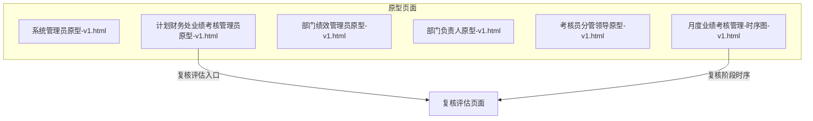
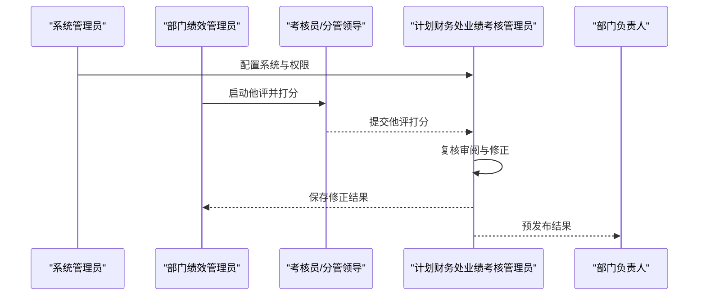
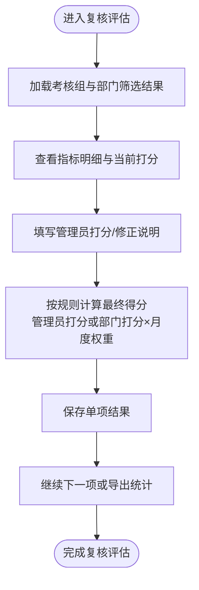
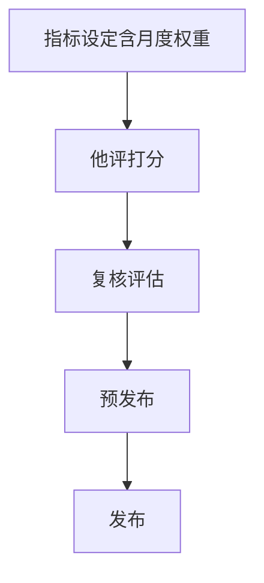

# 复核评估

<cite>
**本文引用的文件**
- [系统管理员原型-v1.html](file://1-系统管理员原型-v1.html)
- [计划财务处业绩考核管理员原型-v1.html](file://2-计划财务处业绩考核管理员原型-v1.html)
- [部门绩效管理员原型-v1.html](file://3-部门绩效管理员原型-v1.html)
- [部门负责人原型-v1.html](file://4-部门负责人原型-v1.html)
- [考核员分管领导原型-v1.html](file://5-考核员分管领导原型-v1.html)
- [月度业绩考核管理-时序图-v1.html](file://6-时序图-v1.html)
</cite>

## 目录
1. [简介](#简介)
2. [项目结构](#项目结构)
3. [核心组件](#核心组件)
4. [架构概览](#架构概览)
5. [详细组件分析](#详细组件分析)
6. [依赖分析](#依赖分析)
7. [性能考虑](#性能考虑)
8. [故障排查指南](#故障排查指南)
9. [结论](#结论)
10. [附录](#附录)

## 简介
本指南面向“复核评估”功能，围绕月度考核数据的复核与修正打分展开，覆盖以下关键目标：
- 明确复核评估的完整流程与角色职责
- 详解“管理员打分”“部门打分”“月度权重”的计算规则
- 提供可操作的复核步骤与示例（修正分数、填写说明、保存）
- 说明质量控制要求与审核流程
- 介绍统计分析与报告能力

## 项目结构
本仓库为“月度业绩考核原型设计”，采用多角色原型页面组合呈现系统功能，复核评估位于“计划财务处业绩考核管理员”角色页面中，同时在“时序图”中明确其在整个月度考核流程中的位置。

图表来源
- [计划财务处业绩考核管理员原型-v1.html](file://2-计划财务处业绩考核管理员原型-v1.html)
- [月度业绩考核管理-时序图-v1.html](file://6-时序图-v1.html)

章节来源
- [系统管理员原型-v1.html](file://1-系统管理员原型-v1.html)
- [计划财务处业绩考核管理员原型-v1.html](file://2-计划财务处业绩考核管理员原型-v1.html)
- [部门绩效管理员原型-v1.html](file://3-部门绩效管理员原型-v1.html)
- [部门负责人原型-v1.html](file://4-部门负责人原型-v1.html)
- [考核员分管领导原型-v1.html](file://5-考核员分管领导原型-v1.html)
- [月度业绩考核管理-时序图-v1.html](file://6-时序图-v1.html)

## 核心组件
- 角色与职责
  - 计划财务处业绩考核管理员：负责月度考核全流程管理，主导“复核评估”环节，对各部门打分进行审阅、修正与最终确认。
  - 部门绩效管理员：负责本部门自评与他评配合，确保数据真实、完整，配合复核与申诉处理。
  - 考核员/分管领导：负责他评打分与复核阶段的协同，提供专业意见与监督。
  - 部门负责人：关注本部门考核结果，配合复核与申诉处理。
- 复核评估页面核心元素
  - 查询条件：考核组、考核部门
  - 表格列：指标大类、指标小类、考核内容、权重（月度）、部门打分、管理员打分、最终得分、打分说明、操作（保存）
  - 计算规则提示：优先取管理员打分，如为空则取部门打分，再乘以月度权重
- 流程定位
  - 复核评估处于“他评完成”之后、“预发布”之前的关键节点，是质量控制与数据修正的核心环节。

章节来源
- [计划财务处业绩考核管理员原型-v1.html](file://2-计划财务处业绩考核管理员原型-v1.html)
- [月度业绩考核管理-时序图-v1.html](file://6-时序图-v1.html)

## 架构概览
复核评估在系统中的位置如下：

图表来源
- [计划财务处业绩考核管理员原型-v1.html](file://2-计划财务处业绩考核管理员原型-v1.html)
- [月度业绩考核管理-时序图-v1.html](file://6-时序图-v1.html)

## 详细组件分析

### 复核评估页面与交互
- 页面入口：在“计划财务处业绩考核管理员”侧边栏中选择“复核评估”
- 查询筛选：支持按“考核组”“考核部门”筛选
- 表格字段与交互
  - 部门打分：来自他评或自评阶段的数据
  - 管理员打分：复核阶段由管理员填写，优先使用
  - 最终得分：按规则计算得出
  - 打分说明：管理员填写修正理由
  - 操作：每行提供“保存”按钮，支持逐项保存
- 计算规则提示：页面明确标注“优先取管理员打分，如为空则取部门打分，再乘以月度权重”

图表来源
- [计划财务处业绩考核管理员原型-v1.html](file://2-计划财务处业绩考核管理员原型-v1.html)

章节来源
- [计划财务处业绩考核管理员原型-v1.html](file://2-计划财务处业绩考核管理员原型-v1.html)

### 复核评估在月度考核流程中的位置
- 月度考核流程分为“准备、自评、他评、复核、预发布、申诉、发布”等阶段
- 复核评估位于“他评完成”与“预发布”之间，是质量把关的关键节点
- 时序图明确了“复核审阅”“计算得分”“预发布”的顺序关系

图表来源
- [月度业绩考核管理-时序图-v1.html](file://6-时序图-v1.html)

章节来源
- [月度业绩考核管理-时序图-v1.html](file://6-时序图-v1.html)

### 得分计算规则与评分标准
- 计算公式
  - 单项指标得分 = 管理员打分（若存在）或 部门打分 × 月度权重
  - 部门月度总分 = 该部门全部指标得分之和（按大类汇总）
- 评分标准
  - 管理员打分优先：若管理员已填写，则直接采用管理员打分
  - 若管理员打分为空，则采用部门打分
  - 月度权重来源于指标设定阶段，复核阶段不再调整
- 质量控制
  - 管理员需在“打分说明”中填写修正依据与理由
  - 支持逐项保存，便于追溯与复核

章节来源
- [计划财务处业绩考核管理员原型-v1.html](file://2-计划财务处业绩考核管理员原型-v1.html)
- [月度业绩考核管理-时序图-v1.html](file://6-时序图-v1.html)

### 复核操作示例
- 示例场景：某部门“生产管理”指标
  - 步骤1：在复核评估页面，选择相应“考核组”“考核部门”
  - 步骤2：查看“部门打分”与“月度权重”
  - 步骤3：在“管理员打分”列输入修正后的分数（如原88分，修正为90分）
  - 步骤4：在“打分说明”填写“根据现场核查与整改材料，符合90分标准”
  - 步骤5：点击“保存”，系统按规则重新计算“最终得分”
- 示例场景：某部门“基础工作”指标
  - 步骤1：管理员发现部门打分存在争议，管理员打分留空
  - 步骤2：系统自动采用“部门打分 × 月度权重”计算
  - 步骤3：管理员可在说明中注明“按部门原始打分计算，无修正”

章节来源
- [计划财务处业绩考核管理员原型-v1.html](file://2-计划财务处业绩考核管理员原型-v1.html)

### 质量控制要求与审核流程
- 质量控制要求
  - 管理员打分必须有依据，打分说明需清晰、可追溯
  - 对于空缺的管理员打分，需在说明中注明原因
  - 修正应基于客观事实与佐证材料
- 审核流程
  - 逐项保存：管理员可随时保存单项修正结果
  - 多轮复核：若申诉成功，可退回他评部门重新评估，复核阶段再次审阅
  - 预发布前统一校验：确保所有部门得分与说明完整

章节来源
- [计划财务处业绩考核管理员原型-v1.html](file://2-计划财务处业绩考核管理员原型-v1.html)
- [月度业绩考核管理-时序图-v1.html](file://6-时序图-v1.html)

### 统计分析与报告
- 页面支持按“考核组”“考核部门”筛选，便于分维度查看
- 结果可导出为明细表与汇总表，满足统计分析与归档需求
- 复核完成后，系统按规则汇总生成部门月度总分与考核系数

章节来源
- [计划财务处业绩考核管理员原型-v1.html](file://2-计划财务处业绩考核管理员原型-v1.html)

## 依赖分析
- 角色依赖
  - 复核评估依赖“他评完成”数据，由“考核员/分管领导”与“部门绩效管理员”共同提供
  - 预发布与发布依赖复核评估的最终结果
- 数据依赖
  - 月度权重来源于指标设定阶段，复核阶段保持不变
  - 最终得分依赖管理员打分与部门打分的取舍逻辑

图表来源
- [月度业绩考核管理-时序图-v1.html](file://6-时序图-v1.html)

章节来源
- [月度业绩考核管理-时序图-v1.html](file://6-时序图-v1.html)

## 性能考虑
- 复核评估页面支持分页与筛选，建议按“考核组”“部门”缩小数据集，提升交互性能
- 逐项保存策略降低一次性提交压力，提高稳定性
- 统计导出建议在低峰时段执行，避免影响在线复核

## 故障排查指南
- 现象：管理员打分为空，最终得分异常
  - 排查：确认是否正确填写管理员打分；若为空，系统将采用部门打分×月度权重
- 现象：保存后得分未更新
  - 排查：确认已点击“保存”；检查“管理员打分”是否为有效数值
- 现象：复核后仍显示旧数据
  - 排查：刷新页面或切换“考核组/部门”后重新进入；确认是否已提交复核

章节来源
- [计划财务处业绩考核管理员原型-v1.html](file://2-计划财务处业绩考核管理员原型-v1.html)

## 结论
复核评估是月度考核质量控制的关键环节。通过明确的角色分工、严格的计算规则与可追溯的说明机制，管理员能够高效完成对各部门月度考核数据的审阅与修正。结合统计导出能力，可形成完整的考核闭环，支撑后续预发布与发布工作。

## 附录
- 关键术语
  - 管理员打分：复核阶段由管理员填写的修正分数
  - 部门打分：他评或自评阶段的原始分数
  - 月度权重：指标设定阶段确定的权重，复核阶段保持不变
- 参考页面
  - 复核评估页面：[计划财务处业绩考核管理员原型-v1.html](file://2-计划财务处业绩考核管理员原型-v1.html)
  - 月度考核流程时序：[月度业绩考核管理-时序图-v1.html](file://6-时序图-v1.html)