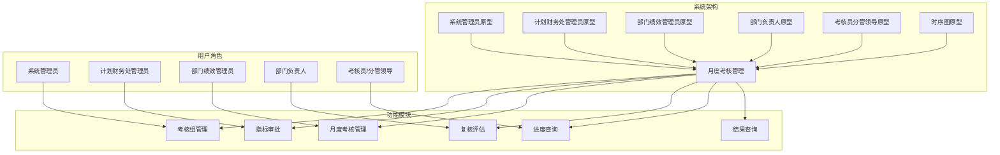
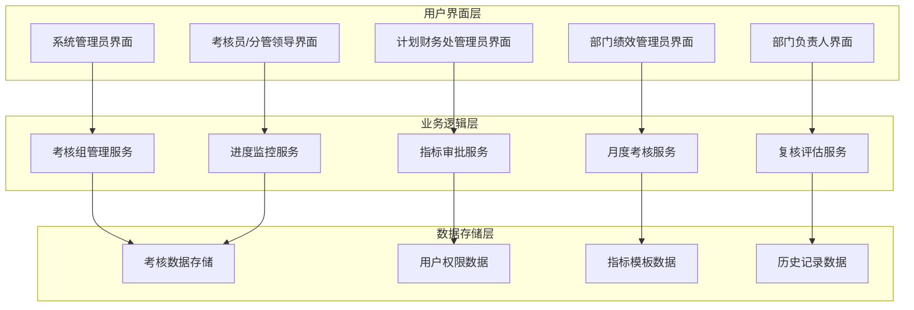
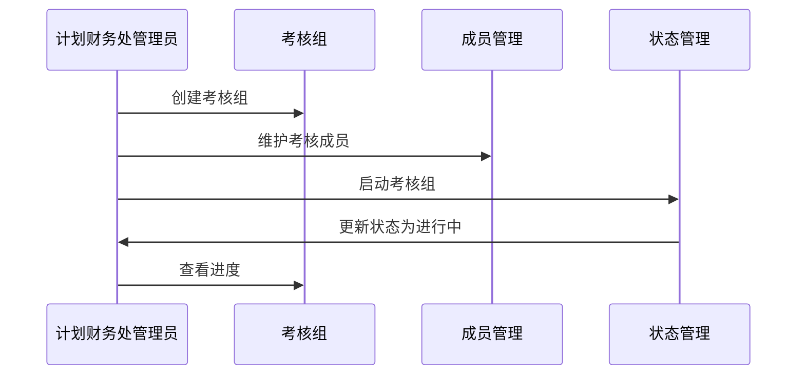
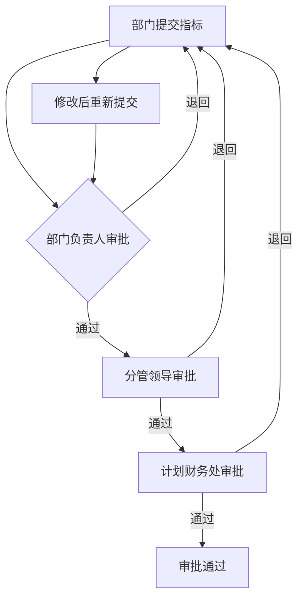
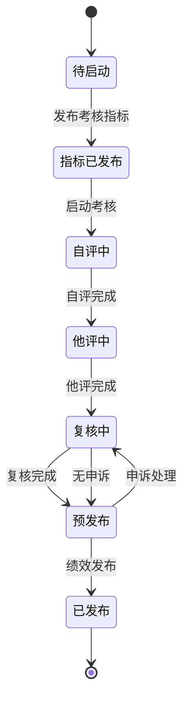
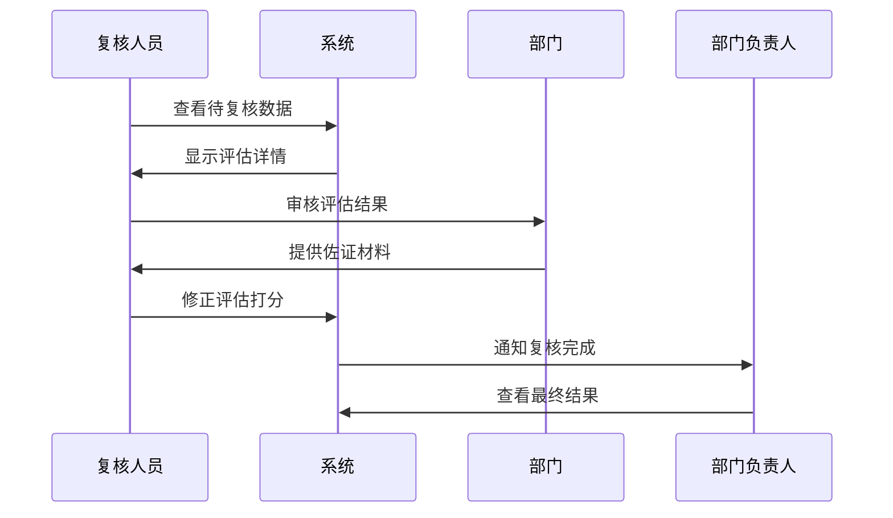
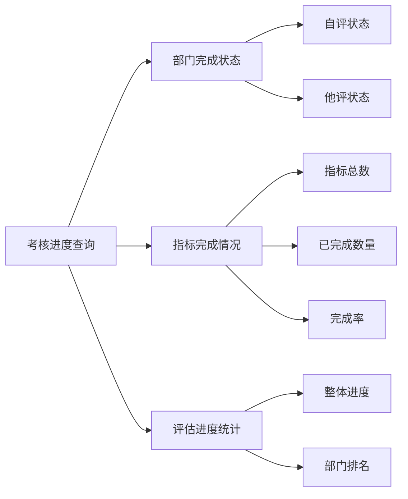
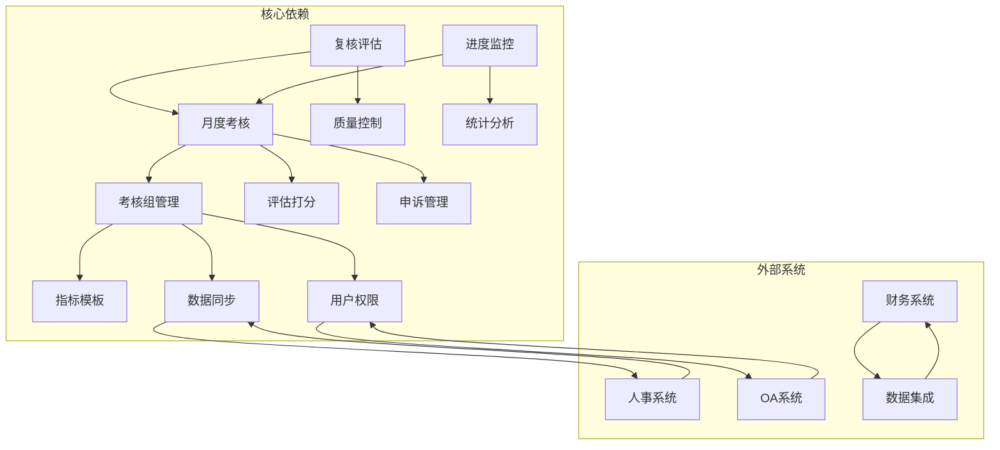
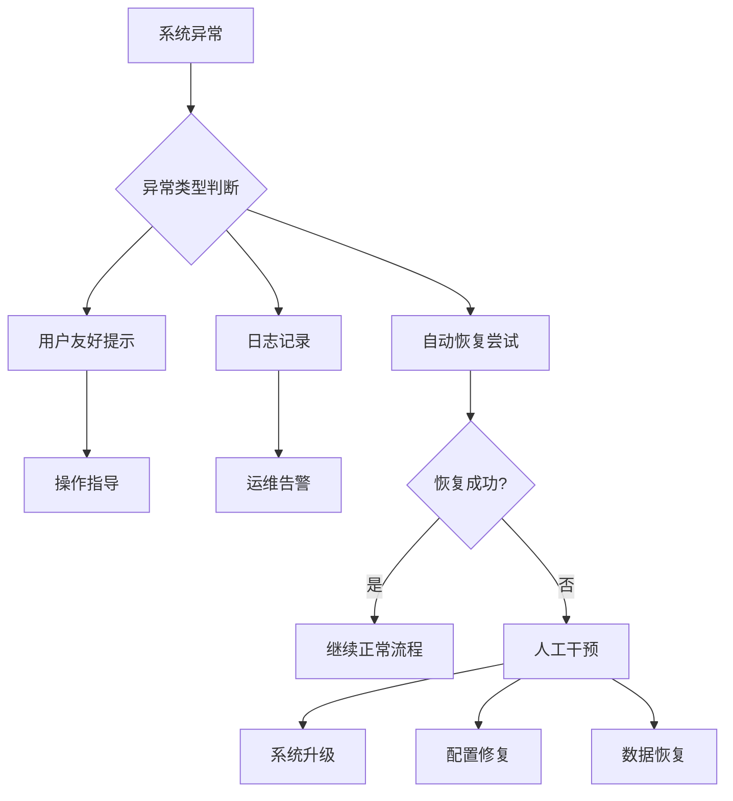

# 月度考核管理

<cite>
**本文档引用的文件**
- [系统管理员原型-v1.html](file://月度业绩考核原型设计初稿/1-系统管理员原型-v1.html)
- [计划财务处业绩考核管理员原型-v1.html](file://月度业绩考核原型设计初稿/2-计划财务处业绩考核管理员原型-v1.html)
- [部门绩效管理员原型-v1.html](file://月度业绩考核原型设计初稿/3-部门绩效管理员原型-v1.html)
- [部门负责人原型-v1.html](file://月度业绩考核原型设计初稿/4-部门负责人原型-v1.html)
- [考核员分管领导原型-v1.html](file://月度业绩考核原型设计初稿/5-考核员分管领导原型-v1.html)
- [月度业绩考核管理-时序图-v1.html](file://月度业绩考核原型设计初稿/6-时序图-v1.html)
</cite>

## 目录
1. [简介](#简介)
2. [项目结构](#项目结构)
3. [核心组件](#核心组件)
4. [架构概览](#架构概览)
5. [详细组件分析](#详细组件分析)
6. [依赖关系分析](#依赖关系分析)
7. [性能考虑](#性能考虑)
8. [故障排除指南](#故障排除指南)
9. [结论](#结论)
10. [附录](#附录)

## 简介

月度业绩考核管理系统是一个基于Web的综合性考核管理平台，旨在为中煤鄂尔多斯能源化工有限公司提供完整的月度考核管理解决方案。该系统涵盖了从指标设定、自评、他评、复核到发布的全流程管理，支持多层级审批和质量控制机制。

系统采用模块化设计，包含多个角色界面：系统管理员、计划财务处业绩考核管理员、部门绩效管理员、部门负责人、考核员/分管领导等，每个角色都有特定的权限和操作界面。

## 项目结构

系统采用HTML/CSS/JavaScript前端技术栈，通过多个独立的原型页面实现不同的功能模块：

**图表来源**
- [系统管理员原型-v1.html:1-635](file://月度业绩考核原型设计初稿/1-系统管理员原型-v1.html#L1-L635)
- [计划财务处业绩考核管理员原型-v1.html:1-1039](file://月度业绩考核原型设计初稿/2-计划财务处业绩考核管理员原型-v1.html#L1-L1039)

**章节来源**
- [系统管理员原型-v1.html:1-635](file://月度业绩考核原型设计初稿/1-系统管理员原型-v1.html#L1-L635)
- [计划财务处业绩考核管理员原型-v1.html:1-1039](file://月度业绩考核原型设计初稿/2-计划财务处业绩考核管理员原型-v1.html#L1-L1039)

## 核心组件

### 考核管理组件

系统的核心功能围绕"考核组"展开，每个考核组代表一次完整的考核周期。主要组件包括：

1. **考核组管理** - 创建、配置和管理考核组
2. **指标审批** - 审批各部门提交的考核指标
3. **月度考核管理** - 控制月度考核全流程
4. **复核评估** - 对考核数据进行复核和修正
5. **进度查询** - 监控考核进度
6. **结果查询** - 查询和导出考核结果

### 用户角色组件

系统支持以下用户角色，每个角色都有专门的功能界面：

- **系统管理员**：负责单位管理、权限分配、数据同步等系统维护工作
- **计划财务处业绩考核管理员**：负责整体考核流程的协调和管理
- **部门绩效管理员**：负责本部门的指标设定、自评和他评工作
- **部门负责人**：负责审批部门指标和查看考核结果
- **考核员/分管领导**：负责他评打分和进度监控

**章节来源**
- [计划财务处业绩考核管理员原型-v1.html:353-653](file://月度业绩考核原型设计初稿/2-计划财务处业绩考核管理员原型-v1.html#L353-L653)
- [部门绩效管理员原型-v1.html:445-761](file://月度业绩考核原型设计初稿/3-部门绩效管理员原型-v1.html#L445-L761)

## 架构概览

系统采用分层架构设计，通过清晰的角色分工和权限控制实现高效的考核管理：

**图表来源**
- [月度业绩考核管理-时序图-v1.html:307-555](file://月度业绩考核原型设计初稿/6-时序图-v1.html#L307-L555)

系统采用事件驱动的设计模式，通过明确的状态转换和流程控制确保考核工作的有序进行。

**章节来源**
- [月度业绩考核管理-时序图-v1.html:300-555](file://月度业绩考核原型设计初稿/6-时序图-v1.html#L300-L555)

## 详细组件分析

### 考核组管理组件

考核组是系统的核心概念，代表一次完整的考核周期。每个考核组包含以下关键属性：

#### 考核组基本信息
- **考核组名称**：唯一标识符，便于识别和管理
- **考核类别**：业绩指标设定或绩效考核
- **考核类型**：月度、季度或年度考核
- **考核时间范围**：开始日期和结束日期
- **状态**：待启动、进行中、已完成

#### 考核组操作流程

**图表来源**
- [计划财务处业绩考核管理员原型-v1.html:353-447](file://月度业绩考核原型设计初稿/2-计划财务处业绩考核管理员原型-v1.html#L353-L447)

#### 考核组状态管理

系统支持以下状态转换：
- 待启动 → 指标已发布 → 自评中 → 他评中 → 复核中 → 预发布 → 已发布

每个状态都有相应的操作权限和质量控制要求。

**章节来源**
- [计划财务处业绩考核管理员原型-v1.html:353-447](file://月度业绩考核原型设计初稿/2-计划财务处业绩考核管理员原型-v1.html#L353-L447)

### 指标审批组件

指标审批是确保考核质量的重要环节，采用多级审批机制：

#### 审批流程

**图表来源**
- [月度业绩考核管理-时序图-v1.html:155-241](file://月度业绩考核原型设计初稿/6-时序图-v1.html#L155-L241)

#### 审批权限控制

- **部门负责人**：审批本部门提交的指标
- **分管领导**：审批所管辖部门的指标
- **计划财务处管理员**：最终审批权

**章节来源**
- [部门负责人原型-v1.html:380-538](file://月度业绩考核原型设计初稿/4-部门负责人原型-v1.html#L380-L538)
- [部门绩效管理员原型-v1.html:445-523](file://月度业绩考核原型设计初稿/3-部门绩效管理员原型-v1.html#L445-L523)

### 月度考核管理组件

月度考核管理涵盖完整的考核生命周期，从指标发布到结果发布的全过程：

#### 考核阶段划分

**图表来源**
- [月度业绩考核管理-时序图-v1.html:494-529](file://月度业绩考核原型设计初稿/6-时序图-v1.html#L494-L529)

#### 关键操作流程

1. **发布考核指标**：向各相关部门发布当月考核指标
2. **启动考核**：设置考核开始和结束时间
3. **自评**：各部门根据指标完成情况进行自评
4. **他评**：部门间相互评估打分
5. **复核**：管理员审核和修正评估结果
6. **预发布**：发布预评估结果供部门查看
7. **申诉处理**：处理部门提出的申诉
8. **正式发布**：发布最终考核结果

**章节来源**
- [计划财务处业绩考核管理员原型-v1.html:481-530](file://月度业绩考核原型设计初稿/2-计划财务处业绩考核管理员原型-v1.html#L481-L530)
- [月度业绩考核管理-时序图-v1.html:352-492](file://月度业绩考核原型设计初稿/6-时序图-v1.html#L352-L492)

### 复核评估组件

复核评估是确保考核公正性和准确性的关键环节：

#### 复核流程

**图表来源**
- [计划财务处业绩考核管理员原型-v1.html:532-560](file://月度业绩考核原型设计初稿/2-计划财务处业绩考核管理员原型-v1.html#L532-L560)

#### 质量控制措施

- **双人复核**：重要指标需要多人复核确认
- **证据保留**：所有复核决策都需要保留佐证材料
- **时限控制**：设置严格的复核时限要求
- **异常预警**：系统自动检测异常评估模式

**章节来源**
- [计划财务处业绩考核管理员原型-v1.html:532-560](file://月度业绩考核原型设计初稿/2-计划财务处业绩考核管理员原型-v1.html#L532-L560)

### 进度监控组件

进度监控确保考核工作按计划推进，提供实时的进度可视化：

#### 进度监控功能

**图表来源**
- [计划财务处业绩考核管理员原型-v1.html:591-621](file://月度业绩考核原型设计初稿/2-计划财务处业绩考核管理员原型-v1.html#L591-L621)

#### 实时监控指标

- **自评完成率**：跟踪各部门自评完成情况
- **他评完成率**：监控部门间评估进度
- **平均分差**：分析评估一致性
- **异常预警**：识别进度异常的部门

**章节来源**
- [计划财务处业绩考核管理员原型-v1.html:591-621](file://月度业绩考核原型设计初稿/2-计划财务处业绩考核管理员原型-v1.html#L591-L621)

## 依赖关系分析

系统各组件之间存在复杂的依赖关系，通过清晰的接口设计实现松耦合：

**图表来源**
- [系统管理员原型-v1.html:484-560](file://月度业绩考核原型设计初稿/1-系统管理员原型-v1.html#L484-L560)

### 数据流依赖

系统采用事件驱动的数据流设计，确保数据的一致性和完整性：

1. **指标数据流**：从指标设定到审批再到发布的完整链路
2. **评估数据流**：自评、他评、复核的递进式数据处理
3. **结果数据流**：从预发布到正式发布的质量控制链路

**章节来源**
- [系统管理员原型-v1.html:484-560](file://月度业绩考核原型设计初稿/1-系统管理员原型-v1.html#L484-L560)

## 性能考虑

系统在设计时充分考虑了性能优化和用户体验：

### 前端性能优化

- **响应式设计**：适配不同分辨率的设备
- **懒加载机制**：大表格和复杂图表的延迟加载
- **缓存策略**：常用数据的本地缓存和服务器缓存
- **异步处理**：批量操作和后台任务的异步执行

### 后端性能优化

- **数据库索引**：关键查询字段建立适当索引
- **分页查询**：大数据量表格的分页显示
- **并发控制**：关键业务操作的并发访问控制
- **数据压缩**：报表导出的数据压缩传输

### 系统监控

- **性能指标**：页面加载时间、API响应时间监控
- **用户行为**：操作频率和使用模式分析
- **系统健康**：内存使用、CPU负载监控

## 故障排除指南

### 常见问题及解决方案

#### 登录和权限问题

**问题现象**：用户无法登录或访问受限
**可能原因**：
- 用户权限配置错误
- 角色分配不当
- 系统维护期间

**解决步骤**：
1. 检查用户账号状态
2. 验证角色权限配置
3. 确认系统维护状态
4. 重置用户密码

#### 数据同步问题

**问题现象**：部门信息或人员信息不同步
**可能原因**：
- 人事系统接口异常
- 网络连接问题
- 数据格式不兼容

**解决步骤**：
1. 检查人事系统连接状态
2. 验证网络连接稳定性
3. 校验数据格式兼容性
4. 执行手动同步操作

#### 考核流程异常

**问题现象**：考核流程中断或状态异常
**可能原因**：
- 流程节点配置错误
- 数据完整性校验失败
- 权限不足

**解决步骤**：
1. 检查流程配置正确性
2. 验证数据完整性
3. 确认操作权限
4. 执行流程回滚或修复

### 异常处理机制

系统内置完善的异常处理机制：

**图表来源**
- [月度业绩考核管理-时序图-v1.html:440-467](file://月度业绩考核原型设计初稿/6-时序图-v1.html#L440-L467)

**章节来源**
- [月度业绩考核管理-时序图-v1.html:440-467](file://月度业绩考核原型设计初稿/6-时序图-v1.html#L440-L467)

## 结论

月度业绩考核管理系统通过模块化设计和清晰的角色分工，为中煤鄂尔多斯能源化工有限公司提供了完整的考核管理解决方案。系统具备以下优势：

1. **完整的流程覆盖**：从指标设定到结果发布的全流程管理
2. **严格的质量控制**：多级审批和复核机制确保考核质量
3. **实时的进度监控**：可视化监控确保考核按时完成
4. **灵活的权限管理**：基于角色的精细化权限控制
5. **强大的扩展性**：模块化设计支持功能扩展和定制

系统采用先进的前端技术栈，提供良好的用户体验和响应速度。通过合理的架构设计和性能优化，能够满足大型企业级应用的需求。

## 附录

### 操作流程速查

#### 系统管理员操作
- 单位管理：新增、编辑、失效单位信息
- 权限分配：为用户分配系统权限和数据范围
- 数据同步：从人事系统同步人员基础数据

#### 计划财务处管理员操作
- 考核组管理：创建、维护考核组
- 指标审批：审批各部门提交的考核指标
- 月度考核：控制月度考核全流程
- 复核评估：对考核数据进行复核和修正

#### 部门绩效管理员操作
- 指标设定：设定本部门年度业绩考核指标
- 自评管理：对本部门月度业绩进行自评
- 他评管理：对其他部门进行评估打分

#### 部门负责人操作
- 指标审批：审批部门绩效管理员提交的指标
- 结果查看：查看预发布/已发布状态的结果

#### 考核员/分管领导操作
- 评估打分：对其他部门进行评估打分
- 进度监控：查看各考核组的评估完成进度
- 申诉处理：处理部门的申诉重新评估

### 技术规范

#### 数据标准
- **编码规范**：统一的编码规则和命名约定
- **数据格式**：标准化的数据格式和验证规则
- **存储结构**：合理的数据库设计和索引策略

#### 接口规范
- **API设计**：RESTful API设计原则
- **认证授权**：OAuth 2.0认证和RBAC权限控制
- **数据传输**：JSON格式的数据交换协议

#### 安全规范
- **数据加密**：敏感数据的加密存储和传输
- **访问控制**：基于角色的细粒度权限控制
- **审计日志**：完整的操作审计和追踪机制