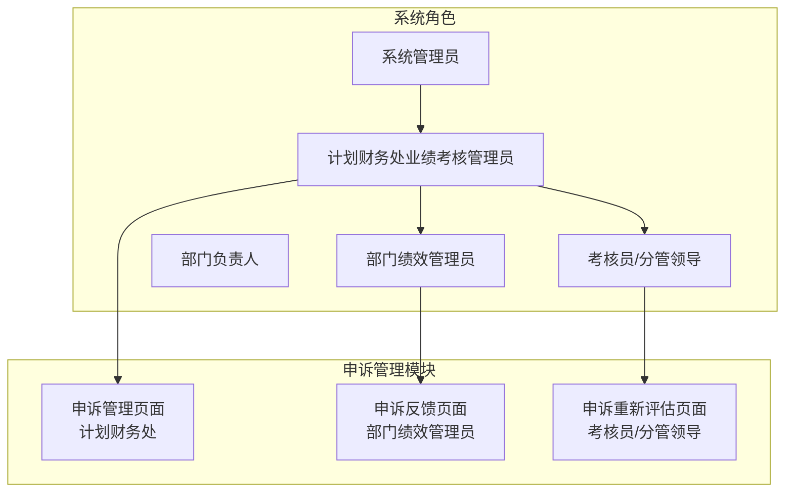
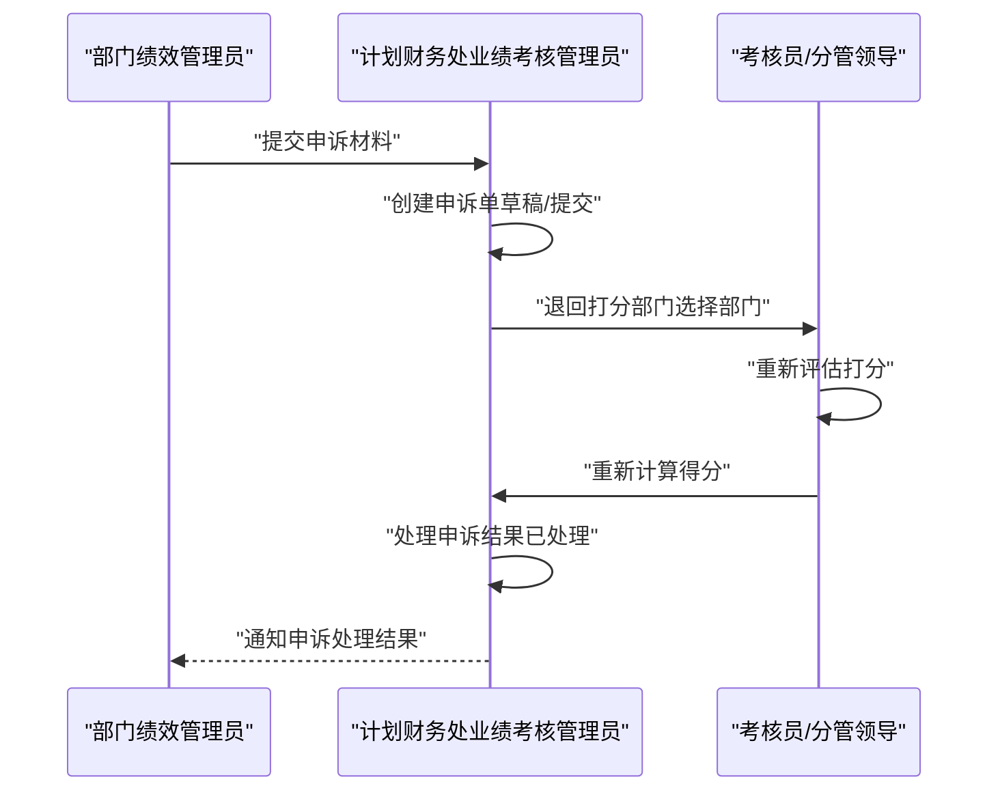
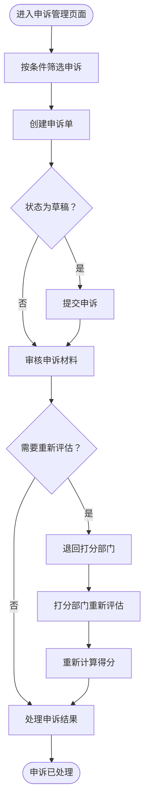

# 申诉管理

<cite>
**本文档引用的文件**
- [系统管理员原型-v1.html](file://月度业绩考核原型设计初稿/1-系统管理员原型-v1.html)
- [计划财务处业绩考核管理员原型-v1.html](file://月度业绩考核原型设计初稿/2-计划财务处业绩考核管理员原型-v1.html)
- [部门绩效管理员原型-v1.html](file://月度业绩考核原型设计初稿/3-部门绩效管理员原型-v1.html)
- [部门负责人原型-v1.html](file://月度业绩考核原型设计初稿/4-部门负责人原型-v1.html)
- [考核员分管领导原型-v1.html](file://月度业绩考核原型设计初稿/5-考核员分管领导原型-v1.html)
- [时序图-v1.html](file://月度业绩考核原型设计初稿/6-时序图-v1.html)
</cite>

## 目录
1. [简介](#简介)
2. [项目结构](#项目结构)
3. [核心组件](#核心组件)
4. [架构概览](#架构概览)
5. [详细组件分析](#详细组件分析)
6. [依赖关系分析](#依赖关系分析)
7. [性能考虑](#性能考虑)
8. [故障排除指南](#故障排除指南)
9. [结论](#结论)
10. [附录](#附录)

## 简介
本指南面向系统管理员与计划财务部业绩考核管理员，提供申诉管理功能的专业操作指导。文档基于原型设计文件，详细说明管理部门对考核结果的申诉处理流程，包括申诉创建、审核、退回打分部门重新评估、重新计算与处理等核心环节。同时涵盖申诉状态管理（草稿、待重新评估、已重新打分、已处理）、申诉材料上传与管理要求、时间节点与质量标准，以及申诉统计分析与处理效率监控的使用方法。

## 项目结构
该项目采用多角色原型设计，围绕月度业绩考核管理构建，申诉管理作为独立页面模块集成在不同角色界面中：
- 系统管理员原型：提供单位管理、权限分配等系统基础配置能力
- 计划财务处业绩考核管理员原型：核心申诉管理页面，负责申诉创建、审核与处理
- 部门绩效管理员原型：提供申诉反馈页面，处理其他部门对本部门评分的申诉
- 部门负责人原型：提供指标审批与结果查看，间接影响申诉处理
- 考核员分管领导原型：提供申诉重新评估页面，处理申诉成功的指标重新打分
- 时序图：系统性展示申诉流程的时序关系与状态流转

**图表来源**
- [系统管理员原型-v1.html](file://月度业绩考核原型设计初稿/1-系统管理员原型-v1.html)
- [计划财务处业绩考核管理员原型-v1.html](file://月度业绩考核原型设计初稿/2-计划财务处业绩考核管理员原型-v1.html)
- [部门绩效管理员原型-v1.html](file://月度业绩考核原型设计初稿/3-部门绩效管理员原型-v1.html)
- [考核员分管领导原型-v1.html](file://月度业绩考核原型设计初稿/5-考核员分管领导原型-v1.html)

**章节来源**
- [系统管理员原型-v1.html](file://月度业绩考核原型设计初稿/1-系统管理员原型-v1.html)
- [计划财务处业绩考核管理员原型-v1.html](file://月度业绩考核原型设计初稿/2-计划财务处业绩考核管理员原型-v1.html)
- [部门绩效管理员原型-v1.html](file://月度业绩考核原型设计初稿/3-部门绩效管理员原型-v1.html)
- [部门负责人原型-v1.html](file://月度业绩考核原型设计初稿/4-部门负责人原型-v1.html)
- [考核员分管领导原型-v1.html](file://月度业绩考核原型设计初稿/5-考核员分管领导原型-v1.html)
- [时序图-v1.html](file://月度业绩考核原型设计初稿/6-时序图-v1.html)

## 核心组件
- 申诉管理页面（计划财务处）
  - 支持按申诉部门、申诉状态筛选
  - 支持创建申诉单、查看申诉详情、退回打分部门、处理申诉结果
  - 支持上传申诉材料（PDF、图片、压缩文件）
- 申诉反馈页面（部门绩效管理员）
  - 处理其他部门对本部门评分的申诉，需重新评估打分
- 申诉重新评估页面（考核员/分管领导）
  - 对申诉成功的考核指标进行重新评估打分
- 状态标签体系
  - 草稿、待重新评估、已重新打分、已处理

**章节来源**
- [计划财务处业绩考核管理员原型-v1.html](file://月度业绩考核原型设计初稿/2-计划财务处业绩考核管理员原型-v1.html)
- [部门绩效管理员原型-v1.html](file://月度业绩考核原型设计初稿/3-部门绩效管理员原型-v1.html)
- [考核员分管领导原型-v1.html](file://月度业绩考核原型设计初稿/5-考核员分管领导原型-v1.html)

## 架构概览
申诉管理贯穿月度考核全流程，涉及多个角色协作与状态流转：

**图表来源**
- [计划财务处业绩考核管理员原型-v1.html](file://月度业绩考核原型设计初稿/2-计划财务处业绩考核管理员原型-v1.html)
- [部门绩效管理员原型-v1.html](file://月度业绩考核原型设计初稿/3-部门绩效管理员原型-v1.html)
- [考核员分管领导原型-v1.html](file://月度业绩考核原型设计初稿/5-考核员分管领导原型-v1.html)
- [时序图-v1.html](file://月度业绩考核原型设计初稿/6-时序图-v1.html)

## 详细组件分析

### 申诉管理页面（计划财务处）
- 页面入口与导航
  - 在“结果管理”下找到“申诉管理”菜单项
- 查询与筛选
  - 支持按“申诉部门”、“申诉状态”筛选
  - 状态选项：草稿、待重新评估、已重新打分、已处理
- 创建申诉
  - 点击“+ 创建申诉”，弹出创建窗口
  - 必填项：考核组、申诉部门、打分部门、申诉说明
  - 可选：上传申诉材料（PDF、图片、压缩文件）
  - 操作按钮：保存草稿、提交
- 处理申诉
  - 查看申诉详情
  - 退回打分部门：选择需重新打分的部门，可多选
  - 处理申诉结果：确认申诉处理完成

**图表来源**
- [计划财务处业绩考核管理员原型-v1.html](file://月度业绩考核原型设计初稿/2-计划财务处业绩考核管理员原型-v1.html)

**章节来源**
- [计划财务处业绩考核管理员原型-v1.html](file://月度业绩考核原型设计初稿/2-计划财务处业绩考核管理员原型-v1.html)

### 申诉反馈页面（部门绩效管理员）
- 页面入口与导航
  - 在“反馈查询”下找到“申诉反馈”菜单项
- 处理流程
  - 查看其他部门对本部门评分的申诉
  - 点击“重新评估”，进入评估打分流程
  - 完成重新评估后，状态更新为“已处理”

**章节来源**
- [部门绩效管理员原型-v1.html](file://月度业绩考核原型设计初稿/3-部门绩效管理员原型-v1.html)

### 申诉重新评估页面（考核员/分管领导）
- 页面入口与导航
  - 在“申诉处理”下找到“申诉重新评估”菜单项
- 处理流程
  - 查看待重新评估的申诉列表
  - 点击“重新评估”，对申诉指标进行重新打分
  - 提交重新评估结果，完成申诉处理

**章节来源**
- [考核员分管领导原型-v1.html](file://月度业绩考核原型设计初稿/5-考核员分管领导原型-v1.html)

### 状态管理与质量标准
- 状态标签
  - 草稿：未提交的申诉单
  - 待重新评估：已提交，等待打分部门重新评估
  - 已重新打分：打分部门已完成重新评估
  - 已处理：申诉处理完成
- 质量标准
  - 申诉说明需清晰、具体，便于打分部门理解
  - 申诉材料需真实、完整，符合格式要求（PDF、图片、压缩文件）
  - 重新评估需在规定时间内完成，确保考核进度不受影响

**章节来源**
- [计划财务处业绩考核管理员原型-v1.html](file://月度业绩考核原型设计初稿/2-计划财务处业绩考核管理员原型-v1.html)
- [部门绩效管理员原型-v1.html](file://月度业绩考核原型设计初稿/3-部门绩效管理员原型-v1.html)
- [考核员分管领导原型-v1.html](file://月度业绩考核原型设计初稿/5-考核员分管领导原型-v1.html)

### 时间节点与处理效率监控
- 时间节点
  - 申诉提交：在预发布阶段内提交
  - 退回打分部门：计划财务处审核后决定
  - 重新评估：打分部门在收到退回通知后尽快完成
  - 重新计算：重新评估完成后立即进行
- 处理效率监控
  - 通过申诉列表查看处理进度
  - 关注“待重新评估”状态的申诉数量与处理时效
  - 结合月度考核进度查询，确保申诉处理不影响整体发布

**章节来源**
- [时序图-v1.html](file://月度业绩考核原型设计初稿/6-时序图-v1.html)
- [计划财务处业绩考核管理员原型-v1.html](file://月度业绩考核原型设计初稿/2-计划财务处业绩考核管理员原型-v1.html)

## 依赖关系分析
- 角色依赖
  - 计划财务处业绩考核管理员：负责申诉的整体管理与处理
  - 部门绩效管理员：接收申诉并进行初步处理
  - 考核员/分管领导：负责重新评估与打分
- 数据依赖
  - 申诉材料与打分数据需与月度考核数据保持一致
  - 申诉处理结果需纳入最终考核结果统计

**图表来源**
- [计划财务处业绩考核管理员原型-v1.html](file://月度业绩考核原型设计初稿/2-计划财务处业绩考核管理员原型-v1.html)
- [部门绩效管理员原型-v1.html](file://月度业绩考核原型设计初稿/3-部门绩效管理员原型-v1.html)
- [考核员分管领导原型-v1.html](file://月度业绩考核原型设计初稿/5-考核员分管领导原型-v1.html)

**章节来源**
- [计划财务处业绩考核管理员原型-v1.html](file://月度业绩考核原型设计初稿/2-计划财务处业绩考核管理员原型-v1.html)
- [部门绩效管理员原型-v1.html](file://月度业绩考核原型设计初稿/3-部门绩效管理员原型-v1.html)
- [考核员分管领导原型-v1.html](file://月度业绩考核原型设计初稿/5-考核员分管领导原型-v1.html)

## 性能考虑
- 申诉处理效率
  - 优化申诉列表加载与筛选性能
  - 提供批量处理功能，减少重复操作
- 数据一致性
  - 确保申诉材料与打分数据的实时同步
  - 建立数据校验机制，防止异常数据影响统计结果
- 用户体验
  - 提供清晰的状态提示与操作指引
  - 支持快捷操作与批量选择，提升处理效率

## 故障排除指南
- 无法创建申诉
  - 检查必填项是否完整（考核组、申诉部门、打分部门、申诉说明）
  - 确认上传文件格式与大小符合要求
- 申诉状态异常
  - 检查是否已正确提交或退回
  - 关注重新评估是否按时完成
- 材料上传失败
  - 确认文件格式为PDF、图片或压缩文件
  - 检查文件大小是否超过限制

**章节来源**
- [计划财务处业绩考核管理员原型-v1.html](file://月度业绩考核原型设计初稿/2-计划财务处业绩考核管理员原型-v1.html)
- [部门绩效管理员原型-v1.html](file://月度业绩考核原型设计初稿/3-部门绩效管理员原型-v1.html)
- [考核员分管领导原型-v1.html](file://月度业绩考核原型设计初稿/5-考核员分管领导原型-v1.html)

## 结论
申诉管理是月度业绩考核的重要组成部分，涉及多角色协作与严格的状态管理。通过规范的流程设计与明确的质量标准，能够有效保障申诉处理的公正性与时效性。建议管理员在日常工作中重点关注申诉处理的时效性与材料完整性，结合统计分析工具持续优化处理效率。

## 附录
- 操作示例
  - 创建申诉单：进入“申诉管理”页面，点击“+ 创建申诉”，填写必填项并上传材料，点击“提交”
  - 查看申诉详情：在申诉列表中选择相应记录，点击“查看”
  - 退回打分部门：在申诉列表中选择“退回打分部门”，选择需重新评估的部门并提交
  - 处理申诉结果：在重新评估完成后，确认申诉处理完成并更新状态为“已处理”
- 统计分析与监控
  - 通过申诉列表查看处理进度与状态分布
  - 结合月度考核进度查询，监控申诉处理对整体进度的影响

**章节来源**
- [计划财务处业绩考核管理员原型-v1.html](file://月度业绩考核原型设计初稿/2-计划财务处业绩考核管理员原型-v1.html)
- [部门绩效管理员原型-v1.html](file://月度业绩考核原型设计初稿/3-部门绩效管理员原型-v1.html)
- [考核员分管领导原型-v1.html](file://月度业绩考核原型设计初稿/5-考核员分管领导原型-v1.html)
- [时序图-v1.html](file://月度业绩考核原型设计初稿/6-时序图-v1.html)