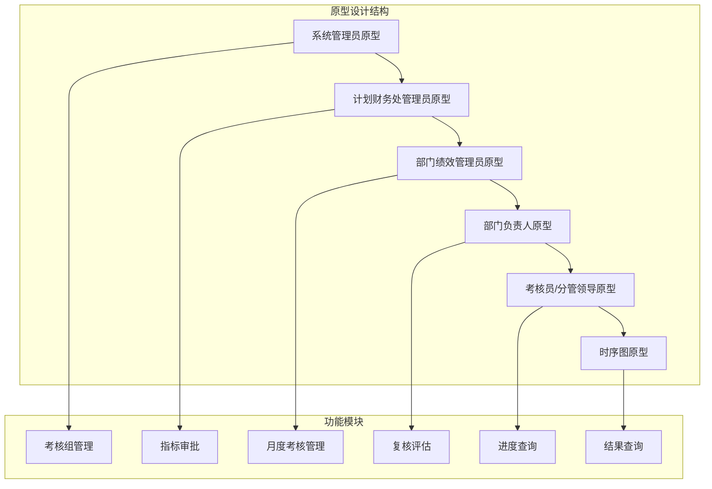
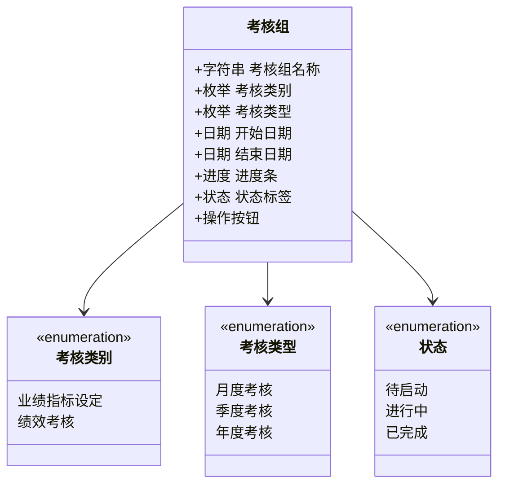
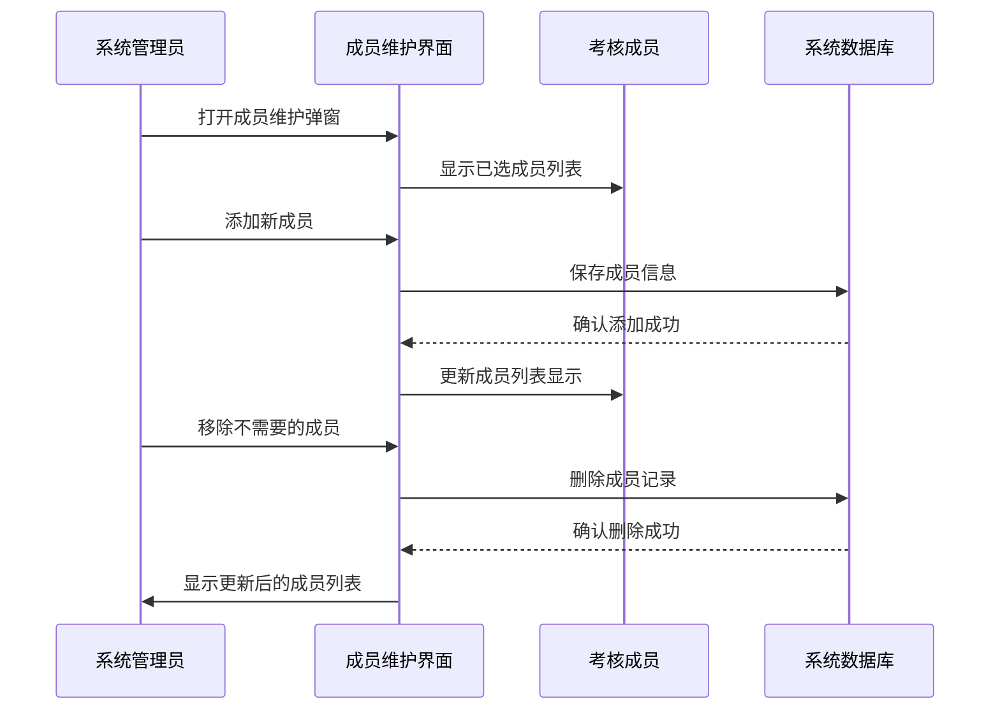
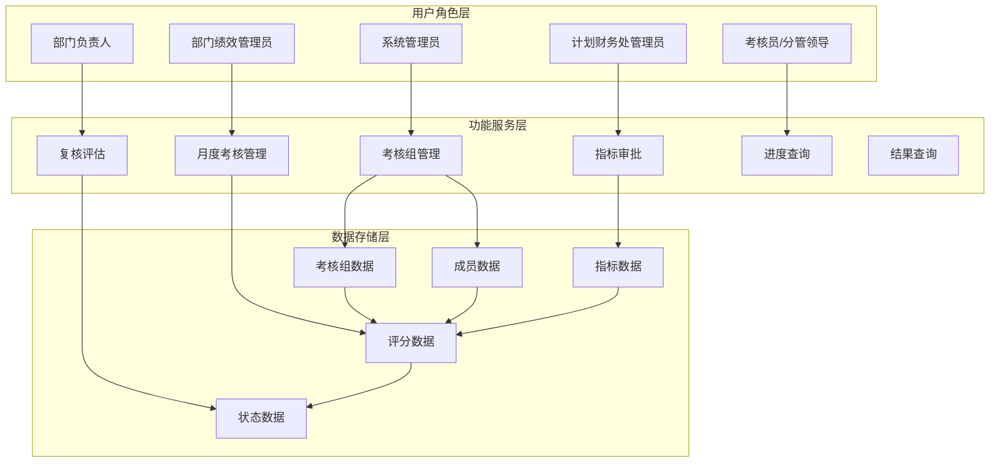
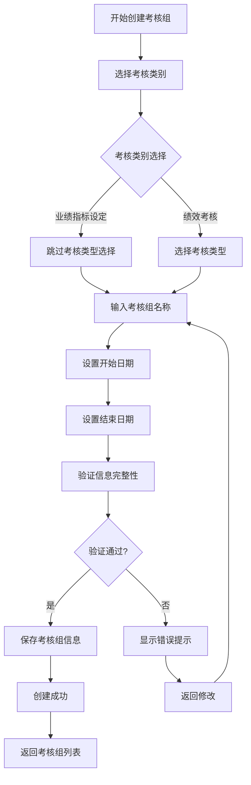
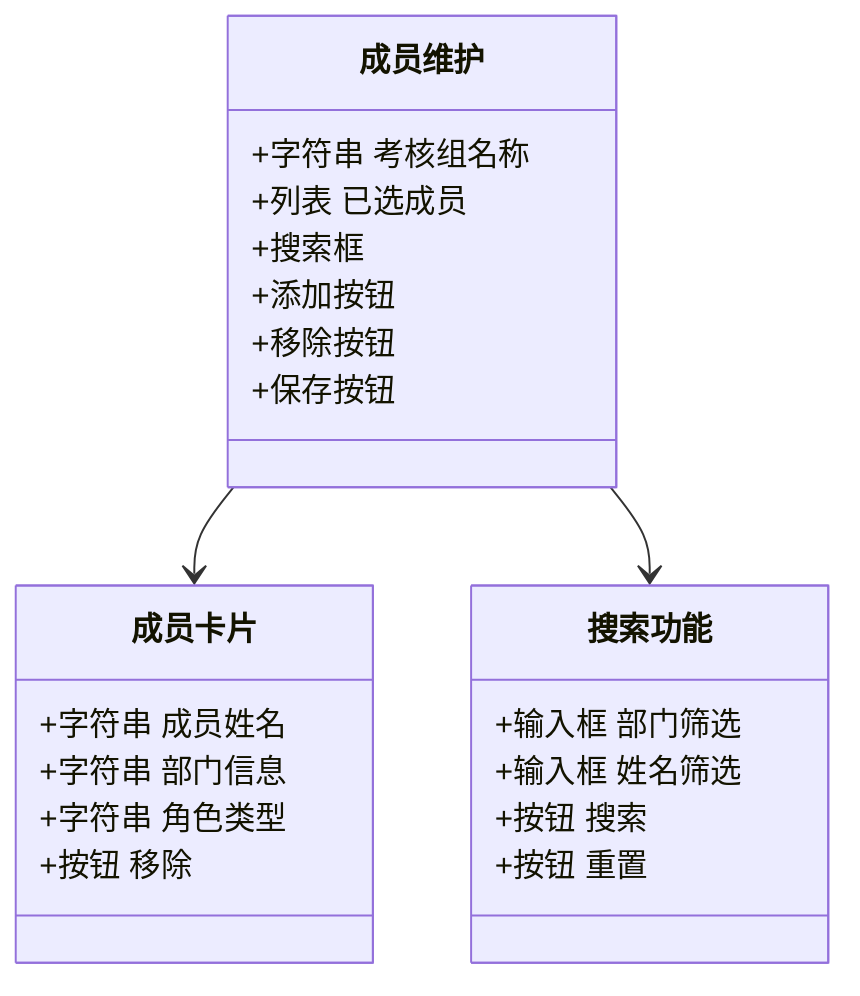
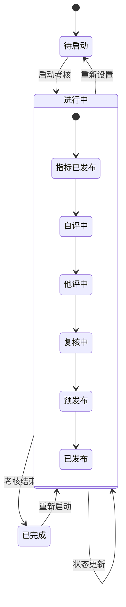
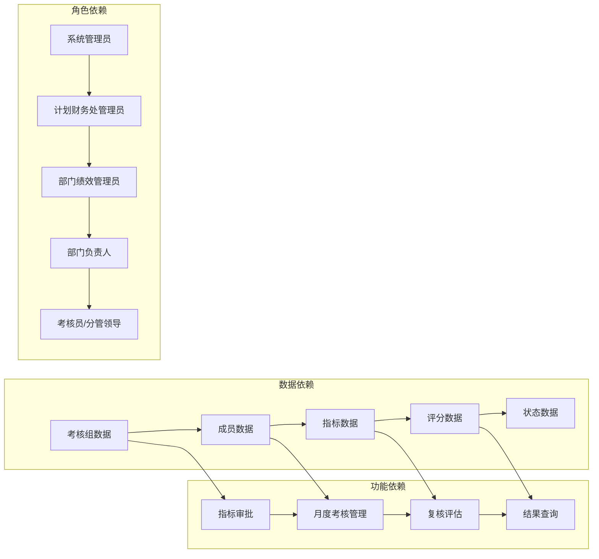
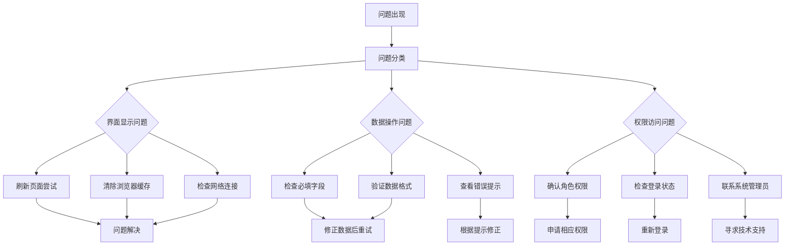

# 考核组管理

<cite>
**本文档引用的文件**
- [系统管理员原型-v1.html](file://月度业绩考核原型设计初稿/1-系统管理员原型-v1.html)
- [计划财务处业绩考核管理员原型-v1.html](file://月度业绩考核原型设计初稿/2-计划财务处业绩考核管理员原型-v1.html)
- [部门绩效管理员原型-v1.html](file://月度业绩考核原型设计初稿/3-部门绩效管理员原型-v1.html)
- [部门负责人原型-v1.html](file://月度业绩考核原型设计初稿/4-部门负责人原型-v1.html)
- [考核员分管领导原型-v1.html](file://月度业绩考核原型设计初稿/5-考核员分管领导原型-v1.html)
- [月度业绩考核管理-时序图-v1.html](file://月度业绩考核原型设计初稿/6-时序图-v1.html)
</cite>

## 目录
1. [简介](#简介)
2. [项目结构](#项目结构)
3. [核心组件](#核心组件)
4. [架构概览](#架构概览)
5. [详细组件分析](#详细组件分析)
6. [依赖关系分析](#依赖关系分析)
7. [性能考虑](#性能考虑)
8. [故障排除指南](#故障排除指南)
9. [结论](#结论)
10. [附录](#附录)

## 简介

本文件为"月度业绩考核管理"系统的考核组管理功能操作指南。该系统基于HTML原型设计，提供了完整的考核管理流程，包括考核组的创建、维护、成员管理、启动流程以及状态跟踪等功能。

系统采用多角色协作模式，涵盖系统管理员、计划财务处业绩考核管理员、部门绩效管理员、部门负责人、考核员/分管领导等多个角色，每个角色在考核流程中承担不同的职责和权限。

## 项目结构

该项目采用原型设计的方式，通过多个HTML文件实现不同的功能模块：

**图表来源**
- [系统管理员原型-v1.html:324-344](file://月度业绩考核原型设计初稿/1-系统管理员原型-v1.html#L324-L344)
- [计划财务处业绩考核管理员原型-v1.html:324-344](file://月度业绩考核原型设计初稿/2-计划财务处业绩考核管理员原型-v1.html#L324-L344)

**章节来源**
- [系统管理员原型-v1.html:1-635](file://月度业绩考核原型设计初稿/1-系统管理员原型-v1.html#L1-L635)
- [计划财务处业绩考核管理员原型-v1.html:1-800](file://月度业绩考核原型设计初稿/2-计划财务处业绩考核管理员原型-v1.html#L1-L800)

## 核心组件

### 考核组管理模块

考核组管理是整个系统的核心功能，负责管理各类考核活动的生命周期。系统支持多种类型的考核组：

**图表来源**
- [计划财务处业绩考核管理员原型-v1.html:354-447](file://月度业绩考核原型设计初稿/2-计划财务处业绩考核管理员原型-v1.html#L354-L447)

### 成员管理组件

成员管理功能允许管理员维护考核组的参与人员，支持批量添加和移除操作：

**图表来源**
- [计划财务处业绩考核管理员原型-v1.html:729-787](file://月度业绩考核原型设计初稿/2-计划财务处业绩考核管理员原型-v1.html#L729-L787)

**章节来源**
- [计划财务处业绩考核管理员原型-v1.html:354-447](file://月度业绩考核原型设计初稿/2-计划财务处业绩考核管理员原型-v1.html#L354-L447)
- [计划财务处业绩考核管理员原型-v1.html:729-800](file://月度业绩考核原型设计初稿/2-计划财务处业绩考核管理员原型-v1.html#L729-L800)

## 架构概览

系统采用分层架构设计，通过多个角色协同完成考核管理任务：

**图表来源**
- [系统管理员原型-v1.html:292-344](file://月度业绩考核原型设计初稿/1-系统管理员原型-v1.html#L292-L344)
- [计划财务处业绩考核管理员原型-v1.html:324-344](file://月度业绩考核原型设计初稿/2-计划财务处业绩考核管理员原型-v1.html#L324-L344)

## 详细组件分析

### 考核组创建流程

考核组创建是整个考核管理的基础操作，涉及多个关键步骤：

**图表来源**
- [计划财务处业绩考核管理员原型-v1.html:658-670](file://月度业绩考核原型设计初稿/2-计划财务处业绩考核管理员原型-v1.html#L658-L670)

### 成员维护管理

成员维护功能支持灵活的人员管理策略：

**图表来源**
- [计划财务处业绩考核管理员原型-v1.html:729-787](file://月度业绩考核原型设计初稿/2-计划财务处业绩考核管理员原型-v1.html#L729-L787)

### 状态管理机制

系统实现了完整的状态管理机制，确保考核流程的可控性：

**图表来源**
- [月度业绩考核管理-时序图-v1.html:494-529](file://月度业绩考核原型设计初稿/6-时序图-v1.html#L494-L529)

**章节来源**
- [计划财务处业绩考核管理员原型-v1.html:354-447](file://月度业绩考核原型设计初稿/2-计划财务处业绩考核管理员原型-v1.html#L354-L447)
- [月度业绩考核管理-时序图-v1.html:494-529](file://月度业绩考核原型设计初稿/6-时序图-v1.html#L494-L529)

## 依赖关系分析

系统各模块之间存在明确的依赖关系和交互模式：

**图表来源**
- [系统管理员原型-v1.html:324-344](file://月度业绩考核原型设计初稿/1-系统管理员原型-v1.html#L324-L344)
- [计划财务处业绩考核管理员原型-v1.html:324-344](file://月度业绩考核原型设计初稿/2-计划财务处业绩考核管理员原型-v1.html#L324-L344)

**章节来源**
- [系统管理员原型-v1.html:324-344](file://月度业绩考核原型设计初稿/1-系统管理员原型-v1.html#L324-L344)
- [计划财务处业绩考核管理员原型-v1.html:324-344](file://月度业绩考核原型设计初稿/2-计划财务处业绩考核管理员原型-v1.html#L324-L344)

## 性能考虑

系统在设计时充分考虑了性能优化和用户体验：

### 前端性能优化
- 使用CSS变量统一管理样式，减少重复定义
- 实现响应式布局，适配不同屏幕尺寸
- 采用懒加载机制，优化大数据量表格渲染
- 实现本地状态缓存，提升交互响应速度

### 数据处理优化
- 支持分页加载，避免一次性渲染大量数据
- 实现搜索过滤功能，快速定位目标数据
- 采用进度条可视化展示，直观反映处理状态
- 提供批量操作功能，提高管理效率

## 故障排除指南

### 常见问题及解决方案

### 错误处理机制

系统实现了完善的错误处理和用户反馈机制：

| 错误类型 | 错误代码 | 处理建议 | 用户提示 |
|---------|---------|---------|---------|
| 必填字段缺失 | 400 | 补充完整信息后重试 | 请填写所有必填字段 |
| 数据格式错误 | 406 | 检查数据格式和类型 | 数据格式不符合要求 |
| 权限不足 | 403 | 联系管理员申请权限 | 当前用户无此操作权限 |
| 系统异常 | 500 | 稍后重试或联系技术支持 | 系统暂时无法处理请求 |

**章节来源**
- [系统管理员原型-v1.html:612-632](file://月度业绩考核原型设计初稿/1-系统管理员原型-v1.html#L612-L632)

## 结论

本考核组管理功能通过原型设计的方式，完整展现了月度业绩考核系统的管理流程。系统采用多角色协作模式，实现了从考核组创建到结果发布的全流程管理。

### 主要优势
- **流程完整**：覆盖了考核管理的所有关键环节
- **角色清晰**：每个角色都有明确的职责和权限边界
- **状态可控**：完善的进度跟踪和状态管理机制
- **用户友好**：直观的界面设计和操作流程

### 应用价值
该系统能够有效提升企业绩效管理水平，通过标准化的流程和可视化的进度跟踪，确保考核工作的规范性和透明度。

## 附录

### 操作示例

#### 新增考核组操作示例
1. 登录系统管理员账号
2. 进入"考核组管理"页面
3. 点击"新增考核组"按钮
4. 选择考核类别（业绩指标设定/绩效考核）
5. 输入考核组名称
6. 设置开始和结束日期
7. 点击"保存"按钮

#### 成员维护操作示例
1. 在考核组管理页面选择目标考核组
2. 点击"成员维护"按钮
3. 在成员列表中添加或移除成员
4. 点击"保存"确认更改

#### 启动考核流程示例
1. 选择需要启动的考核组
2. 点击"启动"按钮
3. 系统状态更新为"进行中"
4. 相关角色收到通知提醒

### 最佳实践建议
- 定期备份考核数据，确保数据安全
- 建立完善的权限管理制度
- 加强用户培训，提升系统使用效率
- 建立问题反馈机制，持续改进系统功能