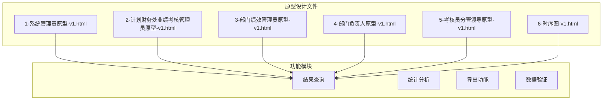
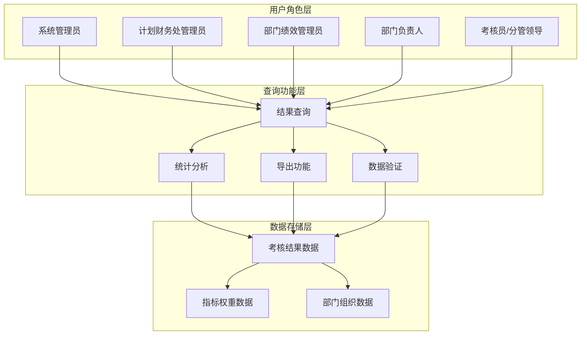
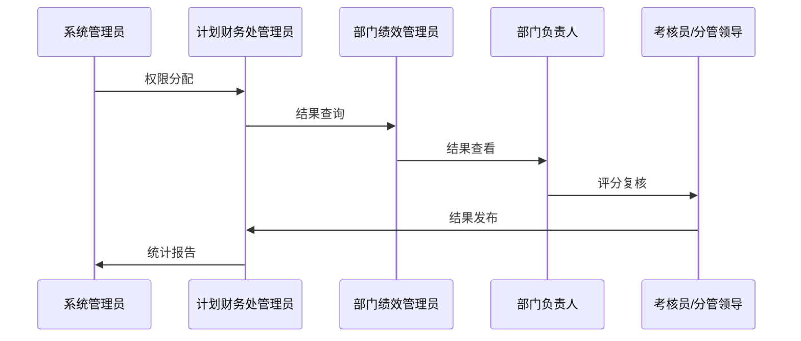
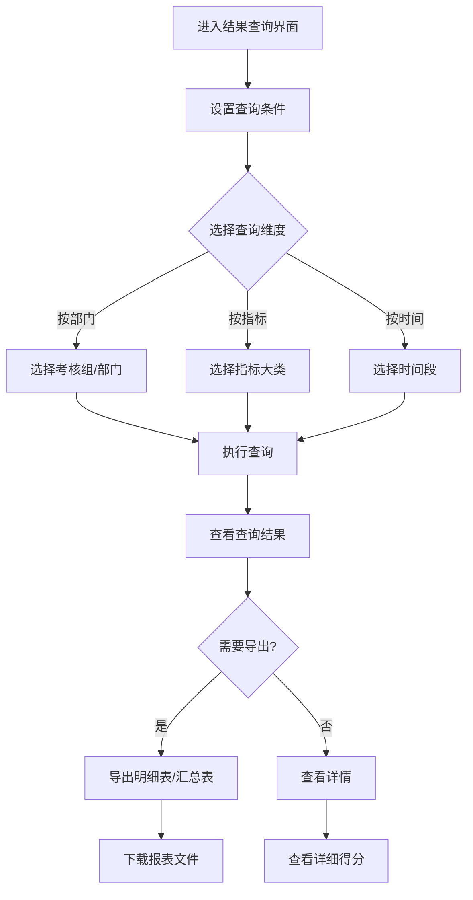
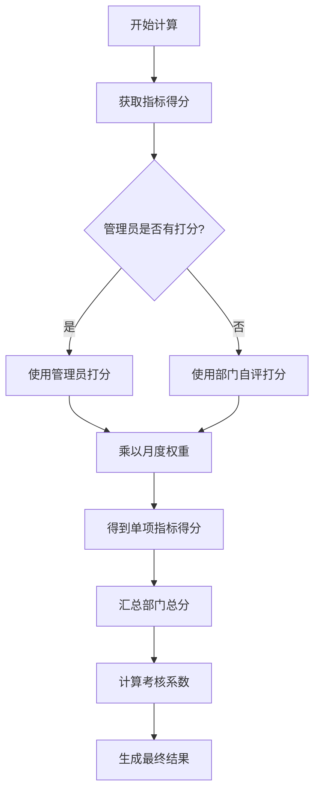
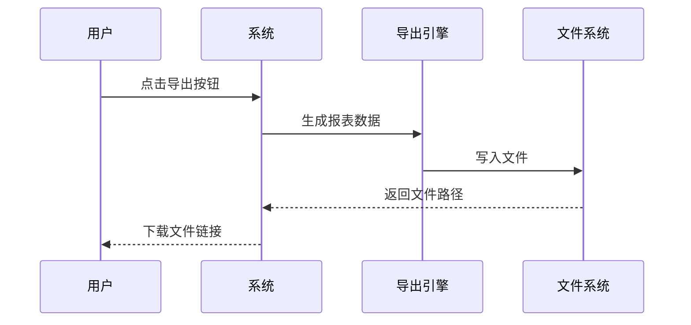
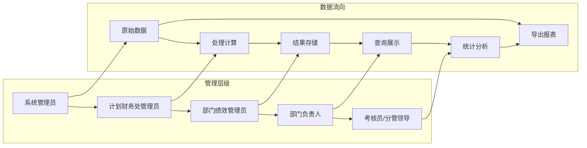

# 考核结果查询

<cite>
**本文档引用的文件**
- [1-系统管理员原型-v1.html](file://1-系统管理员原型-v1.html)
- [2-计划财务处业绩考核管理员原型-v1.html](file://2-计划财务处业绩考核管理员原型-v1.html)
- [3-部门绩效管理员原型-v1.html](file://3-部门绩效管理员原型-v1.html)
- [4-部门负责人原型-v1.html](file://4-部门负责人原型-v1.html)
- [5-考核员分管领导原型-v1.html](file://5-考核员分管领导原型-v1.html)
- [6-时序图-v1.html](file://6-时序图-v1.html)
</cite>

## 目录
1. [简介](#简介)
2. [项目结构](#项目结构)
3. [核心组件](#核心组件)
4. [架构概览](#架构概览)
5. [详细组件分析](#详细组件分析)
6. [依赖关系分析](#依赖关系分析)
7. [性能考虑](#性能考虑)
8. [故障排除指南](#故障排除指南)
9. [结论](#结论)

## 简介

本文档为"月度业绩考核管理"系统的"考核结果查询"功能提供专业的使用指南。该系统基于原型设计文档，展示了完整的考核管理流程，包括结果查询、统计分析、导出等功能。

系统采用多角色协作模式，涵盖系统管理员、计划财务处业绩考核管理员、部门绩效管理员、部门负责人、考核员/分管领导等多个角色，每个角色都有特定的权限和职责。

## 项目结构

该项目采用HTML原型设计方式，通过多个独立的页面文件实现不同的功能模块：

**图表来源**
- [1-系统管理员原型-v1.html:624-653](file://1-系统管理员原型-v1.html#L624-L653)
- [2-计划财务处业绩考核管理员原型-v1.html:623-653](file://2-计划财务处业绩考核管理员原型-v1.html#L623-L653)
- [3-部门绩效管理员原型-v1.html:701-761](file://3-部门绩效管理员原型-v1.html#L701-L761)

**章节来源**
- [1-系统管理员原型-v1.html:1-635](file://1-系统管理员原型-v1.html#L1-L635)
- [2-计划财务处业绩考核管理员原型-v1.html:1-1039](file://2-计划财务处业绩考核管理员原型-v1.html#L1-L1039)
- [3-部门绩效管理员原型-v1.html:1-1663](file://3-部门绩效管理员原型-v1.html#L1-L1663)
- [4-部门负责人原型-v1.html:1-1231](file://4-部门负责人原型-v1.html#L1-L1231)
- [5-考核员分管领导原型-v1.html:1-1459](file://5-考核员分管领导原型-v1.html#L1-L1459)
- [6-时序图-v1.html:1-570](file://6-时序图-v1.html#L1-L570)

## 核心组件

### 结果查询界面组件

系统提供了三个主要的结果查询界面，分别面向不同角色：

1. **系统管理员查询界面**
   - 支持按部门、按指标、按时间三种查询维度
   - 提供明细表和汇总表导出功能
   - 展示月度总分和考核系数

2. **计划财务处业绩考核管理员查询界面**
   - 支持按考核组、部门查询
   - 提供详细的得分统计信息
   - 支持导出功能

3. **部门绩效管理员查询界面**
   - 专注于本部门的历史考核结果
   - 提供详细的得分明细

**章节来源**
- [1-系统管理员原型-v1.html:623-653](file://1-系统管理员原型-v1.html#L623-L653)
- [2-计划财务处业绩考核管理员原型-v1.html:623-653](file://2-计划财务处业绩考核管理员原型-v1.html#L623-L653)
- [3-部门绩效管理员原型-v1.html:701-761](file://3-部门绩效管理员原型-v1.html#L701-L761)

### 查询维度组件

系统支持以下查询维度：

1. **按部门查询**
   - 按组织架构层级筛选
   - 支持职能部门和分公司的区分
   - 提供部门间的横向对比

2. **按指标查询**
   - 按考核指标大类筛选
   - 支持重点工作、基础工作、控制指标等分类
   - 提供指标层面的详细分析

3. **按时间查询**
   - 支持月度、季度、年度维度
   - 提供历史趋势分析
   - 支持时间段的灵活选择

**章节来源**
- [2-计划财务处业绩考核管理员原型-v1.html:623-653](file://2-计划财务处业绩考核管理员原型-v1.html#L623-L653)

## 架构概览

系统采用分层架构设计，通过多个角色协作实现完整的考核结果查询功能：

**图表来源**
- [6-时序图-v1.html:300-556](file://6-时序图-v1.html#L300-L556)

### 角色权限架构

**图表来源**
- [6-时序图-v1.html:340-556](file://6-时序图-v1.html#L340-L556)

## 详细组件分析

### 结果查询界面组件

#### 系统管理员查询界面

系统管理员界面提供了最全面的查询功能：

**图表来源**
- [1-系统管理员原型-v1.html:623-653](file://1-系统管理员原型-v1.html#L623-L653)

#### 查询条件设置

查询界面提供了丰富的筛选选项：

1. **基础查询条件**
   - 考核组选择：支持选择特定的考核组
   - 考核部门：可选择特定部门或全部部门
   - 查询维度：按部门、按指标、按时间三种模式

2. **高级查询条件**
   - 时间范围：支持自定义起止日期
   - 状态筛选：根据考核状态过滤结果
   - 权重配置：根据月度权重计算最终得分

**章节来源**
- [1-系统管理员原型-v1.html:629-638](file://1-系统管理员原型-v1.html#L629-L638)

### 统计分析组件

#### 得分计算规则

系统采用标准化的得分计算方法：

**图表来源**
- [6-时序图-v1.html:422-427](file://6-时序图-v1.html#L422-L427)

#### 结果组成要素

考核结果包含以下关键要素：

1. **各项指标得分**
   - 重点工作得分
   - 基础工作得分  
   - 控制指标得分
   - 动态督办得分

2. **总分计算**
   - 月度总分：各项指标得分之和
   - 考核系数：根据总分计算得出

3. **等级划分**
   - 优秀：90分以上
   - 良好：80-89分
   - 合格：70-79分
   - 需改进：60-69分
   - 不合格：60分以下

**章节来源**
- [2-计划财务处业绩考核管理员原型-v1.html:641-649](file://2-计划财务处业绩考核管理员原型-v1.html#L641-L649)

### 导出功能组件

#### 报表导出功能

系统提供两种导出格式：

1. **明细表导出**
   - 包含每个部门的详细得分
   - 支持Excel格式
   - 可按条件筛选导出

2. **汇总表导出**
   - 汇总各维度的统计结果
   - 支持PDF格式
   - 包含图表和统计分析

**图表来源**
- [6-时序图-v1.html:485-489](file://6-时序图-v1.html#L485-L489)

**章节来源**
- [1-系统管理员原型-v1.html:636-637](file://1-系统管理员原型-v1.html#L636-L637)

## 依赖关系分析

### 角色间依赖关系

**图表来源**
- [6-时序图-v1.html:340-556](file://6-时序图-v1.html#L340-L556)

### 数据依赖关系

系统中的数据依赖关系如下：

1. **基础数据依赖**
   - 指标权重数据 → 得分计算
   - 部门组织数据 → 部门筛选
   - 考核组数据 → 时间维度

2. **计算依赖关系**
   - 指标得分 → 部门总分
   - 部门总分 → 考核系数
   - 考核系数 → 最终评级

**章节来源**
- [6-时序图-v1.html:534-539](file://6-时序图-v1.html#L534-L539)

## 性能考虑

### 查询性能优化

1. **索引优化**
   - 按部门、时间、指标建立复合索引
   - 优化大数据量查询性能

2. **缓存策略**
   - 热门查询结果缓存
   - 统计数据定期预计算

3. **分页机制**
   - 大数据集分页显示
   - 懒加载机制

### 数据准确性保障

1. **数据校验**
   - 输入参数验证
   - 数据完整性检查
   - 逻辑一致性验证

2. **审计追踪**
   - 所有查询操作记录
   - 结果导出记录
   - 异常处理日志

## 故障排除指南

### 常见问题及解决方案

#### 查询无结果
1. **检查查询条件**
   - 确认时间范围设置正确
   - 验证部门选择是否正确
   - 检查指标分类是否合理

2. **系统状态检查**
   - 确认考核组状态为"已发布"
   - 验证数据同步是否正常
   - 检查权限配置是否正确

#### 数据不准确
1. **得分计算问题**
   - 检查管理员打分是否正确
   - 验证月度权重设置
   - 确认指标权重分配

2. **统计结果异常**
   - 检查数据源完整性
   - 验证计算公式正确性
   - 确认数据更新时间

#### 导出功能异常
1. **文件格式问题**
   - 检查浏览器兼容性
   - 验证文件大小限制
   - 确认存储空间充足

2. **导出数据缺失**
   - 检查查询条件设置
   - 验证权限范围
   - 确认数据访问权限

**章节来源**
- [6-时序图-v1.html:534-539](file://6-时序图-v1.html#L534-L539)

## 结论

"月度业绩考核管理"系统的考核结果查询功能通过多角色协作和标准化的数据处理流程，为用户提供了一个完整、准确、高效的考核结果查询解决方案。

系统的主要优势包括：
- **多维度查询**：支持按部门、指标、时间等多种维度查询
- **权限控制**：严格的权限分级管理
- **数据准确**：标准化的计算规则和数据验证
- **功能完善**：包含查询、统计、导出等完整功能链
- **用户体验**：直观的界面设计和操作流程

通过合理的架构设计和完善的错误处理机制，系统能够满足不同角色用户的查询需求，为企业的绩效管理提供强有力的技术支撑。