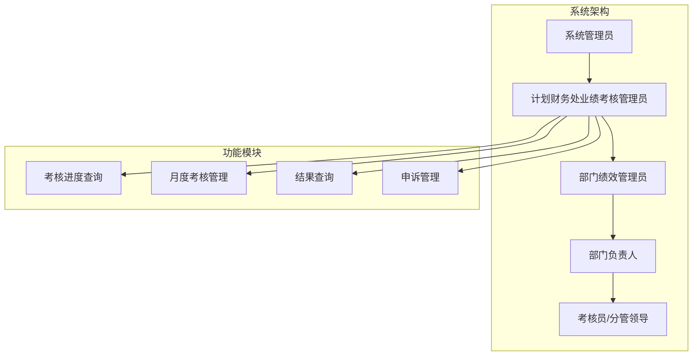
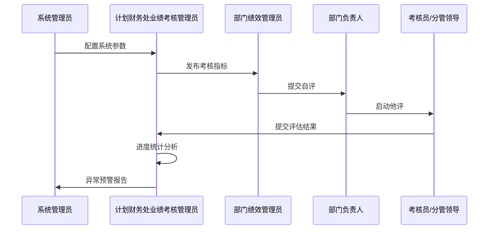
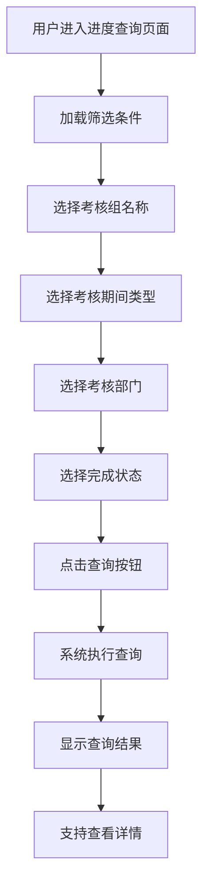
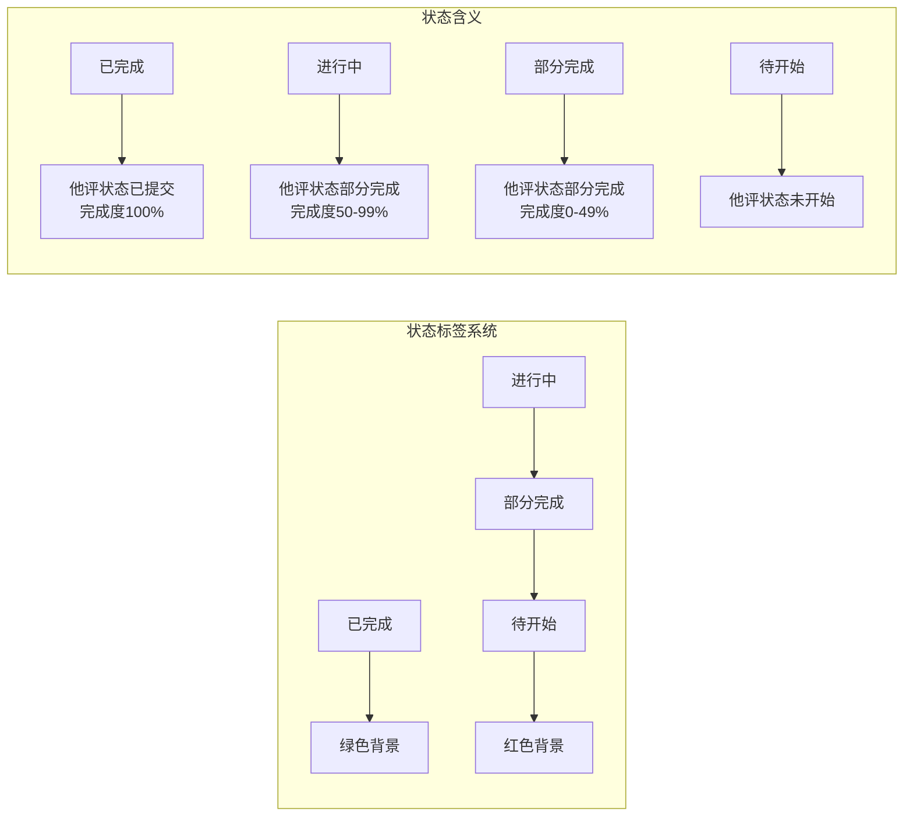
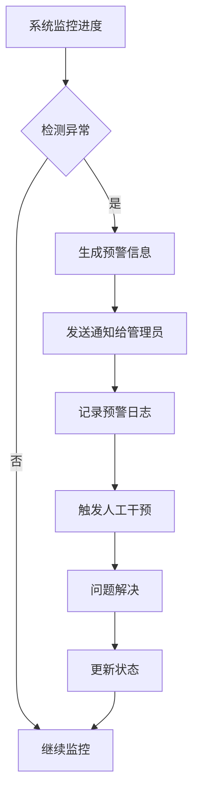
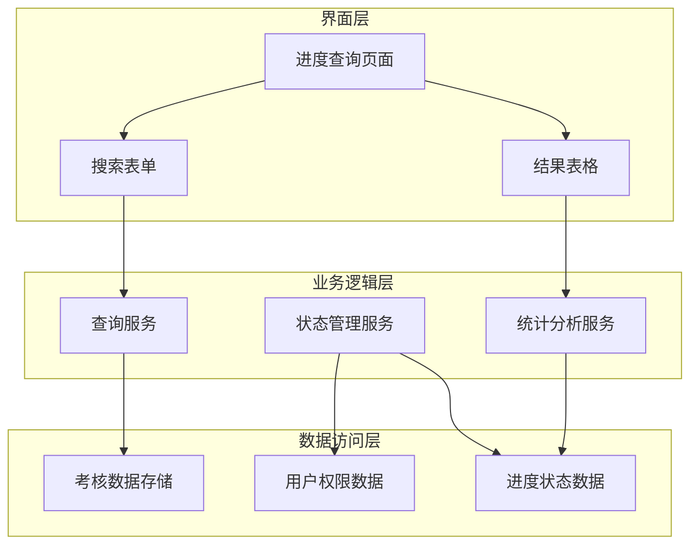

# 考核进度查询

<cite>
**本文档引用的文件**
- [系统管理员原型-v1.html](file://月度业绩考核原型设计初稿/1-系统管理员原型-v1.html)
- [计划财务处业绩考核管理员原型-v1.html](file://月度业绩考核原型设计初稿/2-计划财务处业绩考核管理员原型-v1.html)
- [部门绩效管理员原型-v1.html](file://月度业绩考核原型设计初稿/3-部门绩效管理员原型-v1.html)
- [部门负责人原型-v1.html](file://月度业绩考核原型设计初稿/4-部门负责人原型-v1.html)
- [考核员分管领导原型-v1.html](file://月度业绩考核原型设计初稿/5-考核员分管领导原型-v1.html)
- [时序图-v1.html](file://月度业绩考核原型设计初稿/6-时序图-v1.html)
</cite>

## 目录
1. [简介](#简介)
2. [项目结构](#项目结构)
3. [核心组件](#核心组件)
4. [架构概览](#架构概览)
5. [详细组件分析](#详细组件分析)
6. [依赖关系分析](#依赖关系分析)
7. [性能考虑](#性能考虑)
8. [故障排除指南](#故障排除指南)
9. [结论](#结论)

## 简介

本文档详细介绍月度业绩考核系统的"考核进度查询"功能，这是一个关键的管理工具，允许管理员按期间、部门维度查询绩效考核完成状态。该功能支持多种筛选条件，包括考核组、考核期间、考核部门、完成状态等维度，为管理者提供了全面的考核过程监控能力。

系统采用多角色协作模式，涵盖系统管理员、计划财务处业绩考核管理员、部门绩效管理员、部门负责人、考核员/分管领导等多个角色，每个角色都有特定的权限和职责分工。

## 项目结构

该项目采用原型设计的方式，通过HTML文件展示不同角色的界面和功能。整个系统围绕"月度业绩考核管理"这一核心主题构建，包含以下主要组成部分：

**图表来源**
- [系统管理员原型-v1.html:324-344](file://月度业绩考核原型设计初稿/1-系统管理员原型-v1.html#L324-L344)
- [计划财务处业绩考核管理员原型-v1.html:324-344](file://月度业绩考核原型设计初稿/2-计划财务处业绩考核管理员原型-v1.html#L324-L344)

**章节来源**
- [系统管理员原型-v1.html:1-635](file://月度业绩考核原型设计初稿/1-系统管理员原型-v1.html#L1-L635)
- [计划财务处业绩考核管理员原型-v1.html:1-1039](file://月度业绩考核原型设计初稿/2-计划财务处业绩考核管理员原型-v1.html#L1-L1039)

## 核心组件

### 进度查询页面组件

考核进度查询功能位于计划财务处业绩考核管理员的界面中，提供了一个专门的页面来监控各考核组的完成进度。

#### 页面布局结构
- **搜索区域**：包含多个筛选条件的表单区域
- **结果显示区**：以表格形式展示查询结果
- **分页控件**：支持大数据量的分页浏览

#### 关键功能特性
- 实时进度跟踪：显示每个部门的完成百分比
- 状态可视化：使用颜色标签直观显示状态
- 详细统计：提供完成指标数量和未完成指标数量

**章节来源**
- [计划财务处业绩考核管理员原型-v1.html:591-621](file://月度业绩考核原型设计初稿/2-计划财务处业绩考核管理员原型-v1.html#L591-L621)

### 筛选条件组件

系统提供了丰富的筛选条件，支持精细化的查询需求：

#### 主要筛选维度
1. **考核组名称**：支持模糊查询
2. **考核期间**：按月度考核筛选
3. **考核部门**：下拉选择具体部门
4. **完成状态**：多状态组合筛选

#### 状态标识系统
- **未提交**：自评状态为待提交
- **自评已提交**：自评状态为已提交
- **部分完成**：他评状态为部分完成
- **已完成**：他评状态为已提交且完成度100%

**章节来源**
- [计划财务处业绩考核管理员原型-v1.html:599-605](file://月度业绩考核原型设计初稿/2-计划财务处业绩考核管理员原型-v1.html#L599-L605)

## 架构概览

系统采用分层架构设计，每个角色都有明确的职责边界：

**图表来源**
- [时序图-v1.html:300-556](file://月度业绩考核原型设计初稿/6-时序图-v1.html#L300-L556)

### 角色权限矩阵

| 角色 | 主要职责 | 查询权限 | 操作权限 |
|------|----------|----------|----------|
| 系统管理员 | 系统配置管理 | 全局查询 | 用户管理 |
| 计划财务处业绩考核管理员 | 考核流程管理 | 全部部门进度 | 流程推进 |
| 部门绩效管理员 | 指标设定与自评 | 本部门进度 | 数据维护 |
| 部门负责人 | 审批与监督 | 下属部门进度 | 审批决策 |
| 考核员/分管领导 | 评估打分 | 被评估部门进度 | 打分复核 |

**章节来源**
- [系统管理员原型-v1.html:324-344](file://月度业绩考核原型设计初稿/1-系统管理员原型-v1.html#L324-L344)
- [部门负责人原型-v1.html:350-366](file://月度业绩考核原型设计初稿/4-部门负责人原型-v1.html#L350-L366)

## 详细组件分析

### 进度查询界面组件

#### 搜索表单设计
界面采用响应式设计，支持多种筛选条件的组合查询：

**图表来源**
- [计划财务处业绩考核管理员原型-v1.html:599-605](file://月度业绩考核原型设计初稿/2-计划财务处业绩考核管理员原型-v1.html#L599-L605)

#### 结果展示组件

查询结果以表格形式展示，包含以下关键列：
- **序号**：记录唯一标识
- **考核组名称**：显示所属考核组
- **考核期间**：显示考核时间段
- **考核部门**：显示被考核部门
- **自评状态**：显示自评完成状态
- **他评状态**：显示他评完成状态
- **完成进度**：显示整体完成百分比
- **未完成指标**：显示剩余待完成指标数量

#### 状态标签系统

系统使用颜色编码的状态标签，提供直观的状态指示：

**图表来源**
- [计划财务处业绩考核管理员原型-v1.html:611-616](file://月度业绩考核原型设计初稿/2-计划财务处业绩考核管理员原型-v1.html#L611-L616)

**章节来源**
- [计划财务处业绩考核管理员原型-v1.html:591-621](file://月度业绩考核原型设计初稿/2-计划财务处业绩考核管理员原型-v1.html#L591-L621)

### 统计分析组件

#### 进度统计功能
系统提供多层次的统计分析能力：

1. **部门级统计**：按部门维度统计完成情况
2. **时间维度分析**：按考核期间分析趋势
3. **状态分布统计**：统计各状态的分布情况
4. **异常预警**：识别进度异常的部门

#### 可视化展示
- **进度条**：直观显示完成百分比
- **状态标签**：颜色区分不同状态
- **数字统计**：提供精确的数据指标

**章节来源**
- [计划财务处业绩考核管理员原型-v1.html:611-616](file://月度业绩考核原型设计初稿/2-计划财务处业绩考核管理员原型-v1.html#L611-L616)

### 异常预警机制

#### 预警触发条件
系统能够自动识别以下异常情况：
- **进度严重滞后**：完成度远低于同周期平均水平
- **状态长时间不变**：某个状态持续较长时间无变化
- **部门间差异过大**：同一周期内部门间完成度差异显著

#### 预警处理流程

**图表来源**
- [计划财务处业绩考核管理员原型-v1.html:591-621](file://月度业绩考核原型设计初稿/2-计划财务处业绩考核管理员原型-v1.html#L591-L621)

**章节来源**
- [计划财务处业绩考核管理员原型-v1.html:591-621](file://月度业绩考核原型设计初稿/2-计划财务处业绩考核管理员原型-v1.html#L591-L621)

## 依赖关系分析

### 组件耦合关系

**图表来源**
- [计划财务处业绩考核管理员原型-v1.html:591-621](file://月度业绩考核原型设计初稿/2-计划财务处业绩考核管理员原型-v1.html#L591-L621)

### 角色间依赖关系

不同角色对进度查询功能的依赖程度不同：

| 角色 | 依赖程度 | 使用频率 | 关键需求 |
|------|----------|----------|----------|
| 系统管理员 | 高 | 低 | 全局监控 |
| 计划财务处业绩考核管理员 | 高 | 高 | 流程推进 |
| 部门绩效管理员 | 中 | 中 | 自评进度 |
| 部门负责人 | 中 | 中 | 审批监督 |
| 考核员/分管领导 | 低 | 低 | 评估进度 |

**章节来源**
- [系统管理员原型-v1.html:324-344](file://月度业绩考核原型设计初稿/1-系统管理员原型-v1.html#L324-L344)
- [部门负责人原型-v1.html:350-366](file://月度业绩考核原型设计初稿/4-部门负责人原型-v1.html#L350-L366)

## 性能考虑

### 查询性能优化

1. **索引策略**：对常用查询字段建立数据库索引
2. **缓存机制**：对热门查询结果进行缓存
3. **分页加载**：大数据量时采用分页策略
4. **异步加载**：避免阻塞用户界面

### 响应式设计

系统采用响应式布局，适配不同屏幕尺寸：
- **桌面端**：完整的功能界面
- **平板端**：简化后的功能布局
- **移动端**：核心功能的最小化实现

## 故障排除指南

### 常见问题及解决方案

#### 查询无结果
**可能原因**：
- 筛选条件过于严格
- 数据尚未产生
- 权限不足

**解决步骤**：
1. 检查筛选条件设置
2. 确认数据产生时间
3. 验证用户权限范围

#### 进度显示异常
**可能原因**：
- 系统数据同步延迟
- 状态更新不及时
- 缓存数据过期

**解决步骤**：
1. 刷新页面数据
2. 清除浏览器缓存
3. 联系系统管理员检查

#### 权限访问受限
**可能原因**：
- 用户角色权限不足
- 部门范围限制
- 系统配置问题

**解决步骤**：
1. 确认当前登录用户角色
2. 检查部门权限范围
3. 联系系统管理员授权

**章节来源**
- [系统管理员原型-v1.html:324-344](file://月度业绩考核原型设计初稿/1-系统管理员原型-v1.html#L324-L344)

## 结论

考核进度查询功能作为月度业绩考核系统的核心管理工具，为各级管理人员提供了全面的考核过程监控能力。通过多维度的筛选条件、直观的状态展示、实时的统计分析和智能的异常预警，该功能有效地支撑了考核工作的顺利开展。

系统的设计充分考虑了不同角色的需求，通过清晰的权限分离和职责划分，确保了考核流程的规范性和有效性。同时，响应式的设计和良好的用户体验，使得该功能能够在各种设备和环境下稳定运行。

未来可以进一步优化的方向包括：增强移动端体验、完善自动化提醒机制、扩展更多维度的分析报表等，以更好地满足不断发展的管理需求。