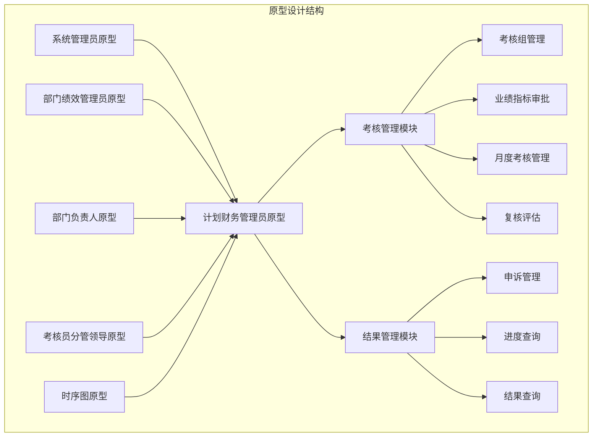
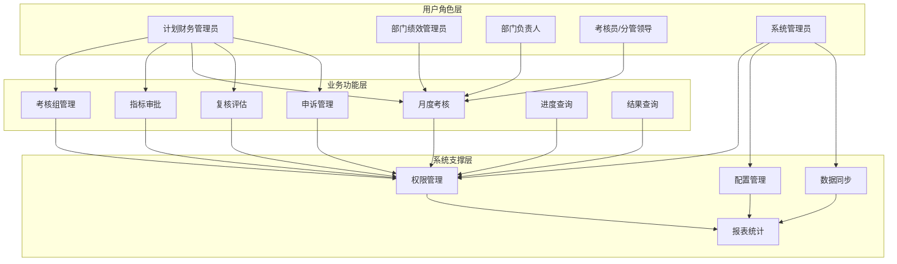
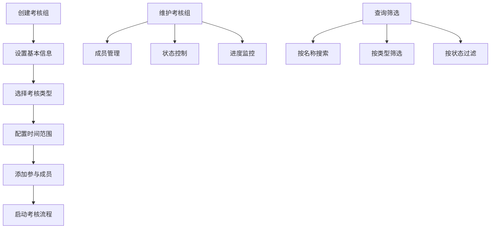
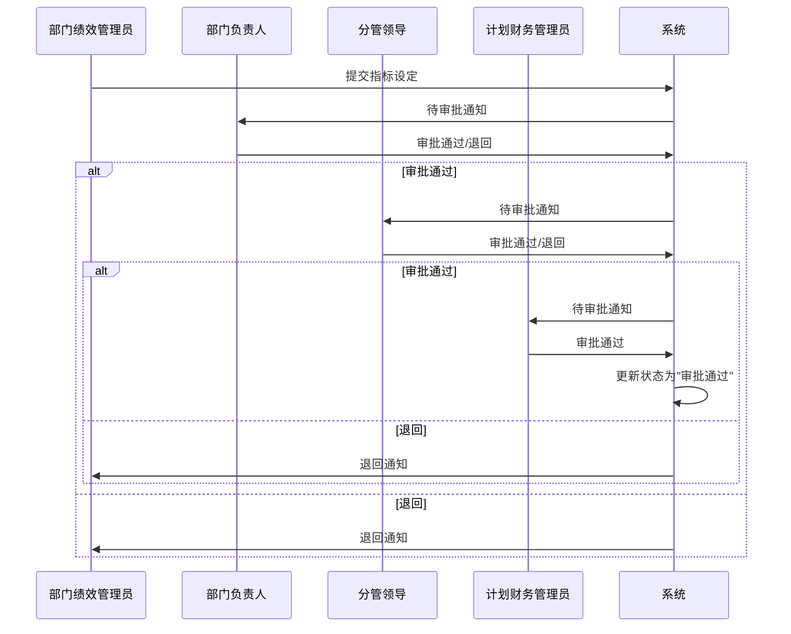
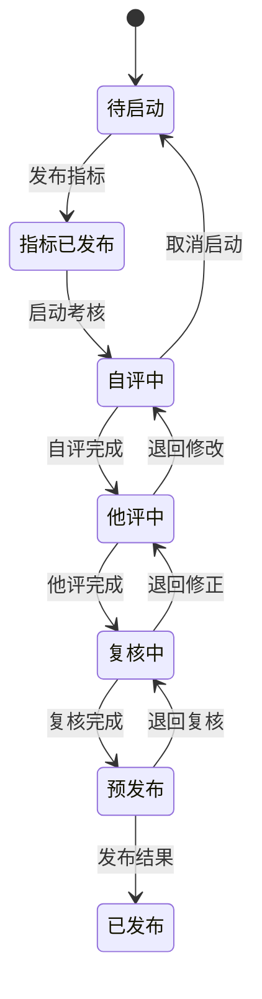
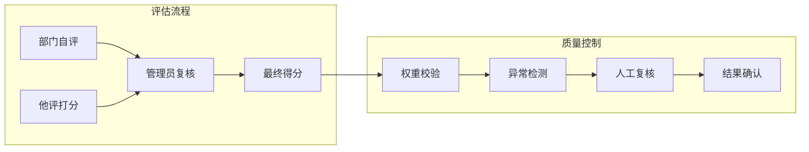
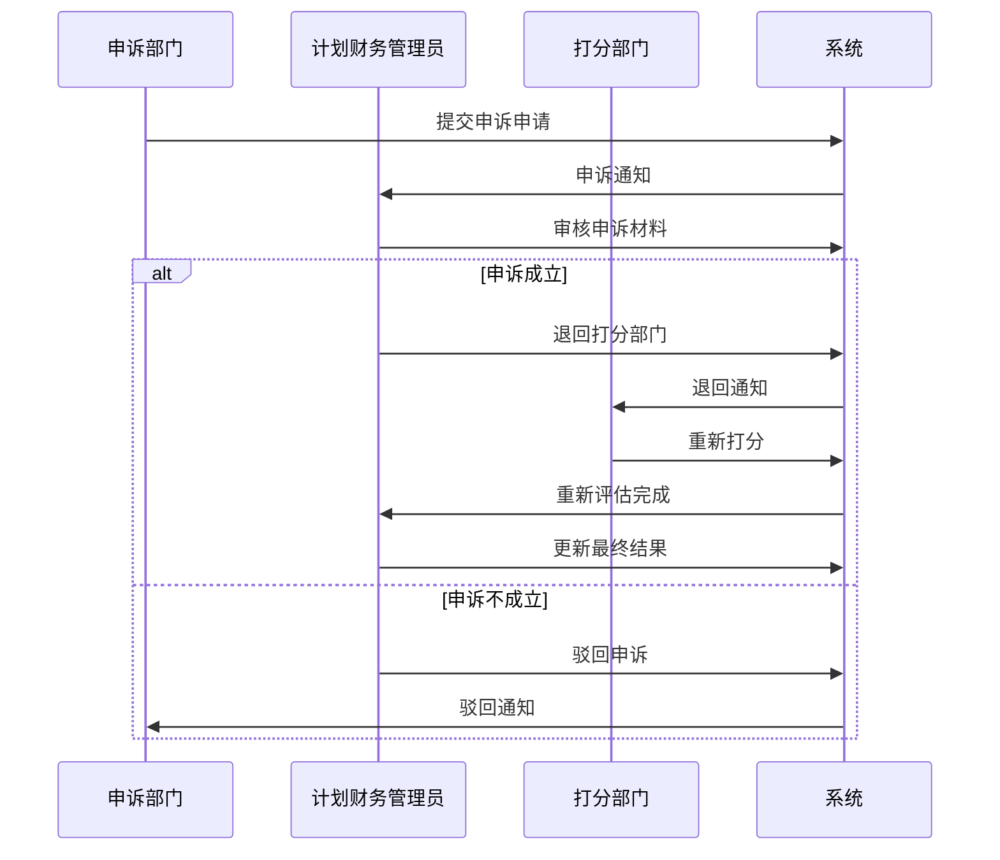
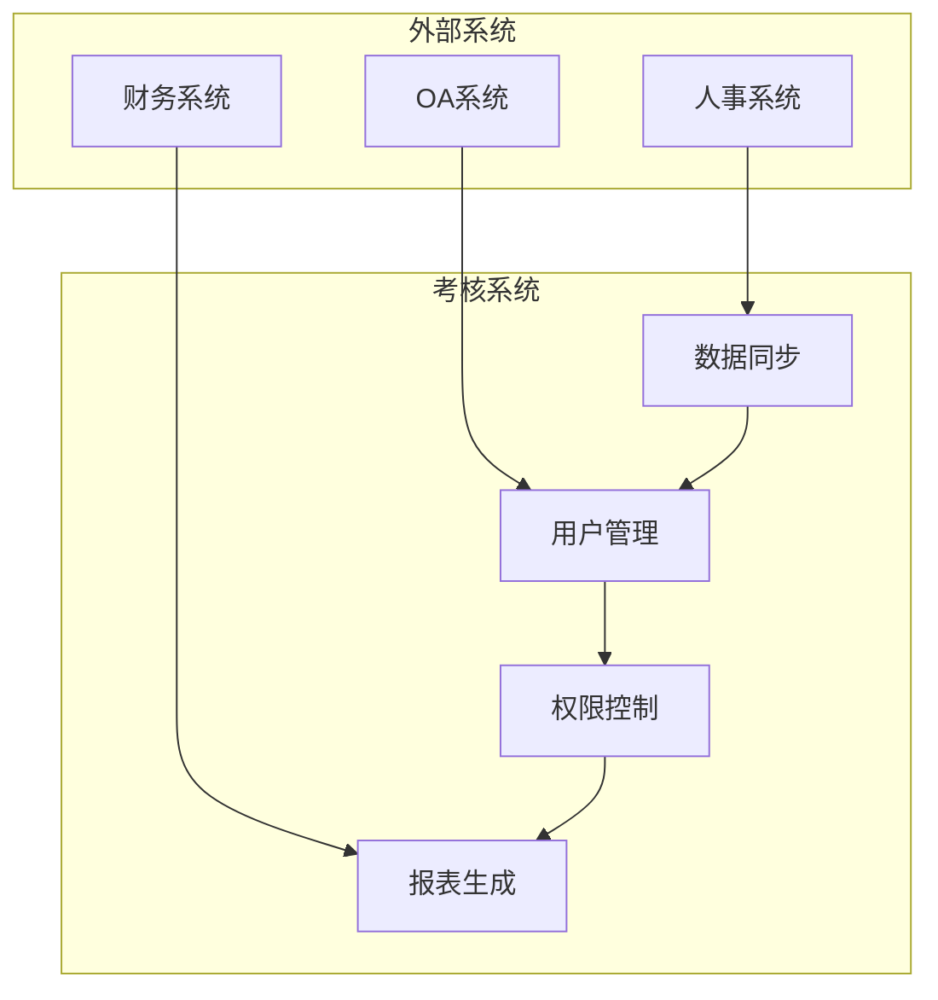

# 计划财务管理员指南

<cite>
**本文档引用的文件**
- [2-计划财务处业绩考核管理员原型-v1.html](file://2-计划财务处业绩考核管理员原型-v1.html)
- [1-系统管理员原型-v1.html](file://1-系统管理员原型-v1.html)
- [3-部门绩效管理员原型-v1.html](file://3-部门绩效管理员原型-v1.html)
- [4-部门负责人原型-v1.html](file://4-部门负责人原型-v1.html)
- [5-考核员分管领导原型-v1.html](file://5-考核员分管领导原型-v1.html)
- [6-时序图-v1.html](file://6-时序图-v1.html)
</cite>

## 目录
1. [简介](#简介)
2. [项目结构](#项目结构)
3. [核心组件](#核心组件)
4. [架构概览](#架构概览)
5. [详细组件分析](#详细组件分析)
6. [依赖关系分析](#依赖关系分析)
7. [性能考虑](#性能考虑)
8. [故障排除指南](#故障排除指南)
9. [结论](#结论)
10. [附录](#附录)

## 简介

本指南面向计划财务部(改革办公室)业绩考核管理员，提供月度业绩考核管理系统的专业使用指导。该系统采用原型设计方法，通过HTML页面模拟完整的考核管理流程，涵盖考核组管理、业绩指标审批、月度考核管理、复核评估、申诉管理等核心业务功能。

系统基于统一的前端框架，提供多种视觉风格切换，支持响应式设计，确保在不同设备上的良好用户体验。管理员可以通过直观的界面完成复杂的考核管理工作，实现从指标设定到结果发布的全流程管控。

## 项目结构

项目采用模块化的HTML原型设计，每个角色都有独立的功能页面：

**图表来源**
- [2-计划财务处业绩考核管理员原型-v1.html:324-344](file://2-计划财务处业绩考核管理员原型-v1.html#L324-L344)
- [1-系统管理员原型-v1.html:291-316](file://1-系统管理员原型-v1.html#L291-L316)

**章节来源**
- [2-计划财务处业绩考核管理员原型-v1.html:1-1039](file://2-计划财务处业绩考核管理员原型-v1.html#L1-L1039)
- [1-系统管理员原型-v1.html:1-635](file://1-系统管理员原型-v1.html#L1-L635)

## 核心组件

### 考核管理模块

系统的核心功能围绕四个主要模块构建：

#### 考核组管理
负责整个考核周期的统筹管理，包括：
- 考核组创建与维护
- 成员管理与权限控制
- 考核流程启动与监控
- 进度跟踪与状态更新

#### 业绩指标审批
提供多层级的指标审批流程：
- 年度指标设定审批
- 月度指标发布控制
- 审批状态跟踪
- 退回与修改流程

#### 月度考核管理
完整的月度考核执行流程：
- 指标发布与启动
- 自评与他评管理
- 复核与修正
- 预发布与正式发布

#### 复核评估
质量控制与数据准确性保障：
- 打分复核与修正
- 异常数据处理
- 最终得分计算
- 考核系数确定

**章节来源**
- [2-计划财务处业绩考核管理员原型-v1.html:353-560](file://2-计划财务处业绩考核管理员原型-v1.html#L353-L560)

### 结果管理模块

#### 申诉管理
建立完善的申诉处理机制：
- 申诉申请与受理
- 材料审核与验证
- 退回与重新评估
- 处理结果跟踪

#### 进度查询
实时监控考核进展：
- 各部门完成状态
- 关键节点提醒
- 异常情况预警
- 统计数据分析

#### 结果查询
考核结果的查询与导出：
- 详细结果查看
- 汇总数据导出
- 历史记录追溯
- 报告生成支持

**章节来源**
- [2-计划财务处业绩考核管理员原型-v1.html:562-653](file://2-计划财务处业绩考核管理员原型-v1.html#L562-L653)

## 架构概览

系统采用分层架构设计，通过角色分离实现职责明确的管理体系：

**图表来源**
- [2-计划财务处业绩考核管理员原型-v1.html:324-344](file://2-计划财务处业绩考核管理员原型-v1.html#L324-L344)
- [1-系统管理员原型-v1.html:291-316](file://1-系统管理员原型-v1.html#L291-L316)

### 角色权限体系

系统建立了清晰的角色权限矩阵：

| 角色 | 主要职责 | 权限范围 |
|------|----------|----------|
| 计划财务管理员 | 考核总指挥 | 全部考核管理功能 |
| 部门绩效管理员 | 指标设定与自评 | 部门内指标管理 |
| 部门负责人 | 指标审批与结果查看 | 所属部门审批权限 |
| 考核员/分管领导 | 他评打分与复核 | 对应部门评估权限 |
| 系统管理员 | 系统配置与维护 | 系统级管理功能 |

**章节来源**
- [1-系统管理员原型-v1.html:521-539](file://1-系统管理员原型-v1.html#L521-L539)
- [2-计划财务处业绩考核管理员原型-v1.html:324-344](file://2-计划财务处业绩考核管理员原型-v1.html#L324-L344)

## 详细组件分析

### 考核组管理分析

#### 功能特性
考核组管理是整个系统的中枢，提供以下核心功能：

**图表来源**
- [2-计划财务处业绩考核管理员原型-v1.html:658-730](file://2-计划财务处业绩考核管理员原型-v1.html#L658-L730)

#### 操作流程
1. **新增考核组**
   - 选择考核类别（业绩指标设定/绩效考核）
   - 输入考核组名称
   - 设置开始结束日期
   - 保存配置

2. **成员维护**
   - 添加参与部门/分公司
   - 设置角色权限
   - 管理成员变更

3. **流程控制**
   - 启动/暂停考核
   - 查看执行进度
   - 状态更新

**章节来源**
- [2-计划财务处业绩考核管理员原型-v1.html:353-447](file://2-计划财务处业绩考核管理员原型-v1.html#L353-L447)

### 业绩指标审批分析

#### 审批流程
指标审批采用三级审批机制，确保指标设定的准确性和合理性：

**图表来源**
- [6-时序图-v1.html:155-241](file://6-时序图-v1.html#L155-L241)

#### 审批标准
- **完整性检查**：确保所有必填指标都已设定
- **合理性验证**：检查指标目标值的可行性
- **一致性核对**：验证跨部门指标的一致性
- **合规性审查**：符合公司考核政策要求

**章节来源**
- [2-计划财务处业绩考核管理员原型-v1.html:449-479](file://2-计划财务处业绩考核管理员原型-v1.html#L449-L479)

### 月度考核管理分析

#### 考核流程
月度考核采用完整的生命周期管理模式：

**图表来源**
- [6-时序图-v1.html:494-529](file://6-时序图-v1.html#L494-L529)

#### 关键控制点
1. **指标发布**：确保所有部门都能及时获取考核指标
2. **自评管理**：监督各部门按时完成自评工作
3. **他评协调**：组织部门间的相互评估
4. **质量复核**：保证评估结果的客观公正
5. **结果发布**：统一发布最终考核结果

**章节来源**
- [2-计划财务处业绩考核管理员原型-v1.html:481-531](file://2-计划财务处业绩考核管理员原型-v1.html#L481-L531)

### 复核评估分析

#### 评估机制
复核评估采用双轨制确保评估质量：

**图表来源**
- [2-计划财务处业绩考核管理员原型-v1.html:532-560](file://2-计划财务处业绩考核管理员原型-v1.html#L532-L560)

#### 打分规则
- **优先原则**：管理员打分优先于部门自评分
- **权重计算**：最终得分 = 打分 × 月度权重
- **汇总规则**：按指标大类汇总计算部门总分
- **系数确定**：根据总分确定月度考核系数

**章节来源**
- [2-计划财务处业绩考核管理员原型-v1.html:547-558](file://2-计划财务考核管理员原型-v1.html#L547-L558)

### 申诉管理分析

#### 申诉处理流程
建立标准化的申诉处理机制：

**图表来源**
- [6-时序图-v1.html:440-467](file://6-时序图-v1.html#L440-L467)

#### 处理要点
- **材料审核**：验证申诉材料的真实性和完整性
- **事实认定**：客观判断申诉事项的合理性
- **流程控制**：严格按照既定流程处理每一起申诉
- **记录保存**：完整记录申诉处理过程和结果

**章节来源**
- [2-计划财务处业绩考核管理员原型-v1.html:562-589](file://2-计划财务处业绩考核管理员原型-v1.html#L562-L589)

## 依赖关系分析

### 系统集成关系

**图表来源**
- [1-系统管理员原型-v1.html:541-559](file://1-系统管理员原型-v1.html#L541-L559)

### 数据流关系

系统内部的数据流向呈现层次化特征：

1. **用户数据**：从人事系统同步到权限管理系统
2. **指标数据**：从指标库到各考核组的分发
3. **评估数据**：从部门到管理员的逐级汇总
4. **结果数据**：从系统到各查询模块的分发

**章节来源**
- [1-系统管理员原型-v1.html:541-559](file://1-系统管理员原型-v1.html#L541-L559)

## 性能考虑

### 系统性能优化

#### 前端性能
- **资源加载优化**：采用懒加载策略，减少初始页面体积
- **缓存机制**：合理利用浏览器缓存，提升重复访问速度
- **响应式设计**：适配不同屏幕尺寸，优化移动端体验

#### 后端性能
- **数据库优化**：合理的索引设计和查询优化
- **并发控制**：高并发场景下的数据一致性保证
- **异步处理**：耗时操作采用异步处理，提升用户体验

### 用户体验优化

#### 界面交互
- **状态反馈**：操作结果的即时反馈和提示
- **进度指示**：长操作的进度显示和取消功能
- **错误处理**：友好的错误提示和恢复机制

#### 数据展示
- **分页加载**：大数据量的分页和虚拟滚动
- **搜索过滤**：高效的搜索和筛选功能
- **统计图表**：直观的数据可视化展示

## 故障排除指南

### 常见问题及解决方案

#### 登录认证问题
**现象**：无法登录系统或频繁退出
**可能原因**：
- 会话超时
- 权限配置错误
- 浏览器兼容性问题

**解决步骤**：
1. 检查网络连接稳定性
2. 清除浏览器缓存和Cookie
3. 验证账号权限状态
4. 尝试使用其他浏览器

#### 数据同步异常
**现象**：用户信息或部门信息不同步
**解决步骤**：
1. 检查人事系统接口状态
2. 验证同步参数配置
3. 查看同步日志和错误信息
4. 手动触发同步操作

#### 权限访问受限
**现象**：某些功能按钮不可用或页面无法访问
**解决步骤**：
1. 确认当前用户角色权限
2. 检查角色对应的菜单权限
3. 验证数据范围授权
4. 联系系统管理员调整权限

### 系统监控与维护

#### 性能监控
- **响应时间监控**：关键页面和接口的响应时间
- **并发用户监控**：同时在线用户的数量和分布
- **资源使用监控**：CPU、内存、磁盘空间使用情况

#### 日志管理
- **操作日志**：记录重要操作的时间、用户和结果
- **错误日志**：收集系统错误和异常信息
- **审计日志**：追踪敏感数据的访问和修改

**章节来源**
- [1-系统管理员原型-v1.html:541-559](file://1-系统管理员原型-v1.html#L541-L559)

## 结论

计划财务管理员原型系统通过模块化的设计理念，为月度业绩考核管理提供了完整的数字化解决方案。系统不仅涵盖了从指标设定到结果发布的全流程管理，还建立了完善的权限控制和质量保证机制。

通过角色分离和职责明确的权限体系，系统实现了高效协同的工作模式。同时，标准化的流程和严格的控制点确保了考核工作的规范性和准确性。

建议在实际部署中重点关注：
1. **流程培训**：确保各角色充分理解自身职责和操作流程
2. **数据治理**：建立完善的数据管理制度和质量控制机制
3. **系统维护**：制定定期的系统维护和升级计划
4. **持续改进**：根据使用反馈不断优化系统功能和用户体验

## 附录

### 快速操作指南

#### 考核组管理快捷操作
1. **新建考核组**：点击"新增考核组"按钮，填写基本信息后保存
2. **成员维护**：在考核组详情中添加或移除参与部门
3. **流程启动**：选择"启动"操作激活考核流程

#### 指标审批快速处理
1. **批量审批**：在审批列表中勾选多个指标进行批量处理
2. **状态跟踪**：通过状态标签快速识别需要处理的指标
3. **退回处理**：使用退回功能向部门反馈修改意见

#### 考核进度监控
1. **实时监控**：通过进度条和状态标签查看各考核组进展
2. **异常预警**：关注超时未完成的考核组
3. **统计分析**：利用统计图表了解整体考核情况

### 支持联系方式

- **技术支持**：IT服务台电话：XXXX-XXXXXXXX
- **系统管理员**：张工，邮箱：zhang@company.com
- **业务咨询**：李主任，邮箱：li@company.com