# 部署和维护指南

<cite>
**本文档引用的文件**
- [1-系统管理员原型-v1.html](file://月度业绩考核原型设计初稿/1-系统管理员原型-v1.html)
- [2-计划财务处业绩考核管理员原型-v1.html](file://月度业绩考核原型设计初稿/2-计划财务处业绩考核管理员原型-v1.html)
- [3-部门绩效管理员原型-v1.html](file://月度业绩考核原型设计初稿/3-部门绩效管理员原型-v1.html)
- [4-部门负责人原型-v1.html](file://月度业绩考核原型设计初稿/4-部门负责人原型-v1.html)
- [5-考核员分管领导原型-v1.html](file://月度业绩考核原型设计初稿/5-考核员分管领导原型-v1.html)
- [6-时序图-v1.html](file://月度业绩考核原型设计初稿/6-时序图-v1.html)
</cite>

## 目录
1. [简介](#简介)
2. [项目结构](#项目结构)
3. [核心组件](#核心组件)
4. [架构概览](#架构概览)
5. [详细组件分析](#详细组件分析)
6. [依赖关系分析](#依赖关系分析)
7. [性能考虑](#性能考虑)
8. [故障排除指南](#故障排除指南)
9. [结论](#结论)
10. [附录](#附录)

## 简介

月度业绩考核管理系统是一个基于Web的绩效管理平台，采用原型设计方法，通过HTML、CSS和JavaScript实现完整的用户界面和交互逻辑。该系统支持多角色协作的绩效考核流程，包括指标设定、月度考核、申诉处理等功能模块。

系统采用响应式设计，支持多种主题风格切换，提供直观的用户界面和流畅的操作体验。所有功能均通过前端原型实现，无需后端服务器即可运行。

## 项目结构

项目采用原型设计文件组织方式，每个文件代表一个特定角色的用户界面原型：

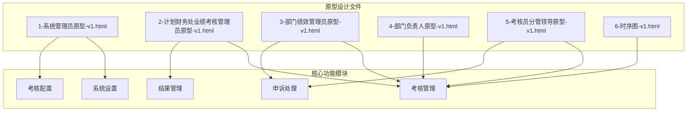

**图表来源**
- [1-系统管理员原型-v1.html:1-635](file://月度业绩考核原型设计初稿/1-系统管理员原型-v1.html#L1-L635)
- [2-计划财务处业绩考核管理员原型-v1.html:1-1039](file://月度业绩考核原型设计初稿/2-计划财务处业绩考核管理员原型-v1.html#L1-L1039)
- [3-部门绩效管理员原型-v1.html:1-1663](file://月度业绩考核原型设计初稿/3-部门绩效管理员原型-v1.html#L1-L1663)
- [4-部门负责人原型-v1.html:1-1231](file://月度业绩考核原型设计初稿/4-部门负责人原型-v1.html#L1-L1231)
- [5-考核员分管领导原型-v1.html:1-1459](file://月度业绩考核原型设计初稿/5-考核员分管领导原型-v1.html#L1-L1459)
- [6-时序图-v1.html:1-570](file://月度业绩考核原型设计初稿/6-时序图-v1.html#L1-L570)

**章节来源**
- [1-系统管理员原型-v1.html:1-635](file://月度业绩考核原型设计初稿/1-系统管理员原型-v1.html#L1-L635)
- [2-计划财务处业绩考核管理员原型-v1.html:1-1039](file://月度业绩考核原型设计初稿/2-计划财务处业绩考核管理员原型-v1.html#L1-L1039)
- [3-部门绩效管理员原型-v1.html:1-1663](file://月度业绩考核原型设计初稿/3-部门绩效管理员原型-v1.html#L1-L1663)
- [4-部门负责人原型-v1.html:1-1231](file://月度业绩考核原型设计初稿/4-部门负责人原型-v1.html#L1-L1231)
- [5-考核员分管领导原型-v1.html:1-1459](file://月度业绩考核原型设计初稿/5-考核员分管领导原型-v1.html#L1-L1459)
- [6-时序图-v1.html:1-570](file://月度业绩考核原型设计初稿/6-时序图-v1.html#L1-L570)

## 核心组件

### 角色管理系统

系统支持五个核心角色，每个角色都有专门的用户界面和功能权限：

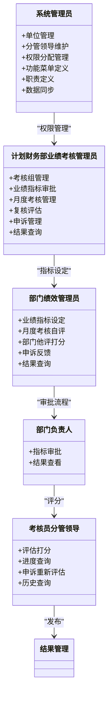

**图表来源**
- [1-系统管理员原型-v1.html:291-316](file://月度业绩考核原型设计初稿/1-系统管理员原型-v1.html#L291-L316)
- [2-计划财务处业绩考核管理员原型-v1.html:324-344](file://月度业绩考核原型设计初稿/2-计划财务处业绩考核管理员原型-v1.html#L324-L344)
- [3-部门绩效管理员原型-v1.html:411-430](file://月度业绩考核原型设计初稿/3-部门绩效管理员原型-v1.html#L411-L430)
- [4-部门负责人原型-v1.html:350-366](file://月度业绩考核原型设计初稿/4-部门负责人原型-v1.html#L350-L366)
- [5-考核员分管领导原型-v1.html:196-227](file://月度业绩考核原型设计初稿/5-考核员分管领导原型-v1.html#L196-L227)

### 主题风格系统

系统内置四种主题风格，支持动态切换：

- **默认风格**：传统蓝色商务风格
- **百度商务风格**：参考百度设计语言
- **飞书应用风格**：现代化简洁设计
- **科技风格**：深色主题科技感
- **央企国企风格**：正式庄重的企业风格

**章节来源**
- [1-系统管理员原型-v1.html:7-149](file://月度业绩考核原型设计初稿/1-系统管理员原型-v1.html#L7-L149)
- [2-计划财务处业绩考核管理员原型-v1.html:8-184](file://月度业绩考核原型设计初稿/2-计划财务处业绩考核管理员原型-v1.html#L8-L184)
- [3-部门绩效管理员原型-v1.html:7-179](file://月度业绩考核原型设计初稿/3-部门绩效管理员原型-v1.html#L7-L179)
- [4-部门负责人原型-v1.html:7-160](file://月度业绩考核原型设计初稿/4-部门负责人原型-v1.html#L7-L160)
- [5-考核员分管领导原型-v1.html:7-192](file://月度业绩考核原型设计初稿/5-考核员分管领导原型-v1.html#L7-L192)

## 架构概览

系统采用前后端分离的原型架构设计，所有功能通过前端JavaScript实现，无需服务器端逻辑。

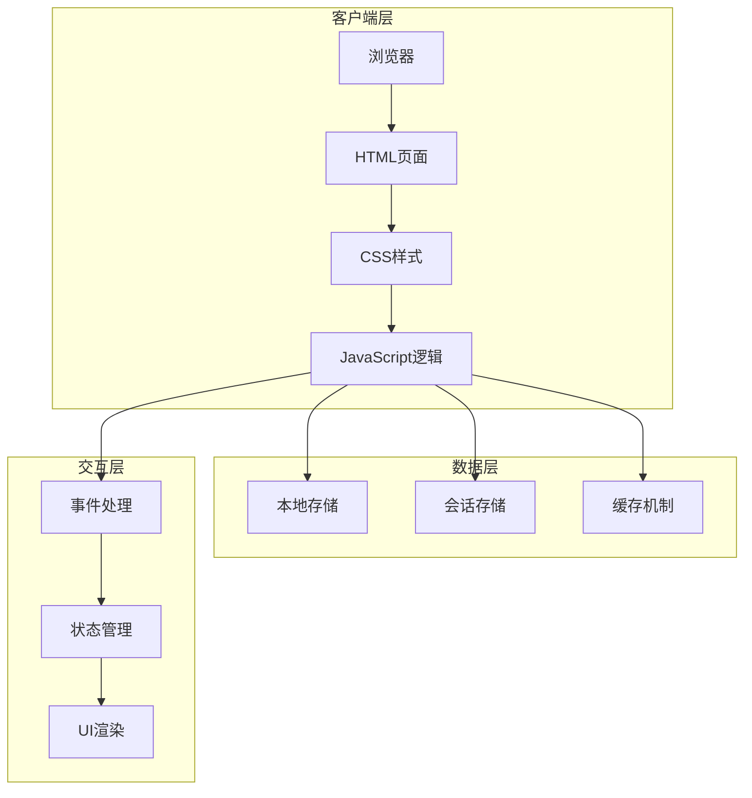

**图表来源**
- [1-系统管理员原型-v1.html:612-632](file://月度业绩考核原型设计初稿/1-系统管理员原型-v1.html#L612-L632)
- [2-计划财务处业绩考核管理员原型-v1.html:664-712](file://月度业绩考核原型设计初稿/2-计划财务处业绩考核管理员原型-v1.html#L664-L712)
- [3-部门绩效管理员原型-v1.html:766-800](file://月度业绩考核原型设计初稿/3-部门绩效管理员原型-v1.html#L766-L800)

## 详细组件分析

### 1. 系统管理员模块

系统管理员负责整个系统的基础设施配置和权限管理。

#### 核心功能模块

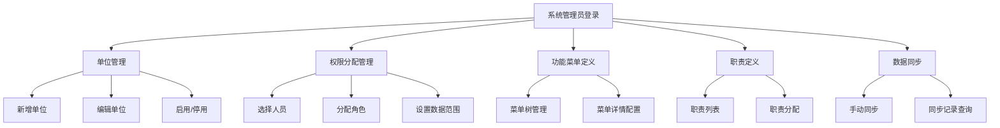

**图表来源**
- [1-系统管理员原型-v1.html:329-559](file://月度业绩考核原型设计初稿/1-系统管理员原型-v1.html#L329-L559)

#### 权限管理流程

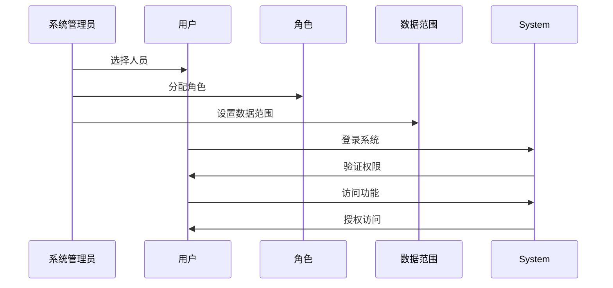

**图表来源**
- [1-系统管理员原型-v1.html:390-414](file://月度业绩考核原型设计初稿/1-系统管理员原型-v1.html#L390-L414)

**章节来源**
- [1-系统管理员原型-v1.html:329-559](file://月度业绩考核原型设计初稿/1-系统管理员原型-v1.html#L329-L559)

### 2. 计划财务处业绩考核管理员模块

负责月度考核的全流程管理，包括指标审批、考核组管理和结果复核。

#### 考核流程管理

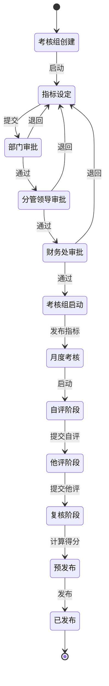

**图表来源**
- [2-计划财务处业绩考核管理员原型-v1.html:353-447](file://月度业绩考核原型设计初稿/2-计划财务处业绩考核管理员原型-v1.html#L353-L447)
- [6-时序图-v1.html:348-556](file://月度业绩考核原型设计初稿/6-时序图-v1.html#L348-L556)

#### 月度考核管理

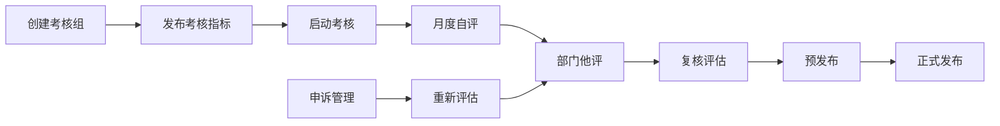

**图表来源**
- [2-计划财务处业绩考核管理员原型-v1.html:481-530](file://月度业绩考核原型设计初稿/2-计划财务处业绩考核管理员原型-v1.html#L481-L530)

**章节来源**
- [2-计划财务处业绩考核管理员原型-v1.html:353-653](file://月度业绩考核原型设计初稿/2-计划财务处业绩考核管理员原型-v1.html#L353-L653)

### 3. 部门绩效管理员模块

负责部门内部的指标设定和月度考核自评工作。

#### 指标设定流程

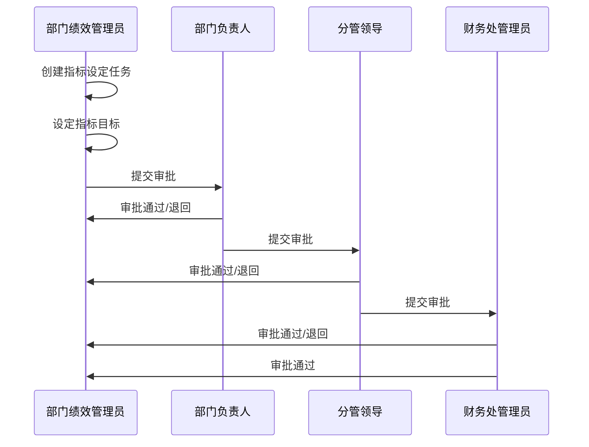

**图表来源**
- [3-部门绩效管理员原型-v1.html:445-523](file://月度业绩考核原型设计初稿/3-部门绩效管理员原型-v1.html#L445-L523)
- [6-时序图-v1.html:155-241](file://月度业绩考核原型设计初稿/6-时序图-v1.html#L155-L241)

#### 月度考核自评

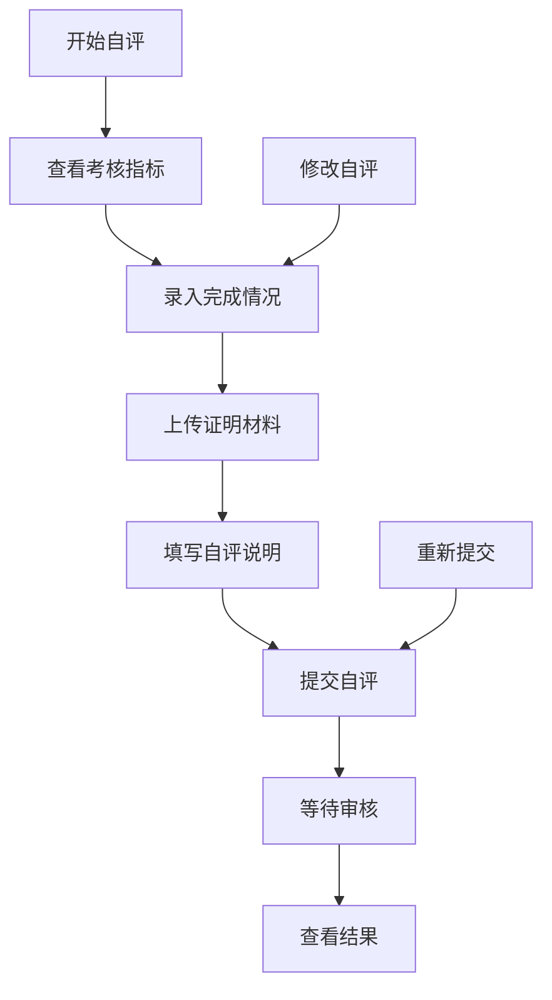

**图表来源**
- [3-部门绩效管理员原型-v1.html:525-596](file://月度业绩考核原型设计初稿/3-部门绩效管理员原型-v1.html#L525-L596)

**章节来源**
- [3-部门绩效管理员原型-v1.html:445-761](file://月度业绩考核原型设计初稿/3-部门绩效管理员原型-v1.html#L445-L761)

### 4. 部门负责人模块

负责部门内部的指标审批和结果查看。

#### 审批管理流程

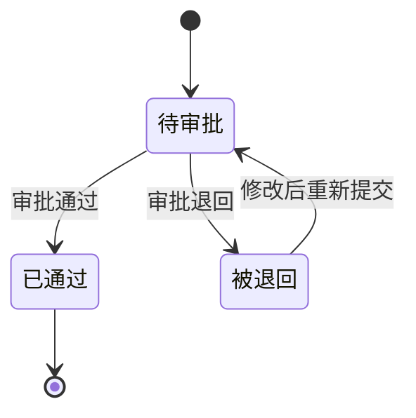

**图表来源**
- [4-部门负责人原型-v1.html:379-538](file://月度业绩考核原型设计初稿/4-部门负责人原型-v1.html#L379-L538)

#### 结果查看功能

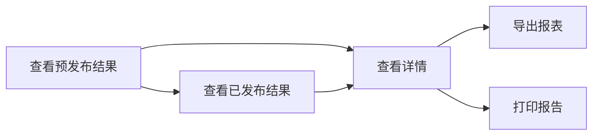

**图表来源**
- [4-部门负责人原型-v1.html:540-660](file://月度业绩考核原型设计初稿/4-部门负责人原型-v1.html#L540-L660)

**章节来源**
- [4-部门负责人原型-v1.html:379-660](file://月度业绩考核原型设计初稿/4-部门负责人原型-v1.html#L379-L660)

### 5. 考核员分管领导模块

负责跨部门的评估打分和申诉处理。

#### 评估打分流程

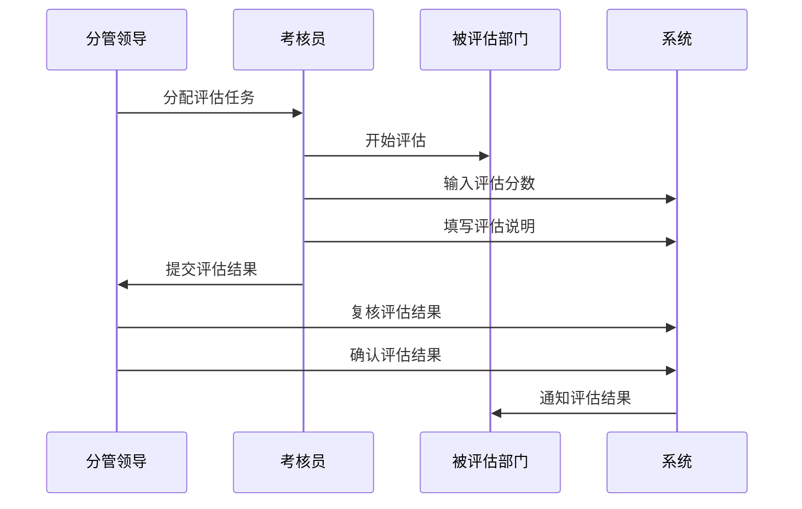

**图表来源**
- [5-考核员分管领导原型-v1.html:345-513](file://月度业绩考核原型设计初稿/5-考核员分管领导原型-v1.html#L345-L513)

#### 申诉处理流程

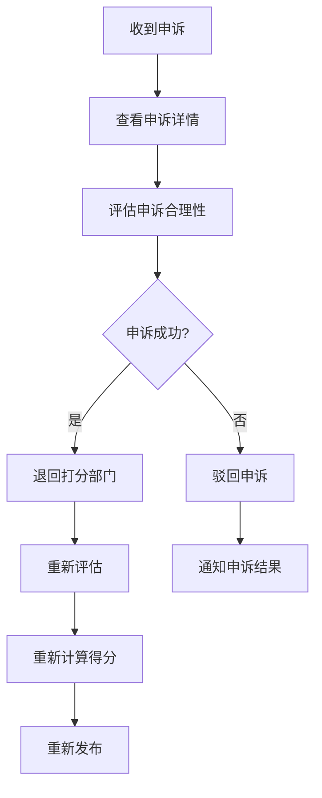

**图表来源**
- [5-考核员分管领导原型-v1.html:634-695](file://月度业绩考核原型设计初稿/5-考核员分管领导原型-v1.html#L634-L695)

**章节来源**
- [5-考核员分管领导原型-v1.html:241-800](file://月度业绩考核原型设计初稿/5-考核员分管领导原型-v1.html#L241-L800)

## 依赖关系分析

### 文件间依赖关系

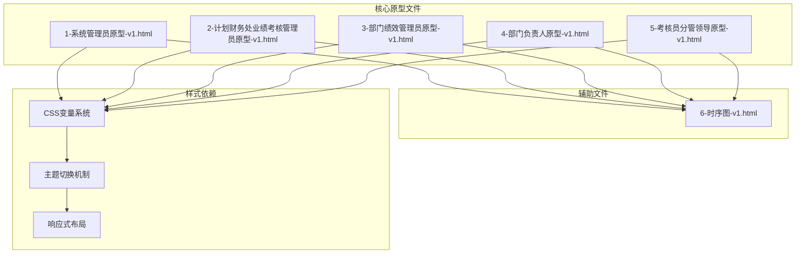

**图表来源**
- [1-系统管理员原型-v1.html:7-35](file://月度业绩考核原型设计初稿/1-系统管理员原型-v1.html#L7-L35)
- [2-计划财务处业绩考核管理员原型-v1.html:7-42](file://月度业绩考核原型设计初稿/2-计划财务处业绩考核管理员原型-v1.html#L7-L42)
- [3-部门绩效管理员原型-v1.html:7-38](file://月度业绩考核原型设计初稿/3-部门绩效管理员原型-v1.html#L7-L38)
- [4-部门负责人原型-v1.html:7-38](file://月度业绩考核原型设计初稿/4-部门负责人原型-v1.html#L7-L38)
- [5-考核员分管领导原型-v1.html:7-9](file://月度业绩考核原型设计初稿/5-考核员分管领导原型-v1.html#L7-L9)
- [6-时序图-v1.html:1-90](file://月度业绩考核原型设计初稿/6-时序图-v1.html#L1-L90)

### JavaScript功能依赖

系统使用统一的JavaScript函数库来实现页面切换、模态框管理和数据验证：

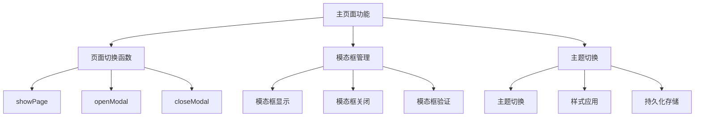

**图表来源**
- [1-系统管理员原型-v1.html:612-632](file://月度业绩考核原型设计初稿/1-系统管理员原型-v1.html#L612-L632)
- [2-计划财务处业绩考核管理员原型-v1.html:664-712](file://月度业绩考核原型设计初稿/2-计划财务处业绩考核管理员原型-v1.html#L664-L712)
- [3-部门绩效管理员原型-v1.html:766-800](file://月度业绩考核原型设计初稿/3-部门绩效管理员原型-v1.html#L766-L800)
- [4-部门负责人原型-v1.html:664-662](file://月度业绩考核原型设计初稿/4-部门负责人原型-v1.html#L664-L662)
- [5-考核员分管领导原型-v1.html:560-567](file://月度业绩考核原型设计初稿/5-考核员分管领导原型-v1.html#L560-L567)

**章节来源**
- [1-系统管理员原型-v1.html:612-632](file://月度业绩考核原型设计初稿/1-系统管理员原型-v1.html#L612-L632)
- [2-计划财务处业绩考核管理员原型-v1.html:664-712](file://月度业绩考核原型设计初稿/2-计划财务处业绩考核管理员原型-v1.html#L664-L712)
- [3-部门绩效管理员原型-v1.html:766-800](file://月度业绩考核原型设计初稿/3-部门绩效管理员原型-v1.html#L766-L800)
- [4-部门负责人原型-v1.html:664-662](file://月度业绩考核原型设计初稿/4-部门负责人原型-v1.html#L664-L662)
- [5-考核员分管领导原型-v1.html:560-567](file://月度业绩考核原型设计初稿/5-考核员分管领导原型-v1.html#L560-L567)

## 性能考虑

### 前端性能优化

由于系统完全基于前端实现，性能优化主要集中在以下方面：

#### 1. 资源加载优化
- **CSS内联**：所有样式直接嵌入HTML文件，减少HTTP请求
- **JavaScript合并**：功能函数集中管理，避免重复加载
- **图片资源**：使用矢量图标，支持高分辨率显示

#### 2. 内存管理
- **DOM操作优化**：批量更新DOM元素，减少重排重绘
- **事件委托**：使用事件冒泡机制，减少事件监听器数量
- **垃圾回收**：及时清理不再使用的变量和DOM引用

#### 3. 用户体验优化
- **响应式设计**：适配不同屏幕尺寸和设备
- **渐进增强**：基础功能在所有浏览器中可用
- **离线支持**：支持本地存储，提高离线使用能力

### 性能监控建议

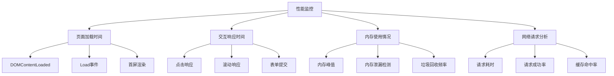

## 故障排除指南

### 常见问题诊断

#### 1. 页面加载问题
- **症状**：页面无法正常显示或功能异常
- **原因**：JavaScript执行错误或CSS样式冲突
- **解决方案**：
  - 检查浏览器控制台错误信息
  - 验证HTML语法正确性
  - 确认CSS变量定义完整

#### 2. 功能按钮无响应
- **症状**：点击按钮无任何反应
- **原因**：JavaScript函数未正确绑定或事件监听器冲突
- **解决方案**：
  - 检查事件绑定代码
  - 验证函数名拼写正确
  - 确认DOM元素已正确加载

#### 3. 主题切换失效
- **症状**：主题切换按钮点击无效
- **原因**：CSS类名冲突或JavaScript逻辑错误
- **解决方案**：
  - 检查switchStyle函数实现
  - 验证CSS变量定义
  - 确认主题类名正确应用

#### 4. 表单验证问题
- **症状**：表单提交验证失败或无提示
- **原因**：验证逻辑错误或提示信息缺失
- **解决方案**：
  - 检查表单验证函数
  - 确认错误提示样式正确
  - 验证必填字段标识

### 调试技巧

#### 1. 浏览器开发者工具使用
- **Elements面板**：检查DOM结构和CSS样式应用
- **Console面板**：查看JavaScript错误和警告信息
- **Network面板**：监控资源加载和网络请求
- **Sources面板**：设置断点调试JavaScript代码

#### 2. 性能分析
- **Performance面板**：分析页面加载和交互性能
- **Memory面板**：检测内存泄漏和内存使用情况
- **Lighthouse**：自动化性能和最佳实践检查

#### 3. 移动端调试
- **设备模式**：模拟不同移动设备进行测试
- **触摸事件**：验证移动端手势操作
- **响应式断点**：检查不同屏幕尺寸下的显示效果

**章节来源**
- [1-系统管理员原型-v1.html:612-632](file://月度业绩考核原型设计初稿/1-系统管理员原型-v1.html#L612-L632)
- [2-计划财务处业绩考核管理员原型-v1.html:664-712](file://月度业绩考核原型设计初稿/2-计划财务处业绩考核管理员原型-v1.html#L664-L712)
- [3-部门绩效管理员原型-v1.html:766-800](file://月度业绩考核原型设计初稿/3-部门绩效管理员原型-v1.html#L766-L800)
- [4-部门负责人原型-v1.html:664-662](file://月度业绩考核原型设计初稿/4-部门负责人原型-v1.html#L664-L662)
- [5-考核员分管领导原型-v1.html:560-567](file://月度业绩考核原型设计初稿/5-考核员分管领导原型-v1.html#L560-L567)

## 结论

月度业绩考核管理系统通过原型设计方法实现了完整的绩效管理功能，具有以下特点：

### 系统优势
- **功能完整性**：涵盖从指标设定到结果发布的全流程
- **用户体验优秀**：响应式设计支持多设备访问
- **主题灵活**：支持多种视觉风格满足不同场景需求
- **开发效率高**：原型设计便于快速迭代和功能验证

### 技术特色
- **纯前端实现**：无需服务器端逻辑，部署简单
- **模块化设计**：清晰的角色分工和功能划分
- **数据驱动**：基于表格和表单的数据管理模式
- **状态管理**：完善的流程状态跟踪机制

### 改进建议
- **后端集成**：考虑添加服务器端数据存储和用户认证
- **实时通信**：实现消息推送和实时状态更新
- **移动端优化**：针对移动设备进行深度优化
- **数据分析**：增加统计图表和趋势分析功能

该系统为后续的功能扩展和生产环境部署奠定了良好的基础，通过合理的架构设计和模块化实现，能够满足企业级绩效管理的需求。

## 附录

### 版本信息
- **当前版本**：v1.0
- **发布时间**：2026年
- **开发周期**：原型设计阶段

### 技术规范
- **HTML标准**：HTML5语义化标签
- **CSS标准**：CSS3现代特性
- **JavaScript标准**：ES6+语法
- **浏览器兼容**：Chrome、Firefox、Safari、Edge

### 维护建议
- **定期更新**：保持浏览器版本更新
- **备份策略**：定期备份重要数据
- **性能监控**：建立性能监控机制
- **用户培训**：定期进行系统使用培训