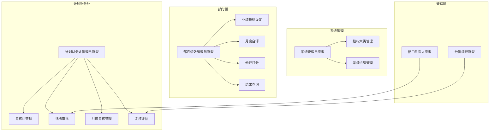
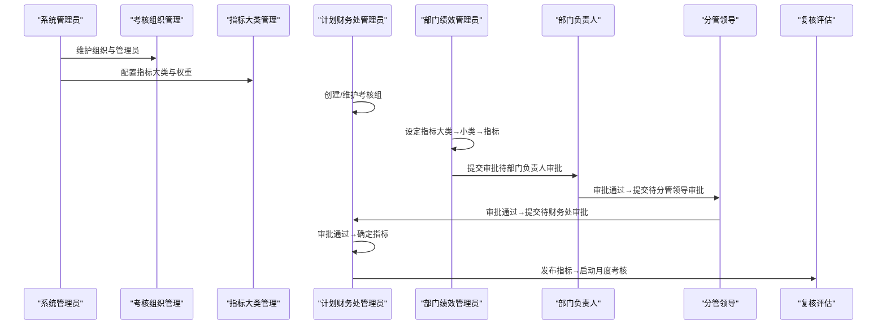
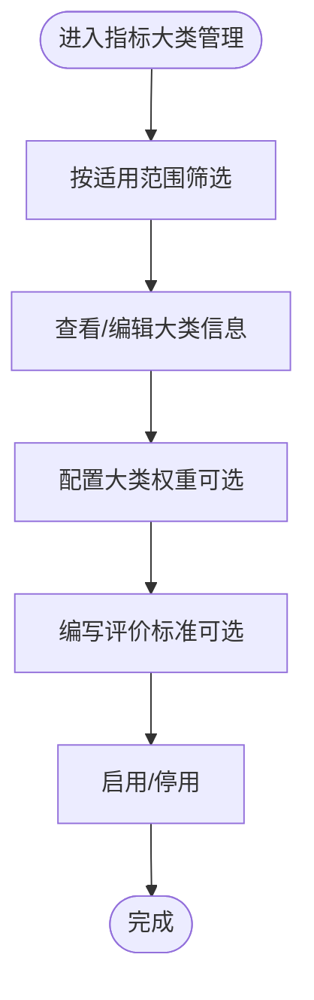
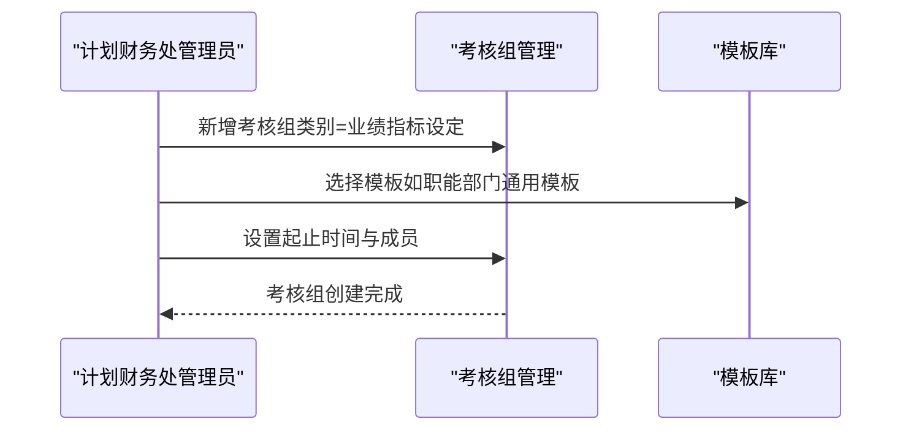
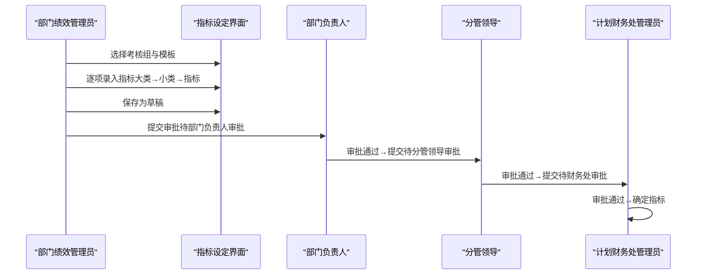
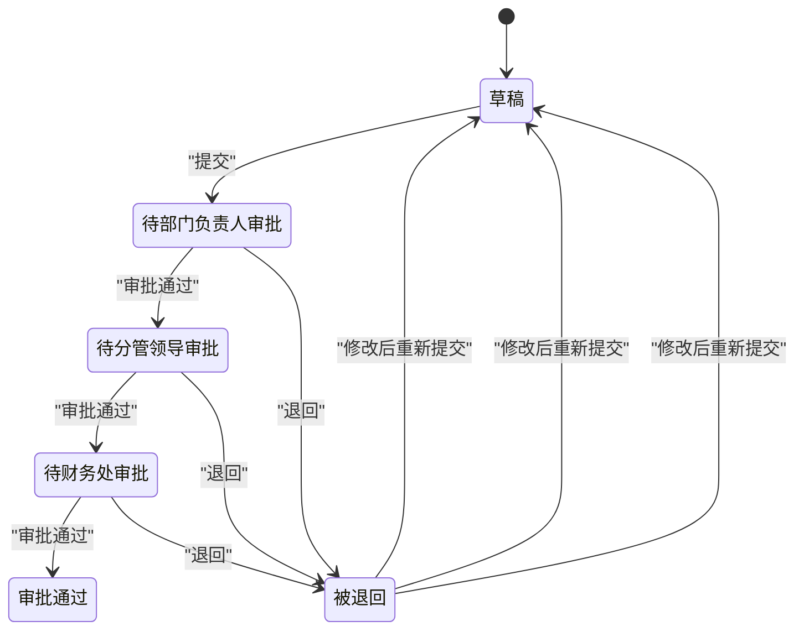
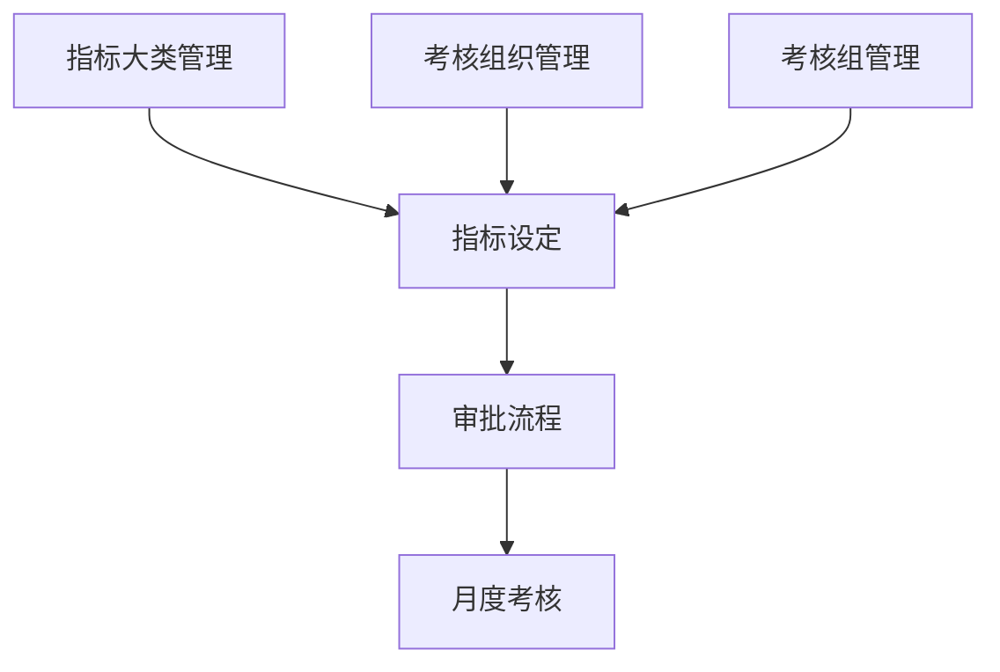

# 业绩指标设定

<cite>
**本文档引用的文件**
- [系统管理员原型-v1.html](file://1-系统管理员原型-v1.html)
- [计划财务处业绩考核管理员原型-v1.html](file://2-计划财务处业绩考核管理员原型-v1.html)
- [部门绩效管理员原型-v1.html](file://3-部门绩效管理员原型-v1.html)
- [部门负责人原型-v1.html](file://4-部门负责人原型-v1.html)
- [考核员分管领导原型-v1.html](file://5-考核员分管领导原型-v1.html)
- [时序图-v1.html](file://6-时序图-v1.html)
</cite>

## 目录
1. [简介](#简介)
2. [项目结构](#项目结构)
3. [核心组件](#核心组件)
4. [架构概览](#架构概览)
5. [详细组件分析](#详细组件分析)
6. [依赖关系分析](#依赖关系分析)
7. [性能考虑](#性能考虑)
8. [故障排除指南](#故障排除指南)
9. [结论](#结论)
10. [附录](#附录)

## 简介
本指南面向部门管理员，详细说明如何在月度业绩考核系统中完成"业绩指标设定"功能。内容涵盖：
- 年度与月度考核指标的设定流程
- 指标大类与小类的选择与划分
- 关键参数配置（权重、评分标准、完成时限）
- 审批流转状态及处理方式
- 不同考核组的适用规则与模板选择
- 实际操作步骤、注意事项与常见问题解决方案

## 项目结构
本项目采用多角色原型页面设计，围绕"业绩指标设定"与"月度考核"两大主线展开，包含以下页面：
- 系统管理员：单位管理、权限分配、指标大类管理、考核组织管理等
- 计划财务处业绩考核管理员：考核组管理、指标审批、月度考核管理、复核评估等
- 部门绩效管理员：业绩指标设定、月度自评、他评打分、结果查询等
- 部门负责人：指标审批、结果查看
- 考核员/分管领导：评估打分、进度查询、申诉处理
- 时序图：指标设定与月度考核的完整流程

**图表来源**
- [系统管理员原型-v1.html:291-316](file://1-系统管理员原型-v1.html#L291-L316)
- [计划财务处业绩考核管理员原型-v1.html:324-344](file://2-计划财务处业绩考核管理员原型-v1.html#L324-L344)
- [部门绩效管理员原型-v1.html:411-430](file://3-部门绩效管理员原型-v1.html#L411-L430)
- [部门负责人原型-v1.html:350-366](file://4-部门负责人原型-v1.html#L350-L366)
- [考核员分管领导原型-v1.html:196-227](file://5-考核员分管领导原型-v1.html#L196-L227)

**章节来源**
- [系统管理员原型-v1.html:291-316](file://1-系统管理员原型-v1.html#L291-L316)
- [计划财务处业绩考核管理员原型-v1.html:324-344](file://2-计划财务处业绩考核管理员原型-v1.html#L324-L344)
- [部门绩效管理员原型-v1.html:411-430](file://3-部门绩效管理员原型-v1.html#L411-L430)
- [部门负责人原型-v1.html:350-366](file://4-部门负责人原型-v1.html#L350-L366)
- [考核员分管领导原型-v1.html:196-227](file://5-考核员分管领导原型-v1.html#L196-L227)

## 核心组件
- 指标大类管理：提供指标分类体系，支持按适用范围（机关部门、分公司、公共）配置权重与评价标准。
- 考核组织管理：维护组织架构与管理员，支撑指标设定与审批的组织边界。
- 考核组管理：创建与维护年度/月度考核组，配置起止时间、成员与状态。
- 指标设定界面：部门管理员按大类→小类→指标层级录入目标值、权重、评分标准与完成时限。
- 审批流程：部门负责人→分管领导→计划财务处管理员逐级审批，支持退回与重新提交。
- 状态标签：草稿、待部门负责人审批、待分管领导审批、待财务处审批、审批通过、被退回。

**章节来源**
- [系统管理员原型-v1.html:448-482](file://1-系统管理员原型-v1.html#L448-L482)
- [计划财务处业绩考核管理员原型-v1.html:353-447](file://2-计划财务处业绩考核管理员原型-v1.html#L353-L447)
- [部门绩效管理员原型-v1.html:445-523](file://3-部门绩效管理员原型-v1.html#L445-L523)
- [部门负责人原型-v1.html:379-538](file://4-部门负责人原型-v1.html#L379-L538)

## 架构概览
系统采用"角色分工 + 流程驱动"的架构：
- 角色层：系统管理员、计划财务处管理员、部门管理员、部门负责人、分管领导、考核员/分管领导
- 流程层：指标设定（草稿→审批→发布）、月度考核（发布→自评→他评→复核→预发布→发布）
- 数据层：指标大类、组织、考核组、指标模板、审批记录、考核结果

**图表来源**
- [系统管理员原型-v1.html:417-446](file://1-系统管理员原型-v1.html#L417-L446)
- [计划财务处业绩考核管理员原型-v1.html:353-447](file://2-计划财务处业绩考核管理员原型-v1.html#L353-L447)
- [部门绩效管理员原型-v1.html:445-523](file://3-部门绩效管理员原型-v1.html#L445-L523)
- [部门负责人原型-v1.html:379-538](file://4-部门负责人原型-v1.html#L379-L538)
- [时序图-v1.html:112-298](file://6-时序图-v1.html#L112-L298)

## 详细组件分析

### 指标大类与小类配置
- 指标大类管理支持按适用范围（机关部门、分公司、公共）筛选，可配置大类权重与评价标准，便于统一规范。
- 小类与指标在设定界面按层级展开，便于部门管理员快速匹配与录入。

**图表来源**
- [系统管理员原型-v1.html:448-482](file://1-系统管理员原型-v1.html#L448-L482)

**章节来源**
- [系统管理员原型-v1.html:448-482](file://1-系统管理员原型-v1.html#L448-L482)

### 考核组与模板选择
- 考核组管理支持创建"业绩指标设定"类别的考核组，配置起止时间与成员。
- 模板选择：职能部门通用模板等，确保指标设定的标准化与一致性。

**图表来源**
- [计划财务处业绩考核管理员原型-v1.html:353-447](file://2-计划财务处业绩考核管理员原型-v1.html#L353-L447)

**章节来源**
- [计划财务处业绩考核管理员原型-v1.html:353-447](file://2-计划财务处业绩考核管理员原型-v1.html#L353-L447)

### 指标设定操作流程（部门管理员）
- 选择考核组与模板，进入"业绩指标设定"页面
- 选择指标大类，展开小类，逐项录入指标内容、目标值、权重、评分标准与完成时限
- 保存为草稿，完成后提交审批
- 跟踪审批状态：待部门负责人审批→待分管领导审批→待财务处审批→审批通过

**图表来源**
- [部门绩效管理员原型-v1.html:445-523](file://3-部门绩效管理员原型-v1.html#L445-L523)
- [部门负责人原型-v1.html:379-538](file://4-部门负责人原型-v1.html#L379-L538)
- [时序图-v1.html:112-298](file://6-时序图-v1.html#L112-L298)

**章节来源**
- [部门绩效管理员原型-v1.html:445-523](file://3-部门绩效管理员原型-v1.html#L445-L523)
- [部门负责人原型-v1.html:379-538](file://4-部门负责人原型-v1.html#L379-L538)
- [时序图-v1.html:112-298](file://6-时序图-v1.html#L112-L298)

### 审批状态与处理方式
- 草稿：可随时修改与保存
- 待部门负责人审批：提交后等待部门负责人审核
- 待分管领导审批：部门负责人通过后提交至分管领导
- 待财务处审批：分管领导通过后提交至计划财务处管理员
- 审批通过：指标正式确定，可用于后续月度考核
- 被退回：退回至部门管理员，按退回说明修改后重新提交

**图表来源**
- [时序图-v1.html:250-284](file://6-时序图-v1.html#L250-L284)

**章节来源**
- [时序图-v1.html:250-284](file://6-时序图-v1.html#L250-L284)

### 关键参数配置
- 指标权重：可在指标设定界面按年度/月度分别配置权重，系统按月度权重参与月度得分计算。
- 评分标准：在指标设定界面填写评分标准，便于部门自评与他评打分参考。
- 完成时限：设定指标的完成时间范围，确保与考核周期一致。
- 适用范围：指标大类支持按适用范围（机关部门、分公司、公共）配置，确保指标匹配性。

**章节来源**
- [部门绩效管理员原型-v1.html:766-800](file://3-部门绩效管理员原型-v1.html#L766-L800)
- [系统管理员原型-v1.html:448-482](file://1-系统管理员原型-v1.html#L448-L482)

### 不同考核组的适用规则
- 年度考核组：用于设定年度业绩指标，流程为部门管理员→部门负责人→分管领导→财务处管理员逐级审批。
- 月度考核组：基于已审批通过的年度指标，按月度发布与执行，包含自评、他评、复核、预发布与发布等阶段。

**章节来源**
- [计划财务处业绩考核管理员原型-v1.html:353-447](file://2-计划财务处业绩考核管理员原型-v1.html#L353-L447)
- [时序图-v1.html:300-556](file://6-时序图-v1.html#L300-L556)

## 依赖关系分析
- 指标大类管理为指标设定提供分类与权重依据
- 考核组织管理为指标设定提供组织边界与管理员配置
- 考核组管理为指标设定提供时间窗口与成员范围
- 审批流程依赖于角色权限与状态流转规则
- 月度考核依赖于已审批通过的年度指标

**图表来源**
- [系统管理员原型-v1.html:417-446](file://1-系统管理员原型-v1.html#L417-L446)
- [计划财务处业绩考核管理员原型-v1.html:353-447](file://2-计划财务处业绩考核管理员原型-v1.html#L353-L447)
- [部门绩效管理员原型-v1.html:445-523](file://3-部门绩效管理员原型-v1.html#L445-L523)

**章节来源**
- [系统管理员原型-v1.html:417-446](file://1-系统管理员原型-v1.html#L417-L446)
- [计划财务处业绩考核管理员原型-v1.html:353-447](file://2-计划财务处业绩考核管理员原型-v1.html#L353-L447)
- [部门绩效管理员原型-v1.html:445-523](file://3-部门绩效管理员原型-v1.html#L445-L523)

## 性能考虑
- 指标大类与小类的层级展开建议使用懒加载，减少初始渲染压力
- 审批列表与指标表格建议分页加载，提升交互响应速度
- 状态标签与进度条采用轻量级组件，避免频繁重绘
- 模态框与弹窗采用按需渲染，降低内存占用

## 故障排除指南
- 无法提交审批
  - 检查指标是否已保存为草稿且填写完整
  - 确认当前状态为"待部门负责人审批"
  - 若被退回，按退回说明修改后重新提交
- 审批状态异常
  - 查看审批列表中的状态变化记录
  - 确认部门负责人、分管领导与财务处管理员均已登录并处理
- 指标权重不生效
  - 确认年度与月度权重均正确配置
  - 检查月度考核组是否使用了正确的模板
- 模板选择错误
  - 在考核组管理中重新选择合适的模板
  - 确保模板与适用范围匹配

**章节来源**
- [部门绩效管理员原型-v1.html:445-523](file://3-部门绩效管理员原型-v1.html#L445-L523)
- [部门负责人原型-v1.html:379-538](file://4-部门负责人原型-v1.html#L379-L538)
- [时序图-v1.html:250-284](file://6-时序图-v1.html#L250-L284)

## 结论
通过明确的角色分工与清晰的流程设计，系统实现了从指标设定到审批发布再到月度执行的闭环管理。部门管理员只需按照"大类→小类→指标"的层级结构完成配置，即可依托审批流程与模板规范确保指标设定的质量与一致性。建议在实施过程中重点关注指标权重与评分标准的准确性，以及审批流程的及时性，以保障月度考核工作的顺利开展。

## 附录
- 操作术语
  - 草稿：未提交的状态
  - 待审批：已提交等待审批
  - 审批通过：指标确定可用
  - 被退回：需要修改后重新提交
- 最佳实践
  - 年度指标设定尽量一次性完成，避免中途调整
  - 指标权重与评分标准应与部门职责相匹配
  - 审批过程中保持沟通畅通，及时处理退回意见