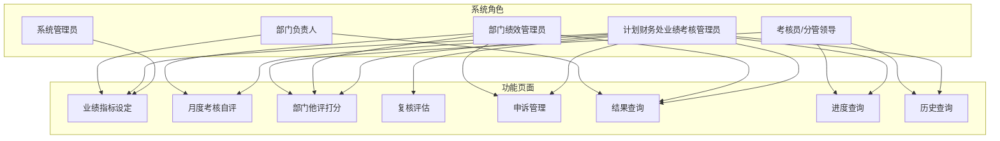
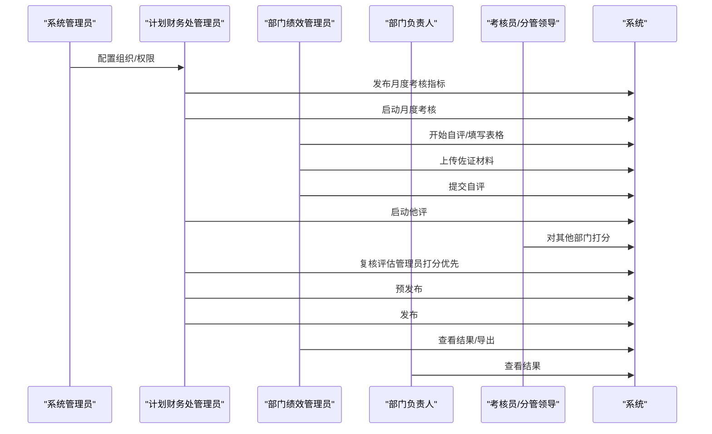
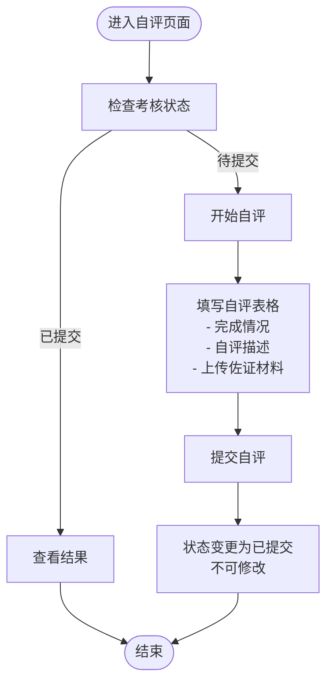
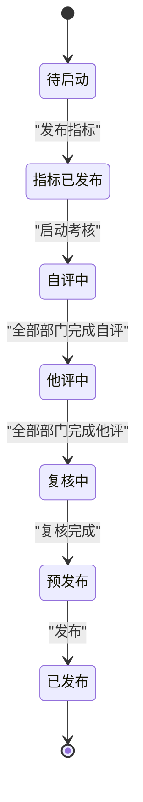
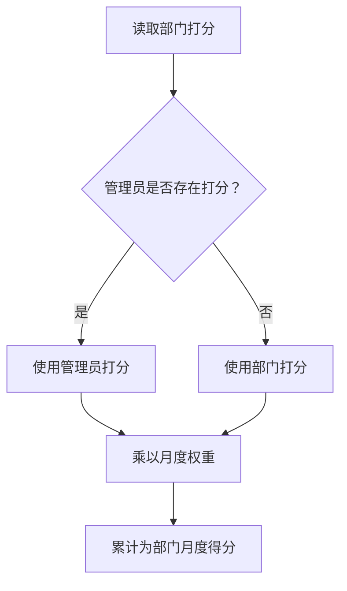
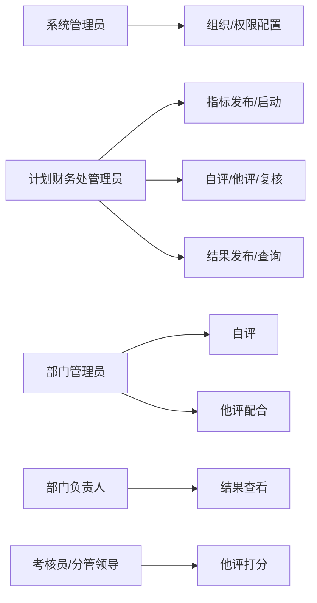

# 月度考核自评

<cite>
**本文档引用的文件**
- [系统管理员原型-v1.html](file://月度业绩考核原型设计初稿/1-系统管理员原型-v1.html)
- [计划财务处业绩考核管理员原型-v1.html](file://月度业绩考核原型设计初稿/2-计划财务处业绩考核管理员原型-v1.html)
- [部门绩效管理员原型-v1.html](file://月度业绩考核原型设计初稿/3-部门绩效管理员原型-v1.html)
- [部门负责人原型-v1.html](file://月度业绩考核原型设计初稿/4-部门负责人原型-v1.html)
- [考核员分管领导原型-v1.html](file://月度业绩考核原型设计初稿/5-考核员分管领导原型-v1.html)
- [时序图-v1.html](file://月度业绩考核原型设计初稿/6-时序图-v1.html)
</cite>

## 目录
1. [简介](#简介)
2. [项目结构](#项目结构)
3. [核心组件](#核心组件)
4. [架构概览](#架构概览)
5. [详细组件分析](#详细组件分析)
6. [依赖分析](#依赖分析)
7. [性能考虑](#性能考虑)
8. [故障排除指南](#故障排除指南)
9. [结论](#结论)
10. [附录](#附录)

## 简介
本指南面向部门管理员，详细说明“月度考核自评”功能的使用方法与流程规范。内容涵盖自评启动条件、评分标准与权重计算、状态管理（待提交/已提交）、提交后的不可修改机制、自评表格填写方法、评分依据收集整理与佐证材料上传要求、历史自评记录查看与对比方法、质量控制要点与评分合理性检查、部门内部审核流程，以及常见问题处理与最佳实践。

## 项目结构
本项目采用多角色原型页面设计，围绕“月度业绩考核”主题，分别提供系统管理员、计划财务处管理员、部门绩效管理员、部门负责人、考核员/分管领导、时序图等页面，便于不同角色在各自职责范围内完成指标设定、自评、他评、复核、申诉与发布等全流程操作。

图表来源
- [系统管理员原型-v1.html:291-360](file://月度业绩考核原型设计初稿/1-系统管理员原型-v1.html#L291-L360)
- [计划财务处业绩考核管理员原型-v1.html:324-344](file://月度业绩考核原型设计初稿/2-计划财务处业绩考核管理员原型-v1.html#L324-L344)
- [部门绩效管理员原型-v1.html:411-430](file://月度业绩考核原型设计初稿/3-部门绩效管理员原型-v1.html#L411-L430)
- [部门负责人原型-v1.html:350-366](file://月度业绩考核原型设计初稿/4-部门负责人原型-v1.html#L350-L366)
- [考核员分管领导原型-v1.html:196-227](file://月度业绩考核原型设计初稿/5-考核员分管领导原型-v1.html#L196-L227)

章节来源
- [系统管理员原型-v1.html:291-360](file://月度业绩考核原型设计初稿/1-系统管理员原型-v1.html#L291-L360)
- [计划财务处业绩考核管理员原型-v1.html:324-344](file://月度业绩考核原型设计初稿/2-计划财务处业绩考核管理员原型-v1.html#L324-L344)
- [部门绩效管理员原型-v1.html:411-430](file://月度业绩考核原型设计初稿/3-部门绩效管理员原型-v1.html#L411-L430)
- [部门负责人原型-v1.html:350-366](file://月度业绩考核原型设计初稿/4-部门负责人原型-v1.html#L350-L366)
- [考核员分管领导原型-v1.html:196-227](file://月度业绩考核原型设计初稿/5-考核员分管领导原型-v1.html#L196-L227)

## 核心组件
- 月度考核自评页面：提供自评列表、状态筛选、开始自评入口、查看与导出能力。
- 月度考核管理页面：提供月度考核组状态管理（指标已发布、自评中、他评中、复核中、预发布、已发布）。
- 复核评估页面：提供管理员对部门打分进行复核与修正，支持“管理员打分优先”的规则。
- 结果查询页面：提供按期间、部门、维度查询与导出明细/汇总表。
- 时序图：清晰展示月度考核从“发布指标、启动考核、自评、他评、复核、预发布、发布”的完整流程与时序关系。

章节来源
- [部门绩效管理员原型-v1.html:525-597](file://月度业绩考核原型设计初稿/3-部门绩效管理员原型-v1.html#L525-L597)
- [计划财务处业绩考核管理员原型-v1.html:481-530](file://月度业绩考核原型设计初稿/2-计划财务处业绩考核管理员原型-v1.html#L481-L530)
- [计划财务处业绩考核管理员原型-v1.html:532-560](file://月度业绩考核原型设计初稿/2-计划财务处业绩考核管理员原型-v1.html#L532-L560)
- [计划财务处业绩考核管理员原型-v1.html:623-653](file://月度业绩考核原型设计初稿/2-计划财务处业绩考核管理员原型-v1.html#L623-L653)
- [时序图-v1.html:300-556](file://月度业绩考核原型设计初稿/6-时序图-v1.html#L300-L556)

## 架构概览
月度考核自评功能遵循“发布指标→启动考核→部门自评→部门他评→复核评估→预发布/发布”的流程闭环。系统管理员负责组织与权限配置；计划财务处管理员负责指标发布、启动考核、进度与结果管理；部门管理员负责本部门自评与他评配合；部门负责人负责审批与结果查看；考核员/分管领导负责他评打分与进度监督。

图表来源
- [时序图-v1.html:300-556](file://月度业绩考核原型设计初稿/6-时序图-v1.html#L300-L556)

章节来源
- [时序图-v1.html:300-556](file://月度业绩考核原型设计初稿/6-时序图-v1.html#L300-L556)

## 详细组件分析

### 月度考核自评页面（部门管理员）
- 页面入口：左侧菜单“月度考核自评”，标题说明“对本部门月度业绩考核指标进行自评打分，提交后不可修改”。
- 列表字段：考核组名称、考核类型、考核状态、考核起止日期、自评得分、最后得分、操作按钮。
- 状态管理：
  - 待提交：可点击“开始自评”，进入自评流程。
  - 已提交：显示自评得分与最终得分，不可再次编辑。
- 自评流程：
  - 开始自评：进入自评表格，逐项填写完成情况、自评描述与上传佐证材料。
  - 提交自评：系统校验进度（如“全部完成方可提交”），提交后状态变更为“已提交”，不可修改。

图表来源
- [部门绩效管理员原型-v1.html:525-597](file://月度业绩考核原型设计初稿/3-部门绩效管理员原型-v1.html#L525-L597)

章节来源
- [部门绩效管理员原型-v1.html:525-597](file://月度业绩考核原型设计初稿/3-部门绩效管理员原型-v1.html#L525-L597)

### 月度考核管理（计划财务处管理员）
- 页面入口：左侧菜单“月度考核管理”，提供按状态筛选（指标已发布、自评中、他评中、复核中、预发布、已发布）。
- 关键状态：
  - 指标已发布：可启动考核。
  - 自评中：等待部门完成自评。
  - 他评中：等待他评打分完成。
  - 复核中：管理员复核与修正打分。
  - 预发布：预发布后部门可查看完整评价信息。
  - 已发布：最终发布，数据冻结。

图表来源
- [计划财务处业绩考核管理员原型-v1.html:481-530](file://月度业绩考核原型设计初稿/2-计划财务处业绩考核管理员原型-v1.html#L481-L530)

章节来源
- [计划财务处业绩考核管理员原型-v1.html:481-530](file://月度业绩考核原型设计初稿/2-计划财务处业绩考核管理员原型-v1.html#L481-L530)

### 复核评估与评分规则（计划财务处管理员）
- 评分优先级：管理员打分优先于部门打分；若管理员打分为空，则取部门打分×月度权重。
- 打分说明：每项指标支持填写“打分说明”，便于追溯与审计。
- 得分计算：单个指标得分 = 管理员打分（如有）或 考核部门打分 × 月度权重；部门月度得分 = 全部指标得分之和，按大类汇总。

图表来源
- [计划财务处业绩考核管理员原型-v1.html:532-560](file://月度业绩考核原型设计初稿/2-计划财务处业绩考核管理员原型-v1.html#L532-L560)

章节来源
- [计划财务处业绩考核管理员原型-v1.html:532-560](file://月度业绩考核原型设计初稿/2-计划财务处业绩考核管理员原型-v1.html#L532-L560)

### 历史自评记录查看与对比（部门/分管领导）
- 历史查询：支持按考核组、期间、部门查询历史结果。
- 对比查看：可查看本部门历次自评与他评得分、最终得分及系数。
- 导出：支持导出明细表与汇总表，便于归档与分析。

章节来源
- [计划财务处业绩考核管理员原型-v1.html:623-653](file://月度业绩考核原型设计初稿/2-计划财务处业绩考核管理员原型-v1.html#L623-L653)
- [考核员分管领导原型-v1.html:697-800](file://月度业绩考核原型设计初稿/5-考核员分管领导原型-v1.html#L697-L800)

## 依赖分析
- 角色依赖：
  - 系统管理员：负责组织与权限配置，确保部门管理员具备自评权限。
  - 计划财务处管理员：负责指标发布、启动考核、进度管理与结果发布。
  - 部门管理员：负责本部门自评与他评配合。
  - 部门负责人：负责审批与结果查看。
  - 考核员/分管领导：负责他评打分与进度监督。
- 数据依赖：
  - 指标模板与权重来源于“指标大类管理”与“业绩指标设定”流程。
  - 自评与他评数据依赖于“月度考核管理”状态推进。

图表来源
- [系统管理员原型-v1.html:417-446](file://月度业绩考核原型设计初稿/1-系统管理员原型-v1.html#L417-L446)
- [计划财务处业绩考核管理员原型-v1.html:324-344](file://月度业绩考核原型设计初稿/2-计划财务处业绩考核管理员原型-v1.html#L324-L344)
- [部门绩效管理员原型-v1.html:411-430](file://月度业绩考核原型设计初稿/3-部门绩效管理员原型-v1.html#L411-L430)
- [部门负责人原型-v1.html:350-366](file://月度业绩考核原型设计初稿/4-部门负责人原型-v1.html#L350-L366)
- [考核员分管领导原型-v1.html:196-227](file://月度业绩考核原型设计初稿/5-考核员分管领导原型-v1.html#L196-L227)

章节来源
- [系统管理员原型-v1.html:417-446](file://月度业绩考核原型设计初稿/1-系统管理员原型-v1.html#L417-L446)
- [计划财务处业绩考核管理员原型-v1.html:324-344](file://月度业绩考核原型设计初稿/2-计划财务处业绩考核管理员原型-v1.html#L324-L344)
- [部门绩效管理员原型-v1.html:411-430](file://月度业绩考核原型设计初稿/3-部门绩效管理员原型-v1.html#L411-L430)
- [部门负责人原型-v1.html:350-366](file://月度业绩考核原型设计初稿/4-部门负责人原型-v1.html#L350-L366)
- [考核员分管领导原型-v1.html:196-227](file://月度业绩考核原型设计初稿/5-考核员分管领导原型-v1.html#L196-L227)

## 性能考虑
- 表格分页与搜索：列表采用分页与多维筛选，提升大数据量下的浏览效率。
- 进度可视化：使用进度条与状态标签直观反映当前阶段完成度。
- 批量导出：支持明细与汇总表导出，减少重复查询成本。

## 故障排除指南
- 自评无法提交：
  - 检查“月度考核管理”页面状态是否为“自评中”，且本部门自评进度是否达到100%。
  - 确认已上传佐证材料且格式符合要求（PDF/图片/压缩包，大小限制见页面提示）。
- 他评打分异常：
  - 确认“他评中”状态已启动，且打分范围与权重规则符合系统要求。
  - 若出现“管理员打分为空”的情况，需由管理员补充打分。
- 结果差异：
  - 使用“复核评估”页面核对管理员打分与部门打分，确认是否按“管理员打分优先”规则计算。
  - 通过“历史查询”对比上期结果，识别异常波动。

章节来源
- [部门绩效管理员原型-v1.html:525-597](file://月度业绩考核原型设计初稿/3-部门绩效管理员原型-v1.html#L525-L597)
- [计划财务处业绩考核管理员原型-v1.html:481-530](file://月度业绩考核原型设计初稿/2-计划财务处业绩考核管理员原型-v1.html#L481-L530)
- [计划财务处业绩考核管理员原型-v1.html:532-560](file://月度业绩考核原型设计初稿/2-计划财务处业绩考核管理员原型-v1.html#L532-L560)
- [计划财务处业绩考核管理员原型-v1.html:623-653](file://月度业绩考核原型设计初稿/2-计划财务处业绩考核管理员原型-v1.html#L623-L653)

## 结论
月度考核自评功能通过明确的状态流转、严格的提交机制与评分优先规则，确保考核过程的公正性与可追溯性。部门管理员应严格遵循自评流程，确保评分依据充分、佐证材料齐全，并在提交前完成内部审核，以降低后续复核与申诉风险。

## 附录

### 自评操作清单（部门管理员）
- 启动条件：考核组状态为“指标已发布”，且本部门自评进度允许提交。
- 填写步骤：
  - 登录“月度考核自评”页面，点击“开始自评”。
  - 逐项填写完成情况与自评描述。
  - 上传佐证材料（PDF/图片/压缩包，注意大小限制）。
  - 校对无误后提交，提交后不可修改。
- 质量控制：
  - 内部审核：部门负责人对自评结果进行复核。
  - 合理性检查：对照指标权重与完成情况，确保评分合理。
- 历史对比：提交后可在“结果查询/历史查询”中查看对比分析。

章节来源
- [部门绩效管理员原型-v1.html:525-597](file://月度业绩考核原型设计初稿/3-部门绩效管理员原型-v1.html#L525-L597)
- [计划财务处业绩考核管理员原型-v1.html:623-653](file://月度业绩考核原型设计初稿/2-计划财务处业绩考核管理员原型-v1.html#L623-L653)