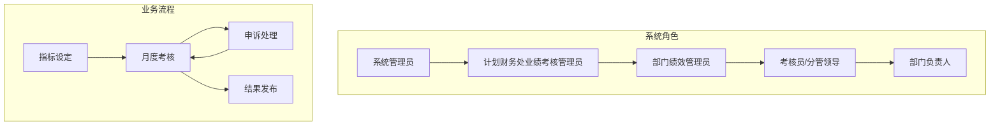
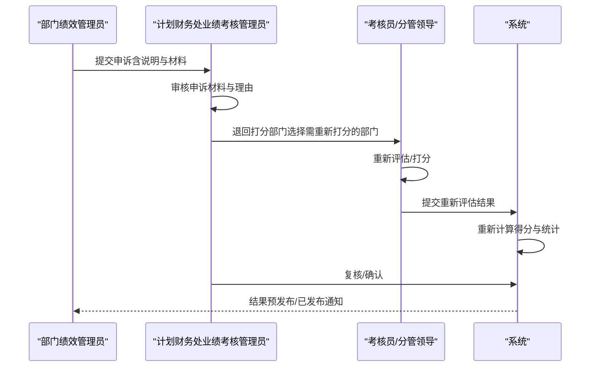
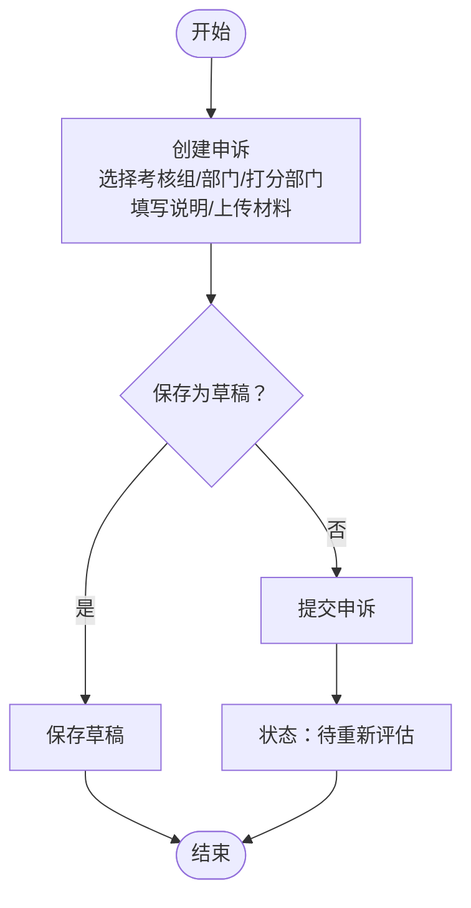
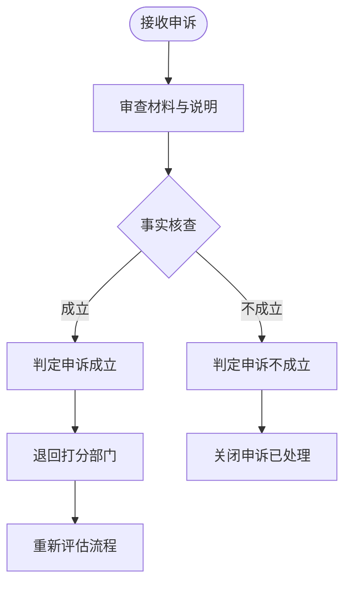
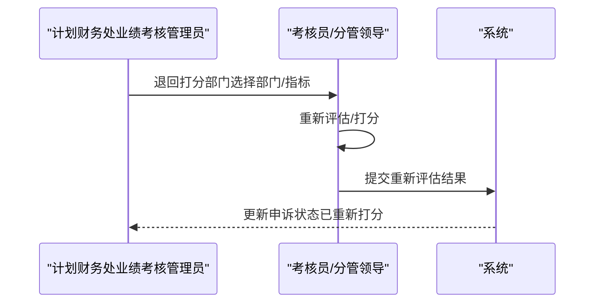
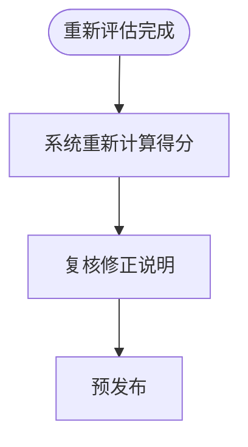
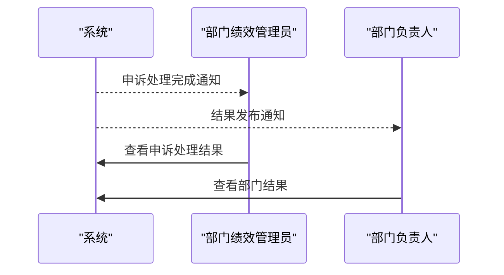
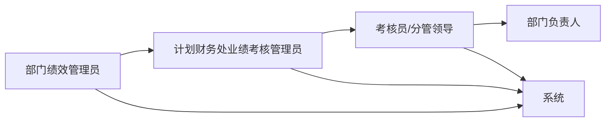

# 申诉反馈处理

<cite>
**本文引用的文件**
- [1-系统管理员原型-v1.html](file://1-系统管理员原型-v1.html)
- [2-计划财务处业绩考核管理员原型-v1.html](file://2-计划财务处业绩考核管理员原型-v1.html)
- [3-部门绩效管理员原型-v1.html](file://3-部门绩效管理员原型-v1.html)
- [4-部门负责人原型-v1.html](file://4-部门负责人原型-v1.html)
- [5-考核员分管领导原型-v1.html](file://5-考核员分管领导原型-v1.html)
- [6-时序图-v1.html](file://6-时序图-v1.html)
</cite>

## 目录
1. [简介](#简介)
2. [项目结构](#项目结构)
3. [核心组件](#核心组件)
4. [架构概览](#架构概览)
5. [详细组件分析](#详细组件分析)
6. [依赖关系分析](#依赖关系分析)
7. [性能考虑](#性能考虑)
8. [故障排除指南](#故障排除指南)
9. [结论](#结论)
10. [附录](#附录)

## 简介
本指南面向部门管理员，提供“申诉反馈处理”的完整操作手册，涵盖申诉的接收、调查、重新评估与处理流程；明确申诉状态管理（草稿、待重新评估、已重新打分、已处理）与处理时限要求；说明证据收集、事实核查、重新评分的标准与方法；给出决策流程、审批要求与结果通知方式；介绍质量控制、记录保存与后续跟踪机制；并总结沟通技巧、争议解决与跨部门协作最佳实践及常见问题与解决方案。

## 项目结构
本项目采用多角色原型页面设计，围绕“月度业绩考核”主题，分别提供系统管理员、计划财务处管理员、部门绩效管理员、部门负责人、考核员/分管领导等角色的界面原型，以及“时序图”文档，直观展示考核全流程，包括申诉与重新评估环节。

图表来源
- [6-时序图-v1.html:300-556](file://6-时序图-v1.html#L300-L556)

章节来源
- [6-时序图-v1.html:1-570](file://6-时序图-v1.html#L1-L570)

## 核心组件
- 系统管理员：负责单位/组织/权限/指标大类等系统级配置，保障考核系统稳定运行。
- 计划财务处业绩考核管理员：统筹月度考核流程，接收并处理申诉，退回打分部门进行重新评估，并监督复核与发布。
- 部门绩效管理员：发起/提交申诉，上传申诉材料，配合调查与证据补充。
- 部门负责人：审批部门层面的指标与结果，关注本部门申诉处理进展。
- 考核员/分管领导：执行他评打分、复核修正、按需重新评估，确保评分公正与准确。

章节来源
- [1-系统管理员原型-v1.html:291-560](file://1-系统管理员原型-v1.html#L291-L560)
- [2-计划财务处业绩考核管理员原型-v1.html:324-656](file://2-计划财务处业绩考核管理员原型-v1.html#L324-L656)
- [3-部门绩效管理员原型-v1.html:411-764](file://3-部门绩效管理员原型-v1.html#L411-L764)
- [4-部门负责人原型-v1.html:350-662](file://4-部门负责人原型-v1.html#L350-L662)
- [5-考核员分管领导原型-v1.html:196-695](file://5-考核员分管领导原型-v1.html#L196-L695)

## 架构概览
申诉处理贯穿“月度考核”主流程，关键节点如下：
- 他评完成后进入“预发布”，期间允许部门提出申诉；
- 申诉成功后，系统将相关打分退回至打分部门进行重新评估；
- 重新评估完成后，系统重新计算得分并进入复核；
- 最终发布结果，形成闭环。

图表来源
- [6-时序图-v1.html:440-467](file://6-时序图-v1.html#L440-L467)

章节来源
- [6-时序图-v1.html:300-556](file://6-时序图-v1.html#L300-L556)

## 详细组件分析

### 申诉接收与登记
- 触发入口：部门绩效管理员在“申诉反馈”页面查看待处理申诉，或在“申诉管理”页面创建新申诉。
- 申诉创建：选择考核组、申诉部门、打分部门、填写申诉说明、上传申诉材料（PDF、图片、压缩包等）。
- 状态：创建后为“草稿”，提交后进入“待重新评估”。

图表来源
- [2-计划财务处业绩考核管理员原型-v1.html:562-589](file://2-计划财务处业绩考核管理员原型-v1.html#L562-L589)
- [3-部门绩效管理员原型-v1.html:655-699](file://3-部门绩效管理员原型-v1.html#L655-L699)

章节来源
- [2-计划财务处业绩考核管理员原型-v1.html:562-589](file://2-计划财务处业绩考核管理员原型-v1.html#L562-L589)
- [3-部门绩效管理员原型-v1.html:655-699](file://3-部门绩效管理员原型-v1.html#L655-L699)

### 申诉调查与事实核查
- 调查依据：申诉说明与上传材料（如整改记录、会议纪要、外部影响证明等）。
- 核查要点：评分标准理解偏差、客观因素影响、指标计算口径差异、证据链完整性。
- 决策：根据核查结果判定“申诉成立/不成立”，若成立则进入“退回打分部门”流程。

图表来源
- [2-计划财务处业绩考核管理员原型-v1.html:562-589](file://2-计划财务处业绩考核管理员原型-v1.html#L562-L589)
- [6-时序图-v1.html:440-467](file://6-时序图-v1.html#L440-L467)

章节来源
- [2-计划财务处业绩考核管理员原型-v1.html:562-589](file://2-计划财务处业绩考核管理员原型-v1.html#L562-L589)
- [6-时序图-v1.html:440-467](file://6-时序图-v1.html#L440-L467)

### 退回打分部门与重新评估
- 退回操作：计划财务处业绩考核管理员在“申诉管理”中选择“退回打分部门”，指定需要重新评估的部门与指标。
- 重新评估：打分部门在“评估打分”页面对相关指标进行重新打分，补充修正说明，提交后进入复核。
- 状态变更：申诉状态从“待重新评估”变为“已重新打分”，随后进入“复核中”。

图表来源
- [2-计划财务处业绩考核管理员原型-v1.html:562-589](file://2-计划财务处业绩考核管理员原型-v1.html#L562-L589)
- [5-考核员分管领导原型-v1.html:634-695](file://5-考核员分管领导原型-v1.html#L634-L695)
- [6-时序图-v1.html:456-467](file://6-时序图-v1.html#L456-L467)

章节来源
- [2-计划财务处业绩考核管理员原型-v1.html:562-589](file://2-计划财务处业绩考核管理员原型-v1.html#L562-L589)
- [5-考核员分管领导原型-v1.html:634-695](file://5-考核员分管领导原型-v1.html#L634-L695)
- [6-时序图-v1.html:456-467](file://6-时序图-v1.html#L456-L467)

### 复核与重新计算
- 复核：计划财务处业绩考核管理员对重新评估后的数据进行复核，必要时补充修正说明。
- 重新计算：系统根据“管理员打分优先”规则重新计算得分（若无管理员打分，则取部门打分×月度权重）。
- 统计输出：按大类汇总，生成部门月度考核系数，进入“预发布”。

图表来源
- [6-时序图-v1.html:464-467](file://6-时序图-v1.html#L464-L467)

章节来源
- [6-时序图-v1.html:464-467](file://6-时序图-v1.html#L464-L467)

### 结果发布与通知
- 发布：完成预发布与申诉闭环后，系统发布月度考核结果，数据冻结。
- 通知：系统向申诉部门与打分部门推送结果通知，部门负责人可在“结果查询”中查看。

图表来源
- [2-计划财务处业绩考核管理员原型-v1.html:623-653](file://2-计划财务处业绩考核管理员原型-v1.html#L623-L653)
- [3-部门绩效管理员原型-v1.html:701-761](file://3-部门绩效管理员原型-v1.html#L701-L761)
- [6-时序图-v1.html:472-488](file://6-时序图-v1.html#L472-L488)

章节来源
- [2-计划财务处业绩考核管理员原型-v1.html:623-653](file://2-计划财务处业绩考核管理员原型-v1.html#L623-L653)
- [3-部门绩效管理员原型-v1.html:701-761](file://3-部门绩效管理员原型-v1.html#L701-L761)
- [6-时序图-v1.html:472-488](file://6-时序图-v1.html#L472-L488)

### 申诉状态管理与时限要求
- 状态清单
  - 草稿：部门创建但未提交
  - 待重新评估：计划财务处已接收并审核，等待退回打分部门
  - 已重新打分：打分部门完成重新评估
  - 已处理：申诉处理完成，结果已发布
- 时限建议
  - 申诉材料补正：收到退回说明后3个工作日内补齐
  - 重新评估完成：收到退回后5个工作日内完成并提交
  - 复核与重新计算：重新评估提交后2个工作日内完成
  - 预发布与发布：复核完成后1个工作日内完成

章节来源
- [2-计划财务处业绩考核管理员原型-v1.html:562-589](file://2-计划财务处业绩考核管理员原型-v1.html#L562-L589)
- [6-时序图-v1.html:440-467](file://6-时序图-v1.html#L440-L467)

### 证据收集与事实核查要点
- 证据类型：整改记录、会议纪要、外部影响证明、系统截图、邮件往来等
- 核查维度：评分标准理解、客观因素、指标口径、数据准确性、时效性
- 记录规范：保留申诉说明、材料清单、核查过程、决策依据与沟通记录

章节来源
- [2-计划财务处业绩考核管理员原型-v1.html:562-589](file://2-计划财务处业绩考核管理员原型-v1.html#L562-L589)

### 重新评分标准与方法
- 评分优先级：管理员打分优先于部门打分
- 计算公式：单指标得分 = 管理员打分（若有）或 考核部门打分 × 月度权重
- 汇总规则：部门月度得分 = 全部指标得分之和，按大类汇总，确定部门月度考核系数

章节来源
- [6-时序图-v1.html:464-467](file://6-时序图-v1.html#L464-L467)

### 决策流程与审批要求
- 申诉成立：退回打分部门进行重新评估
- 申诉不成立：关闭申诉，状态为“已处理”
- 重新评估后：由计划财务处业绩考核管理员进行复核与确认
- 发布前：确保申诉闭环与数据准确，方可发布

章节来源
- [2-计划财务处业绩考核管理员原型-v1.html:562-589](file://2-计划财务处业绩考核管理员原型-v1.html#L562-L589)
- [6-时序图-v1.html:456-467](file://6-时序图-v1.html#L456-L467)

### 结果通知方式
- 系统内通知：通过“申诉管理/申诉重新评估”页面与“结果查询”页面推送
- 邮件/短信：可结合企业通讯工具进行补充通知（系统原型中体现为“系统自动处理”）

章节来源
- [2-计划财务处业绩考核管理员原型-v1.html:623-653](file://2-计划财务处业绩考核管理员原型-v1.html#L623-L653)
- [3-部门绩效管理员原型-v1.html:701-761](file://3-部门绩效管理员原型-v1.html#L701-L761)

### 质量控制、记录保存与后续跟踪
- 质控措施：建立申诉处理清单、双人复核、定期抽查、申诉处理时限监控
- 记录保存：申诉说明、材料归档、核查记录、决策依据、沟通记录
- 后续跟踪：申诉处理完成后的回访与满意度调查，持续优化流程

章节来源
- [2-计划财务处业绩考核管理员原型-v1.html:562-589](file://2-计划财务处业绩考核管理员原型-v1.html#L562-L589)

### 沟通技巧与争议解决
- 沟通原则：客观陈述、提供证据、尊重流程、保持记录
- 争议解决：协商为主、分级审批、必要时引入第三方仲裁
- 跨部门协作：明确职责边界、统一口径、及时反馈、共享结果

章节来源
- [2-计划财务处业绩考核管理员原型-v1.html:562-589](file://2-计划财务处业绩考核管理员原型-v1.html#L562-L589)

### 常见问题与解决方案
- 问题：申诉材料不完整
  - 解决：退回并明确补正清单与时限
- 问题：评分标准理解偏差
  - 解决：提供标准解读与示例，必要时修订标准
- 问题：客观因素影响评分
  - 解决：收集外部证明，按流程调整并记录
- 问题：重新评估超时
  - 解决：提醒与预警，必要时升级处理

章节来源
- [2-计划财务处业绩考核管理员原型-v1.html:562-589](file://2-计划财务处业绩考核管理员原型-v1.html#L562-L589)
- [6-时序图-v1.html:440-467](file://6-时序图-v1.html#L440-L467)

## 依赖关系分析
- 角色依赖：部门绩效管理员 → 计划财务处业绩考核管理员 → 考核员/分管领导 → 部门负责人
- 数据依赖：申诉材料与评分数据的完整性与一致性
- 流程依赖：申诉→退回→重新评估→复核→重新计算→预发布→发布

图表来源
- [2-计划财务处业绩考核管理员原型-v1.html:324-656](file://2-计划财务处业绩考核管理员原型-v1.html#L324-L656)
- [5-考核员分管领导原型-v1.html:196-695](file://5-考核员分管领导原型-v1.html#L196-L695)

章节来源
- [2-计划财务处业绩考核管理员原型-v1.html:324-656](file://2-计划财务处业绩考核管理员原型-v1.html#L324-L656)
- [5-考核员分管领导原型-v1.html:196-695](file://5-考核员分管领导原型-v1.html#L196-L695)

## 性能考虑
- 界面响应：批量操作与状态切换需优化加载性能
- 数据检索：申诉列表与结果查询应支持高效筛选与分页
- 流程并发：多部门同时申诉与重新评估时的系统并发处理能力

## 故障排除指南
- 无法提交申诉：检查必填项与文件格式大小限制
- 申诉被退回：按退回说明补正后重新提交
- 重新评估超时：关注系统提醒，及时完成并提交
- 结果未更新：确认申诉闭环与复核流程已完成

章节来源
- [2-计划财务处业绩考核管理员原型-v1.html:562-589](file://2-计划财务处业绩考核管理员原型-v1.html#L562-L589)
- [3-部门绩效管理员原型-v1.html:655-699](file://3-部门绩效管理员原型-v1.html#L655-L699)

## 结论
申诉反馈处理是月度考核质量保障的关键环节。通过明确的状态管理、严格的证据核查、规范的重新评估与复核流程，以及完善的沟通与协作机制，能够有效提升考核公正性与透明度，促进跨部门协同与持续改进。

## 附录
- 关键术语
  - 申诉：对评分结果持有异议并请求重新评估的行为
  - 重新评估：针对申诉成立的指标进行再次打分与修正
  - 预发布：发布前的内部试运行与申诉闭环验证阶段
  - 已发布：最终冻结的数据与正式结果