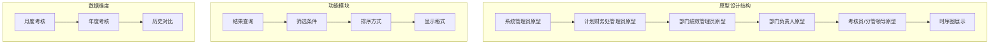
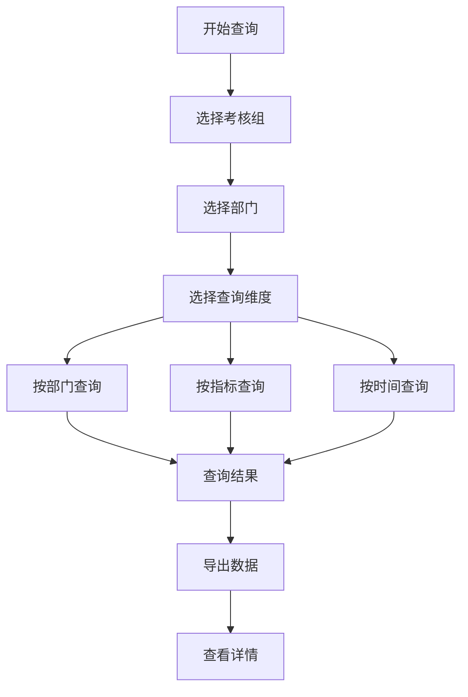
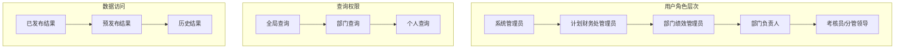
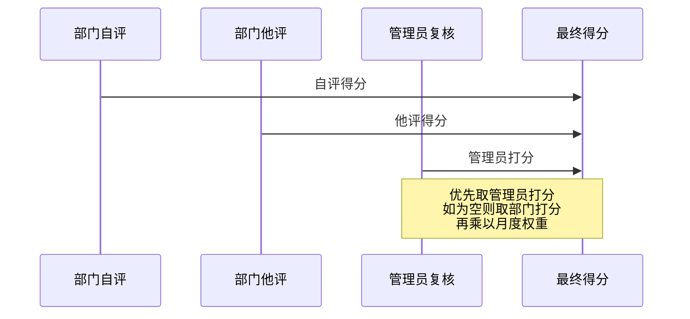
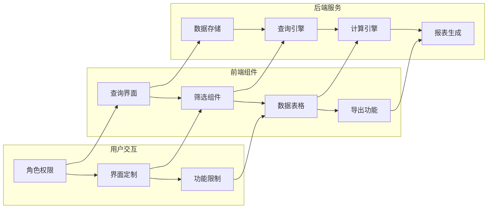

# 考核结果查询

<cite>
**本文档引用的文件**
- [系统管理员原型-v1.html](file://1-系统管理员原型-v1.html)
- [计划财务处业绩考核管理员原型-v1.html](file://2-计划财务处业绩考核管理员原型-v1.html)
- [部门绩效管理员原型-v1.html](file://3-部门绩效管理员原型-v1.html)
- [部门负责人原型-v1.html](file://4-部门负责人原型-v1.html)
- [考核员分管领导原型-v1.html](file://5-考核员分管领导原型-v1.html)
- [时序图-v1.html](file://6-时序图-v1.html)
</cite>

## 目录
1. [简介](#简介)
2. [项目结构](#项目结构)
3. [核心组件](#核心组件)
4. [架构概览](#架构概览)
5. [详细组件分析](#详细组件分析)
6. [依赖关系分析](#依赖关系分析)
7. [性能考虑](#性能考虑)
8. [故障排除指南](#故障排除指南)
9. [结论](#结论)
10. [附录](#附录)

## 简介

本文档为部门管理员创建的考核结果查询功能详细使用指南。基于月度业绩考核原型设计项目，系统提供了完整的考核结果查询、筛选、排序和导出功能。用户可以通过多种维度查看已发布的考核结果，包括按部门、按指标、按时间的查询方式。

该系统支持月度和年度考核结果的查询，提供详细的得分构成分析，包括自评得分、他评得分和最终得分的计算方法。同时，系统还支持历史结果的查询和对比分析，帮助用户进行绩效改进和决策制定。

## 项目结构

项目采用原型设计的方式，通过HTML页面展示不同的角色界面和功能模块。整体结构分为六个主要原型页面：

**图表来源**
- [系统管理员原型-v1.html:621-632](file://1-系统管理员原型-v1.html#L621-L632)
- [计划财务处业绩考核管理员原型-v1.html:346-351](file://2-计划财务处业绩考核管理员原型-v1.html#L346-L351)

**章节来源**
- [系统管理员原型-v1.html:1-635](file://1-系统管理员原型-v1.html#L1-L635)
- [计划财务处业绩考核管理员原型-v1.html:1-1039](file://2-计划财务处业绩考核管理员原型-v1.html#L1-L1039)

## 核心组件

### 结果查询界面

系统为不同角色提供了专门的结果查询界面，每个界面都包含了完整的查询功能：

#### 系统管理员查询界面
- 支持按考核组、部门、查询维度进行筛选
- 提供明细表和汇总表导出功能
- 展示月度总分和考核系数

#### 部门绩效管理员查询界面  
- 专注于本部门的历史考核结果
- 提供自评得分、他评得分、最终得分的详细对比
- 支持按时间段的查询和筛选

#### 部门负责人查询界面
- 查看预发布和已发布状态的部门考核结果
- 支持按考核期间和部门的筛选
- 提供完整的评分详情查看功能

**章节来源**
- [系统管理员原型-v1.html:623-653](file://1-系统管理员原型-v1.html#L623-L653)
- [部门绩效管理员原型-v1.html:701-761](file://3-部门绩效管理员原型-v1.html#L701-L761)
- [部门负责人原型-v1.html:540-660](file://4-部门负责人原型-v1.html#L540-L660)

### 筛选条件系统

系统提供了灵活的筛选条件，支持多维度的数据查询：

**图表来源**
- [系统管理员原型-v1.html:631-638](file://1-系统管理员原型-v1.html#L631-L638)

**章节来源**
- [系统管理员原型-v1.html:629-638](file://1-系统管理员原型-v1.html#L629-L638)

### 排序和显示格式

系统支持多种排序方式和显示格式：

- **排序方式**：支持按部门名称、考核期间、得分高低等维度排序
- **显示格式**：提供表格形式的详细列表，支持颜色标识的得分等级
- **数据格式**：支持数字、百分比、权重等不同格式的数据显示

**章节来源**
- [系统管理员原型-v1.html:640-651](file://1-系统管理员原型-v1.html#L640-L651)

## 架构概览

系统采用分层架构设计，不同角色拥有相应的查询权限和功能范围：

**图表来源**
- [时序图-v1.html:315-338](file://6-时序图-v1.html#L315-L338)

**章节来源**
- [时序图-v1.html:300-556](file://6-时序图-v1.html#L300-L556)

## 详细组件分析

### 结果查询功能详解

#### 月度考核结果查询

月度考核结果查询是系统的核心功能之一，支持以下特性：

1. **查询维度**：
   - 按部门维度：查看特定部门的月度考核结果
   - 按指标维度：查看特定指标在各部门的表现
   - 按时间维度：查看特定时间段内的考核结果

2. **数据展示**：
   - 关键指标得分：重点工作得分、基础工作得分、控制指标得分、动态督办得分
   - 总分计算：月度总分和考核系数
   - 等级标识：使用颜色区分优秀、良好、合格、待改进等等级

3. **导出功能**：
   - 明细表导出：包含所有详细指标和得分
   - 汇总表导出：提供部门层面的汇总数据

**章节来源**
- [系统管理员原型-v1.html:623-653](file://1-系统管理员原型-v1.html#L623-L653)

#### 年度考核结果查询

年度考核结果查询功能相对简化，主要面向管理层和高级用户：

1. **查询范围**：支持年度维度的考核结果查询
2. **数据粒度**：提供部门层面的年度汇总结果
3. **应用场景**：主要用于年度绩效评估和薪酬发放

**章节来源**
- [部门负责人原型-v1.html:540-660](file://4-部门负责人原型-v1.html#L540-L660)

### 得分构成和计算方法

#### 自评得分、他评得分、最终得分

系统采用多层次的评分机制：

**图表来源**
- [计划财务处业绩考核管理员原型-v1.html:546-557](file://2-计划财务处业绩考核管理员原型-v1.html#L546-L557)

#### 权重计算机制

1. **月度权重**：每个指标都有对应的月度权重，影响最终得分
2. **部门权重**：按部门的大类权重进行汇总
3. **系数计算**：根据最终得分计算月度考核系数

**章节来源**
- [计划财务处业绩考核管理员原型-v1.html:546-557](file://2-计划财务处业绩考核管理员原型-v1.html#L546-L557)

### 结果详情查看功能

#### 详细得分明细

系统提供详细的结果详情查看功能，包括：

1. **指标明细**：每个指标的具体得分和权重
2. **评分依据**：支持查看评分说明和佐证材料
3. **对比分析**：支持与其他部门或历史数据的对比

#### 权重分布展示

系统清晰展示权重分布情况：

- 大类权重：重点工作、基础工作、控制指标、动态督办等
- 小类权重：具体业务领域的权重分配
- 指标权重：单项指标的权重占比

**章节来源**
- [部门绩效管理员原型-v1.html:701-761](file://3-部门绩效管理员原型-v1.html#L701-L761)

### 历史结果查询和对比分析

#### 历史数据查询

系统支持历史考核结果的查询和对比：

1. **时间范围**：支持跨月度、跨季度、跨年度的历史数据查询
2. **对比维度**：支持部门间、指标间的横向对比
3. **趋势分析**：提供得分趋势的可视化展示

#### 对比分析方法

1. **同比分析**：与去年同期数据进行对比
2. **环比分析**：与上月数据进行对比
3. **目标达成分析**：与既定目标进行对比

**章节来源**
- [考核员分管领导原型-v1.html:697-800](file://5-考核员分管领导原型-v1.html#L697-L800)

## 依赖关系分析

系统各组件之间的依赖关系如下：

**图表来源**
- [系统管理员原型-v1.html:621-632](file://1-系统管理员原型-v1.html#L621-L632)

**章节来源**
- [系统管理员原型-v1.html:621-632](file://1-系统管理员原型-v1.html#L621-L632)

## 性能考虑

### 查询性能优化

1. **索引策略**：对常用查询字段建立数据库索引
2. **缓存机制**：对热门查询结果进行缓存
3. **分页加载**：大数据量时采用分页加载机制
4. **异步处理**：导出功能采用异步处理，避免阻塞

### 数据展示优化

1. **虚拟滚动**：大量数据时采用虚拟滚动技术
2. **懒加载**：详情页面采用懒加载机制
3. **数据压缩**：传输过程中对数据进行压缩
4. **CDN加速**：静态资源通过CDN进行加速

## 故障排除指南

### 常见问题及解决方案

#### 查询无结果

**可能原因**：
- 查询条件过于严格
- 数据尚未发布
- 权限不足

**解决方法**：
1. 简化查询条件
2. 检查数据发布状态
3. 联系系统管理员提升权限

#### 数据显示异常

**可能原因**：
- 浏览器兼容性问题
- 缓存数据过期
- 网络连接不稳定

**解决方法**：
1. 更换浏览器尝试
2. 清除浏览器缓存
3. 检查网络连接状态

#### 导出功能失败

**可能原因**：
- 文件过大
- 浏览器阻止弹窗
- 服务器负载过高

**解决方法**：
1. 减少查询数据量
2. 允许浏览器弹窗
3. 稍后再试或联系技术支持

**章节来源**
- [系统管理员原型-v1.html:621-632](file://1-系统管理员原型-v1.html#L621-L632)

## 结论

月度业绩考核结果查询系统为部门管理员提供了全面、便捷的考核结果查询功能。系统通过多维度的查询方式、灵活的筛选条件、详细的得分分析和丰富的导出功能，满足了不同用户的需求。

系统的主要优势包括：
- **多角色适配**：针对不同角色提供专门的查询界面
- **多维度查询**：支持按部门、指标、时间等多种维度查询
- **详细分析**：提供完整的得分构成和计算方法说明
- **灵活导出**：支持明细表和汇总表的导出功能
- **历史对比**：支持历史数据的查询和对比分析

通过合理使用这些功能，部门管理员可以更好地进行绩效管理和决策制定，提高工作效率和管理水平。

## 附录

### 使用技巧和最佳实践

1. **查询技巧**
   - 使用组合筛选条件缩小查询范围
   - 先进行粗略查询，再逐步细化
   - 利用导出来进行批量数据分析

2. **结果应用**
   - 定期查看历史趋势，识别改进机会
   - 与部门目标进行对比分析
   - 结合他评结果进行综合评估

3. **数据导出**
   - 导出前先预览数据完整性
   - 选择合适的导出格式
   - 及时备份重要数据

### 相关文档链接

- [系统管理员原型](file://1-系统管理员原型-v1.html)
- [计划财务处管理员原型](file://2-计划财务处业绩考核管理员原型-v1.html)
- [部门绩效管理员原型](file://3-部门绩效管理员原型-v1.html)
- [部门负责人原型](file://4-部门负责人原型-v1.html)
- [考核员/分管领导原型](file://5-考核员分管领导原型-v1.html)
- [时序图展示](file://6-时序图-v1.html)