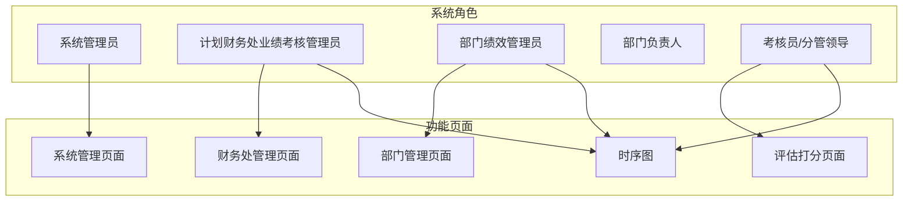
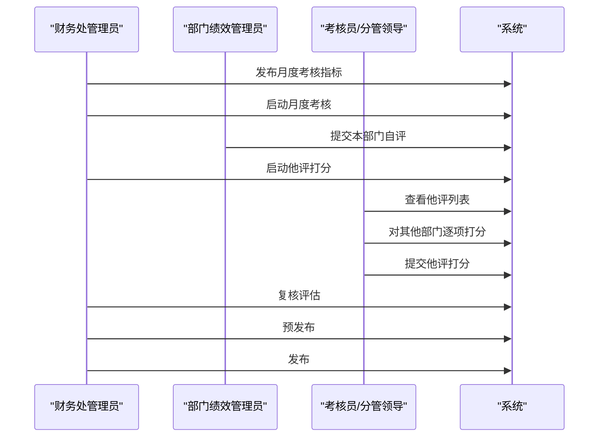
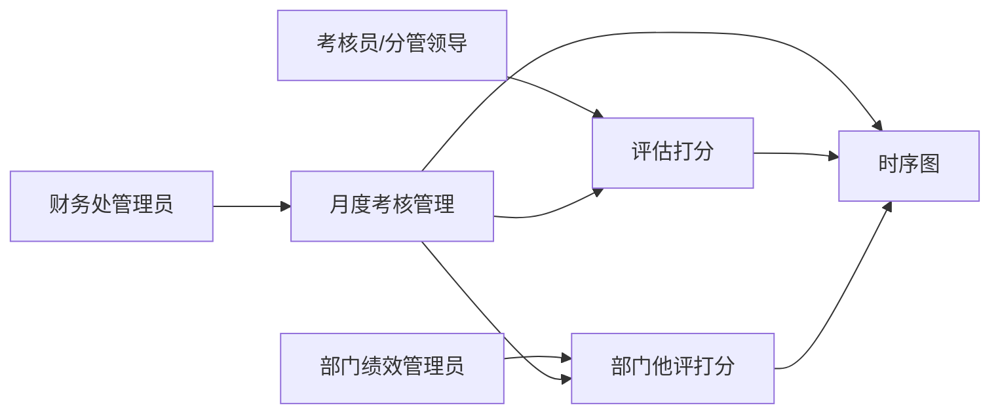

# 部门他评打分

<cite>
**本文引用的文件**
- [系统管理员原型-v1.html](file://1-系统管理员原型-v1.html)
- [计划财务处业绩考核管理员原型-v1.html](file://2-计划财务处业绩考核管理员原型-v1.html)
- [部门绩效管理员原型-v1.html](file://3-部门绩效管理员原型-v1.html)
- [部门负责人原型-v1.html](file://4-部门负责人原型-v1.html)
- [考核员分管领导原型-v1.html](file://5-考核员分管领导原型-v1.html)
- [月度业绩考核管理 - 时序图-v1.html](file://6-时序图-v1.html)
</cite>

## 目录
1. [简介](#简介)
2. [项目结构](#项目结构)
3. [核心组件](#核心组件)
4. [架构概览](#架构概览)
5. [详细组件分析](#详细组件分析)
6. [依赖关系分析](#依赖关系分析)
7. [性能考虑](#性能考虑)
8. [故障排除指南](#故障排除指南)
9. [结论](#结论)
10. [附录](#附录)

## 简介
本指南面向部门管理员，提供“部门他评打分”功能的完整操作说明。他评是指在月度考核中，由非被考核部门对其他部门的月度业绩指标进行评估与打分。本指南涵盖：
- 启动条件与评估范围
- 评分标准与权重规则
- 参与方式与流程
- 评估表格填写规范与评分依据
- 他评状态管理与结果确认
- 跨部门协作与争议处理
- 质量保障与最佳实践

## 项目结构
本项目采用多角色原型页面设计，围绕“月度业绩考核”主题，分别提供系统管理员、计划财务处管理员、部门绩效管理员、部门负责人、考核员/分管领导等角色的界面与流程视图。

图表来源
- [系统管理员原型-v1.html](file://1-系统管理员原型-v1.html)
- [计划财务处业绩考核管理员原型-v1.html](file://2-计划财务处业绩考核管理员原型-v1.html)
- [部门绩效管理员原型-v1.html](file://3-部门绩效管理员原型-v1.html)
- [考核员分管领导原型-v1.html](file://5-考核员分管领导原型-v1.html)
- [月度业绩考核管理 - 时序图-v1.html](file://6-时序图-v1.html)

章节来源
- [系统管理员原型-v1.html](file://1-系统管理员原型-v1.html)
- [计划财务处业绩考核管理员原型-v1.html](file://2-计划财务处业绩考核管理员原型-v1.html)
- [部门绩效管理员原型-v1.html](file://3-部门绩效管理员原型-v1.html)
- [部门负责人原型-v1.html](file://4-部门负责人原型-v1.html)
- [考核员分管领导原型-v1.html](file://5-考核员分管领导原型-v1.html)
- [月度业绩考核管理 - 时序图-v1.html](file://6-时序图-v1.html)

## 核心组件
- 系统管理员：负责单位、权限、组织、指标大类等系统级配置，间接支撑他评流程的组织与规则基础。
- 计划财务处业绩考核管理员：统筹月度考核流程，包括发布指标、启动他评、复核评估、预发布与发布；负责跨部门他评的总体推进与监督。
- 部门绩效管理员：负责本部门的自评与他评参与，查看他评状态，提交与确认本部门的评估结果。
- 部门负责人：查看本部门的考核结果，关注他评反馈与申诉处理。
- 考核员/分管领导：承担他评打分的具体执行，支持按部门/按指标两种视图，进行评分与提交。

章节来源
- [系统管理员原型-v1.html](file://1-系统管理员原型-v1.html)
- [计划财务处业绩考核管理员原型-v1.html](file://2-计划财务处业绩考核管理员原型-v1.html)
- [部门绩效管理员原型-v1.html](file://3-部门绩效管理员原型-v1.html)
- [部门负责人原型-v1.html](file://4-部门负责人原型-v1.html)
- [考核员分管领导原型-v1.html](file://5-考核员分管领导原型-v1.html)

## 架构概览
他评流程在系统层面由“发布指标—启动考核—部门自评—启动他评—他评打分—复核评估—预发布—发布”构成。其中“他评打分”环节由考核员/分管领导与部门绩效管理员共同完成，系统提供状态跟踪与进度可视化。

图表来源
- [月度业绩考核管理 - 时序图-v1.html](file://6-时序图-v1.html)
- [计划财务处业绩考核管理员原型-v1.html](file://2-计划财务处业绩考核管理员原型-v1.html)
- [部门绩效管理员原型-v1.html](file://3-部门绩效管理员原型-v1.html)
- [考核员分管领导原型-v1.html](file://5-考核员分管领导原型-v1.html)

## 详细组件分析

### 他评启动条件与评估范围
- 启动条件
  - 财务处管理员在“月度考核管理”中完成“发布考核指标”和“启动考核”，并在“他评中”状态下开启“启动他评”。
  - 系统会将处于“他评中”的考核组展示在“部门他评打分”页面，供打分人员进入。
- 评估范围
  - 他评针对“其他部门”的月度指标进行评估，打分人员需在“按部门展示”或“按指标展示”两种视图中完成评分。
  - 评估对象为“被考核部门”的具体指标，包含指标大类、小类、考核内容与权重。

章节来源
- [计划财务处业绩考核管理员原型-v1.html](file://2-计划财务处业绩考核管理员原型-v1.html)
- [部门绩效管理员原型-v1.html](file://3-部门绩效管理员原型-v1.html)
- [考核员分管领导原型-v1.html](file://5-考核员分管领导原型-v1.html)
- [月度业绩考核管理 - 时序图-v1.html](file://6-时序图-v1.html)

### 评分标准与权重规则
- 评分范围与格式
  - 打分输入为数值型，系统提供统一的评分输入控件与说明文本域，确保评分依据可追溯。
- 权重与计算
  - 单项指标得分 = 管理员打分（如有）或 考核部门打分 × 月度权重。
  - 部门月度得分 = 该部门全部指标得分之和，按大类汇总。
  - 月度考核系数与绩效奖金挂钩，用于及时激励。
- 评分一致性
  - 若管理员打分为空，则系统取部门打分作为最终依据；若管理员打分存在，则优先使用管理员打分。

章节来源
- [计划财务处业绩考核管理员原型-v1.html](file://2-计划财务处业绩考核管理员原型-v1.html)
- [月度业绩考核管理 - 时序图-v1.html](file://6-时序图-v1.html)

### 参与方式与流程
- 角色分工
  - 考核员/分管领导：登录“评估打分”页面，选择“按部门展示”或“按指标展示”，对其他部门逐项打分并提交。
  - 部门绩效管理员：在“部门他评打分”页面查看本部门他评状态，确认评估结果。
- 流程步骤
  1) 财务处管理员启动他评；
  2) 考核员/分管领导进入评估页面，选择部门并完成打分；
  3) 提交他评打分；
  4) 财务处管理员复核评估并计算得分；
  5) 预发布与发布。

章节来源
- [考核员分管领导原型-v1.html](file://5-考核员分管领导原型-v1.html)
- [部门绩效管理员原型-v1.html](file://3-部门绩效管理员原型-v1.html)
- [月度业绩考核管理 - 时序图-v1.html](file://6-时序图-v1.html)

### 评估表格填写规范与评分依据
- 表格字段
  - 指标大类、指标小类、考核内容、指标/目标、考核标准、权重（年度/月度）、得分、打分说明、考核结果。
- 填写规范
  - 得分必须为有效数值，建议在“打分说明”中简要说明评分依据与佐证材料链接。
  - “按指标展示”视图便于横向对比同一指标在不同部门的表现，有助于统一评分尺度。
- 评分依据的客观性
  - 建议以KPI达成率、过程文档、会议纪要、外部检查报告等为依据，避免主观臆断。
  - 对于跨部门协作类指标，应结合协作记录、配合度与产出质量进行综合评估。

章节来源
- [考核员分管领导原型-v1.html](file://5-考核员分管领导原型-v1.html)

### 他评状态管理与结果确认
- 状态流转
  - 待评估 → 已提交 → 已发布（中间可能经历复核中、预发布）。
- 状态查询
  - 财务处管理员可在“月度考核管理”中查看“他评完成”进度。
  - 部门绩效管理员可在“部门他评打分”页面查看本部门他评状态。
- 结果确认
  - 预发布阶段允许部门查看完整评估信息；发布后数据冻结，结果正式生效。

章节来源
- [计划财务处业绩考核管理员原型-v1.html](file://2-计划财务处业绩考核管理员原型-v1.html)
- [部门绩效管理员原型-v1.html](file://3-部门绩效管理员原型-v1.html)
- [月度业绩考核管理 - 时序图-v1.html](file://6-时序图-v1.html)

### 跨部门协作与沟通技巧
- 建立协作机制
  - 在他评前，组织跨部门沟通会，明确指标口径、评分标准与权重，形成共识。
- 透明与可追溯
  - 打分说明应清晰、可追溯，必要时附上佐证材料链接或编号。
- 反馈闭环
  - 对评分存疑的部门，可通过申诉流程进行复核与重新评估，确保公平公正。

章节来源
- [月度业绩考核管理 - 时序图-v1.html](file://6-时序图-v1.html)

### 评估争议处理与质量保障
- 争议处理
  - 申诉成功后，系统退回打分部门进行重新评估，重新计算并再次复核。
- 质量保障
  - 财务处管理员在“复核评估”中可对异常分数进行修正，并记录说明。
  - 建议定期开展评分培训，统一尺度，减少偏差。

章节来源
- [计划财务处业绩考核管理员原型-v1.html](file://2-计划财务处业绩考核管理员原型-v1.html)
- [月度业绩考核管理 - 时序图-v1.html](file://6-时序图-v1.html)

## 依赖关系分析
他评流程涉及的角色与页面存在如下依赖关系：

图表来源
- [计划财务处业绩考核管理员原型-v1.html](file://2-计划财务处业绩考核管理员原型-v1.html)
- [部门绩效管理员原型-v1.html](file://3-部门绩效管理员原型-v1.html)
- [考核员分管领导原型-v1.html](file://5-考核员分管领导原型-v1.html)
- [月度业绩考核管理 - 时序图-v1.html](file://6-时序图-v1.html)

章节来源
- [计划财务处业绩考核管理员原型-v1.html](file://2-计划财务处业绩考核管理员原型-v1.html)
- [部门绩效管理员原型-v1.html](file://3-部门绩效管理员原型-v1.html)
- [考核员分管领导原型-v1.html](file://5-考核员分管领导原型-v1.html)
- [月度业绩考核管理 - 时序图-v1.html](file://6-时序图-v1.html)

## 性能考虑
- 页面加载与交互
  - 评估打分页面提供“按部门展示/按指标展示”切换，建议在指标较多时优先使用“按指标展示”以提升对比效率。
- 数据量与进度
  - 系统提供进度条与统计卡片，便于实时掌握他评完成度，建议按部门分批推进，避免集中提交造成拥堵。
- 评分一致性
  - 建议在打分前统一培训与口径，减少反复修正带来的系统压力。

## 故障排除指南
- 无法进入他评页面
  - 检查当前考核组状态是否为“他评中”，若尚未启动他评，请联系财务处管理员。
- 打分提交失败
  - 确认所有必填字段（得分、打分说明）已填写；检查网络连接与浏览器兼容性。
- 评分差异较大
  - 通过“按指标展示”视图对比各部门得分，结合打分说明与佐证材料进行复核；必要时发起申诉流程。
- 状态显示异常
  - 刷新页面或切换“按部门/按指标”视图；若仍异常，联系系统管理员核查系统状态。

章节来源
- [计划财务处业绩考核管理员原型-v1.html](file://2-计划财务处业绩考核管理员原型-v1.html)
- [部门绩效管理员原型-v1.html](file://3-部门绩效管理员原型-v1.html)
- [考核员分管领导原型-v1.html](file://5-考核员分管领导原型-v1.html)

## 结论
部门他评打分是月度考核中的关键环节，既体现跨部门协作与监督，也关系到考核结果的公平性与激励效果。通过明确启动条件、统一评分标准、规范填写流程、加强沟通与争议处理，以及利用系统提供的状态与视图工具，可以高效、高质量地完成他评工作。

## 附录
- 最佳实践清单
  - 他评前统一培训与口径，确保评分一致性。
  - 打分说明与佐证材料齐全，便于复核与申诉。
  - 按部门分批推进他评，避免集中提交造成拥堵。
  - 预发布阶段组织交叉复核，降低发布风险。
  - 建立申诉与重新评估机制，保障公平公正。