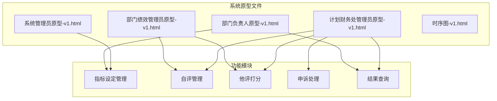
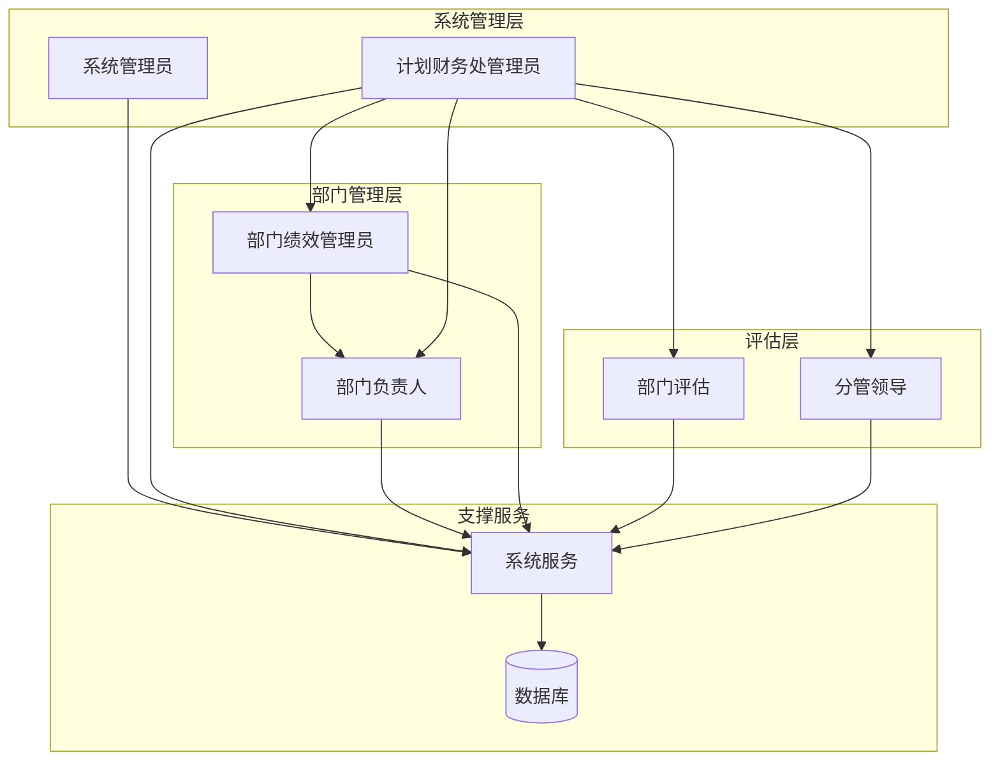
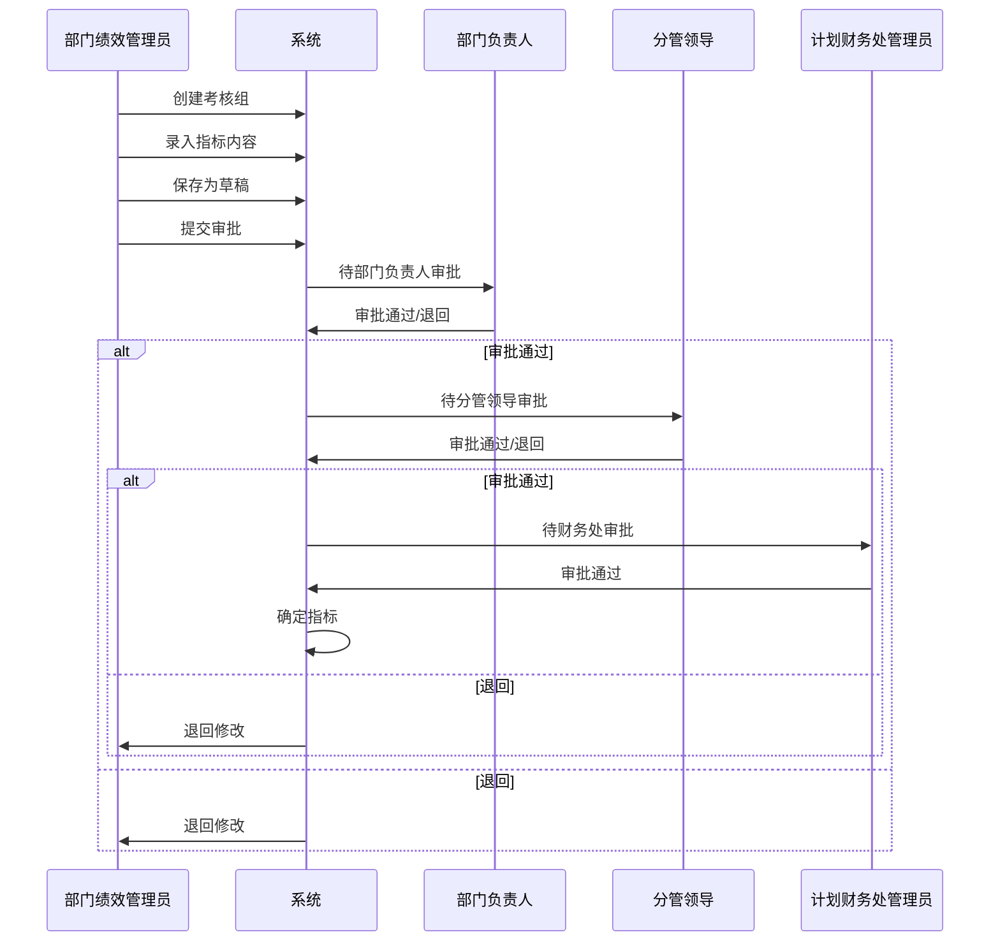
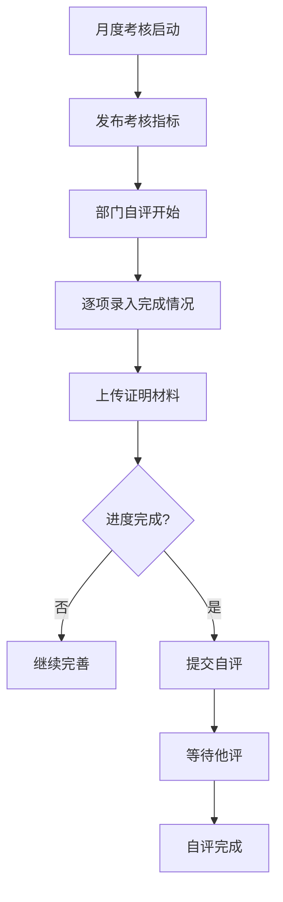
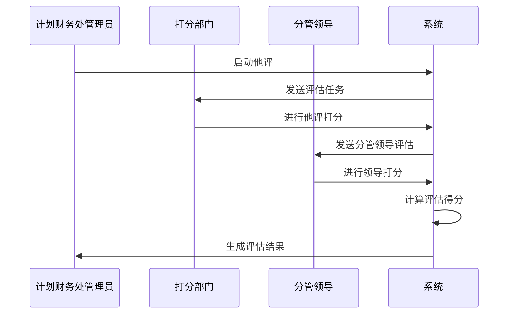
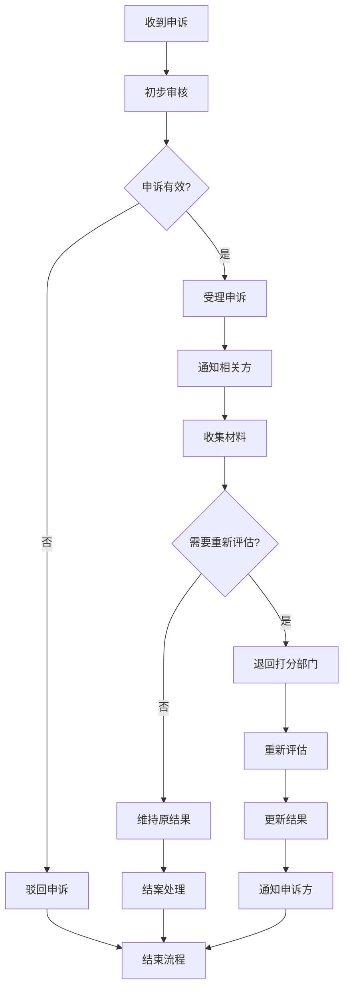
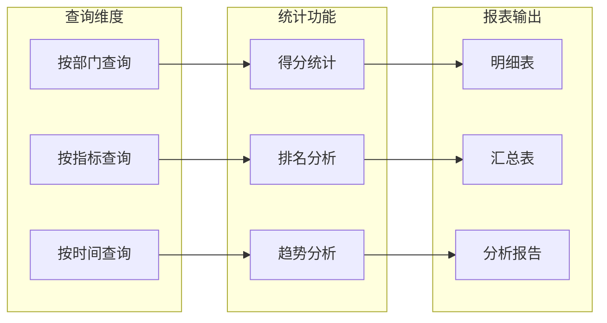
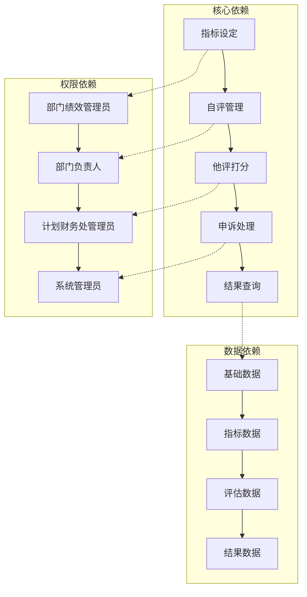
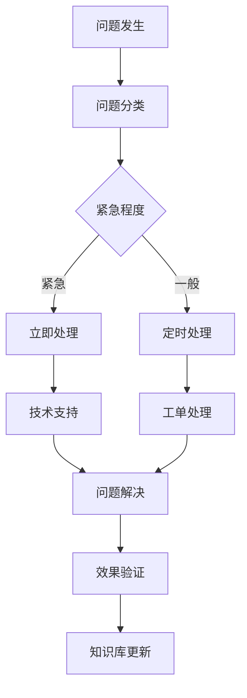

# 部门管理员指南

<cite>
**本文档引用的文件**
- [3-部门绩效管理员原型-v1.html](file://3-部门绩效管理员原型-v1.html)
- [4-部门负责人原型-v1.html](file://4-部门负责人原型-v1.html)
- [6-时序图-v1.html](file://6-时序图-v1.html)
- [1-系统管理员原型-v1.html](file://1-系统管理员原型-v1.html)
- [2-计划财务处业绩考核管理员原型-v1.html](file://2-计划财务处业绩考核管理员原型-v1.html)
</cite>

## 目录
1. [简介](#简介)
2. [项目结构](#项目结构)
3. [核心功能模块](#核心功能模块)
4. [架构概览](#架构概览)
5. [详细功能分析](#详细功能分析)
6. [依赖关系分析](#依赖关系分析)
7. [性能考虑](#性能考虑)
8. [故障排除指南](#故障排除指南)
9. [结论](#结论)

## 简介

本指南面向部门管理员，详细介绍月度业绩考核系统的操作流程和管理方法。该系统采用原型设计方式，通过HTML页面模拟完整的考核管理流程，涵盖指标设定、自评管理、他评打分、申诉反馈处理和结果查询等核心功能。

系统采用分层架构设计，包含多个角色协同工作：系统管理员负责系统配置和权限管理，计划财务处管理员负责整体考核流程管控，部门负责人负责审批和监督，部门绩效管理员负责具体执行操作。

## 项目结构

项目采用模块化设计，包含以下主要原型文件：

**图表来源**
- [3-部门绩效管理员原型-v1.html:411-430](file://3-部门绩效管理员原型-v1.html#L411-L430)
- [4-部门负责人原型-v1.html:350-366](file://4-部门负责人原型-v1.html#L350-L366)

**章节来源**
- [3-部门绩效管理员原型-v1.html:1-800](file://3-部门绩效管理员原型-v1.html#L1-L800)
- [4-部门负责人原型-v1.html:1-800](file://4-部门负责人原型-v1.html#L1-L800)

## 核心功能模块

### 指标设定模块
部门绩效管理员负责年度和月度指标的设定与维护，包括：
- 考核组管理与状态控制
- 指标目标设定与提交
- 审批流程跟踪与处理
- 状态流转监控

### 自评管理模块
支持部门内部自评流程：
- 月度考核自评启动
- 指标完成情况录入
- 自评描述与附件上传
- 提交与状态管理

### 他评打分模块
实现跨部门评估机制：
- 他评打分启动与管理
- 打分标准与权重应用
- 分管领导参与评估
- 评估结果汇总

### 申诉处理模块
建立完善的争议解决机制：
- 申诉申请与材料提交
- 申诉审核与处理
- 重新评估流程
- 结果更新与通知

### 结果查询模块
提供全面的结果查询功能：
- 考核结果浏览与统计
- 指标得分明细查看
- 绩效等级与系数计算
- 报表导出与分析

**章节来源**
- [3-部门绩效管理员原型-v1.html:445-764](file://3-部门绩效管理员原型-v1.html#L445-L764)
- [2-计划财务处业绩考核管理员原型-v1.html:353-656](file://2-计划财务处业绩考核管理员原型-v1.html#L353-L656)

## 架构概览

系统采用多角色协作架构，各角色职责明确，权限分离：

**图表来源**
- [6-时序图-v1.html:118-296](file://6-时序图-v1.html#L118-L296)
- [1-系统管理员原型-v1.html:292-316](file://1-系统管理员原型-v1.html#L292-L316)

系统采用前后端分离设计，前端使用HTML/CSS/JavaScript实现用户界面，后端通过AJAX与服务器交互，实现数据的实时更新和状态同步。

## 详细功能分析

### 指标设定流程

指标设定是整个考核体系的基础，部门绩效管理员需要按照以下步骤操作：

**图表来源**
- [6-时序图-v1.html:155-241](file://6-时序图-v1.html#L155-L241)

**操作要点**：
- 指标更新遵循"中途不调整"原则，特殊情况需重新发起审批流程
- 状态流转严格控制，确保审批层级完整
- 权重设置需符合组织架构要求

### 自评管理流程

自评管理是部门内部的重要环节：

**图表来源**
- [6-时序图-v1.html:366-376](file://6-时序图-v1.html#L366-L376)

**实施标准**：
- 自评必须基于实际完成情况进行
- 证明材料需真实有效，格式符合要求
- 提交前需进行完整性检查

### 他评打分流程

他评打分体现跨部门协作：

**图表来源**
- [6-时序图-v1.html:390-407](file://6-时序图-v1.html#L390-L407)

**评分标准**：
- 打分范围通常为0-120分
- 系统自动计算：管理员打分或部门打分×月度权重
- 优先使用管理员打分作为最终得分

### 申诉处理流程

申诉处理确保考核公正性：

**图表来源**
- [6-时序图-v1.html:440-467](file://6-时序图-v1.html#L440-L467)

**处理要求**：
- 申诉材料需在规定时间内提交
- 重新评估需在指定时限内完成
- 处理过程需保持透明和可追溯

### 结果查询与统计

结果查询提供多维度的数据分析：

**图表来源**
- [2-计划财务处业绩考核管理员原型-v1.html:623-653](file://2-计划财务处业绩考核管理员原型-v1.html#L623-L653)

**查询要点**：
- 支持多条件组合查询
- 实时数据更新和展示
- 导出功能便于进一步分析

**章节来源**
- [3-部门绩效管理员原型-v1.html:525-764](file://3-部门绩效管理员原型-v1.html#L525-L764)
- [2-计划财务处业绩考核管理员原型-v1.html:481-656](file://2-计划财务处业绩考核管理员原型-v1.html#L481-L656)

## 依赖关系分析

系统各模块之间存在复杂的依赖关系：

**图表来源**
- [6-时序图-v1.html:352-554](file://6-时序图-v1.html#L352-L554)

**依赖特点**：
- 严格的层级依赖关系
- 数据流向清晰明确
- 权限控制贯穿始终

**章节来源**
- [1-系统管理员原型-v1.html:291-316](file://1-系统管理员原型-v1.html#L291-L316)
- [4-部门负责人原型-v1.html:350-366](file://4-部门负责人原型-v1.html#L350-L366)

## 性能考虑

系统设计充分考虑了性能优化：

### 前端性能优化
- 使用CSS变量统一样式管理
- 图片懒加载减少初始加载时间
- 模态框按需加载提升响应速度
- 本地存储常用配置数据

### 后端性能优化
- 异步数据加载避免页面阻塞
- 缓存机制减少重复请求
- 分页加载处理大量数据
- 实时状态更新保持数据一致性

### 数据处理优化
- 批量操作支持大数据量处理
- 智能搜索减少数据库压力
- 权限缓存提升访问效率
- 日志记录便于性能监控

## 故障排除指南

### 常见问题及解决方案

**登录认证问题**
- 检查账号权限配置
- 验证密码强度要求
- 确认所属组织归属
- 清除浏览器缓存重试

**数据同步异常**
- 检查网络连接状态
- 验证系统服务可用性
- 查看同步日志记录
- 手动触发同步操作

**权限访问受限**
- 确认角色权限范围
- 检查数据范围配置
- 验证组织架构关系
- 联系系统管理员授权

**功能操作失败**
- 检查必填字段完整性
- 验证文件格式和大小
- 确认操作时机正确性
- 查看系统提示信息

### 技术支持流程

**章节来源**
- [1-系统管理员原型-v1.html:541-559](file://1-系统管理员原型-v1.html#L541-L559)

## 结论

本指南详细介绍了部门管理员在月度业绩考核系统中的操作方法和管理职责。通过理解系统架构、掌握各功能模块的操作流程，部门管理员可以有效地组织和管理本部门的考核工作。

关键成功因素包括：
- 严格按照流程执行各项操作
- 注重数据准确性和完整性
- 及时处理各类异常和申诉
- 加强部门内外部沟通协调

建议定期回顾和优化工作流程，持续提升考核工作的效率和质量。同时要关注系统更新和版本升级，确保操作方法与最新系统功能保持一致。