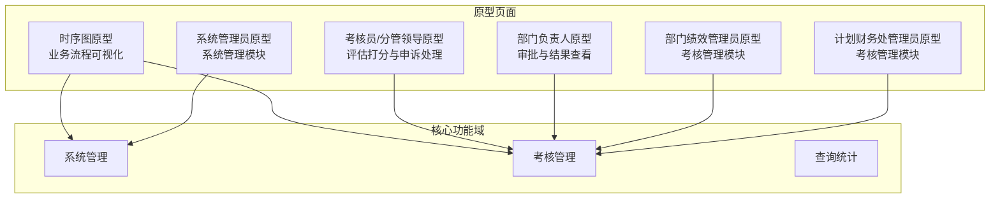
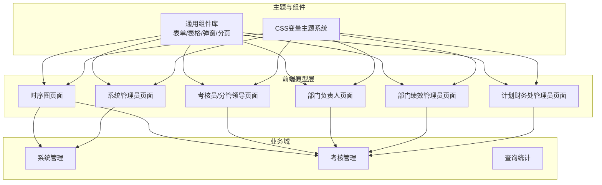
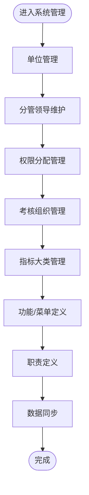
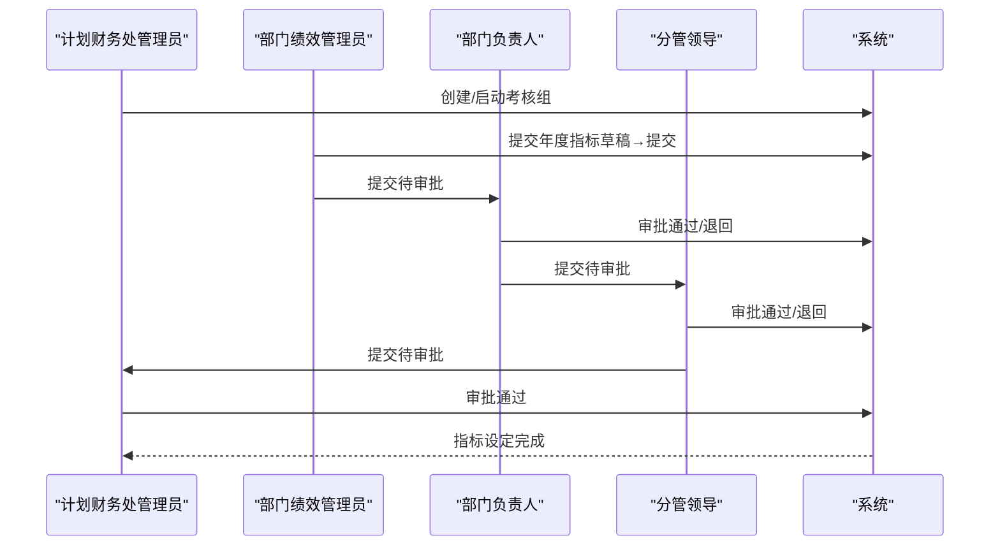
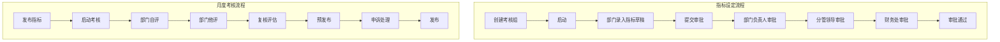

# 项目概述

<cite>
**本文档引用的文件**
- [1-系统管理员原型-v1.html](file://月度业绩考核原型设计初稿/1-系统管理员原型-v1.html)
- [2-计划财务处业绩考核管理员原型-v1.html](file://月度业绩考核原型设计初稿/2-计划财务处业绩考核管理员原型-v1.html)
- [3-部门绩效管理员原型-v1.html](file://月度业绩考核原型设计初稿/3-部门绩效管理员原型-v1.html)
- [4-部门负责人原型-v1.html](file://月度业绩考核原型设计初稿/4-部门负责人原型-v1.html)
- [5-考核员分管领导原型-v1.html](file://月度业绩考核原型设计初稿/5-考核员分管领导原型-v1.html)
- [6-时序图-v1.html](file://月度业绩考核原型设计初稿/6-时序图-v1.html)
</cite>

## 目录
1. [引言](#引言)
2. [项目结构](#项目结构)
3. [核心组件](#核心组件)
4. [架构总览](#架构总览)
5. [详细组件分析](#详细组件分析)
6. [依赖关系分析](#依赖关系分析)
7. [性能考虑](#性能考虑)
8. [故障排除指南](#故障排除指南)
9. [结论](#结论)
10. [附录](#附录)

## 引言
本项目为“月度业绩考核管理系统”的前端原型设计，面向企业级绩效管理场景，围绕“系统管理、考核管理、查询统计”三大模块构建，覆盖从指标设定、自评、他评、复核、申诉到发布的完整业务闭环。系统采用多角色协作模式，通过HTML5、CSS3与轻量JavaScript实现高可用的交互界面与主题化视觉体系，支持风格切换与响应式布局，满足不同组织的视觉偏好与使用习惯。

## 项目结构
项目以“角色原型”为核心组织形式，每个角色页面独立封装，包含：
- 系统管理：单位管理、权限分配、功能菜单、职责定义、数据同步等
- 考核管理：考核组管理、指标审批、月度考核、复核评估、申诉管理、进度查询、结果查询等
- 查询统计：历史查询、结果统计等
- 时序图：指标设定与月度考核的端到端流程图

图表来源
- [1-系统管理员原型-v1.html:1-635](file://月度业绩考核原型设计初稿/1-系统管理员原型-v1.html#L1-L635)
- [2-计划财务处业绩考核管理员原型-v1.html:1-1039](file://月度业绩考核原型设计初稿/2-计划财务处业绩考核管理员原型-v1.html#L1-L1039)
- [3-部门绩效管理员原型-v1.html:1-1663](file://月度业绩考核原型设计初稿/3-部门绩效管理员原型-v1.html#L1-L1663)
- [4-部门负责人原型-v1.html:1-1231](file://月度业绩考核原型设计初稿/4-部门负责人原型-v1.html#L1-L1231)
- [5-考核员分管领导原型-v1.html:1-1459](file://月度业绩考核原型设计初稿/5-考核员分管领导原型-v1.html#L1-L1459)
- [6-时序图-v1.html:1-570](file://月度业绩考核原型设计初稿/6-时序图-v1.html#L1-L570)

章节来源
- [1-系统管理员原型-v1.html:1-635](file://月度业绩考核原型设计初稿/1-系统管理员原型-v1.html#L1-L635)
- [2-计划财务处业绩考核管理员原型-v1.html:1-1039](file://月度业绩考核原型设计初稿/2-计划财务处业绩考核管理员原型-v1.html#L1-L1039)
- [3-部门绩效管理员原型-v1.html:1-1663](file://月度业绩考核原型设计初稿/3-部门绩效管理员原型-v1.html#L1-L1663)
- [4-部门负责人原型-v1.html:1-1231](file://月度业绩考核原型设计初稿/4-部门负责人原型-v1.html#L1-L1231)
- [5-考核员分管领导原型-v1.html:1-1459](file://月度业绩考核原型设计初稿/5-考核员分管领导原型-v1.html#L1-L1459)
- [6-时序图-v1.html:1-570](file://月度业绩考核原型设计初稿/6-时序图-v1.html#L1-L570)

## 核心组件
- 主题系统与风格切换
  - 基于CSS变量的统一主题体系，支持默认、百度商务、飞书应用、科技风、央企国企五种风格
  - 通过JavaScript动态切换body类名实现风格切换，不影响业务逻辑
- 侧边栏导航与面包屑
  - 固定左侧导航，按模块分组，支持当前项高亮与页面标题联动
- 表单与搜索
  - 统一的表单项、按钮、分页组件，支持多条件筛选与重置
- 弹窗与模态框
  - 封装通用的遮罩层、头部、主体、底部结构，支持打开/关闭事件绑定
- 数据表格与状态标签
  - 支持hover高亮、分页、状态标签（启用/禁用、进行中/已完成、待评估/已提交等）
- 进度条与统计卡片
  - 展示完成进度与关键指标，提升可视化体验

章节来源
- [1-系统管理员原型-v1.html:7-279](file://月度业绩考核原型设计初稿/1-系统管理员原型-v1.html#L7-L279)
- [2-计划财务处业绩考核管理员原型-v1.html:7-312](file://月度业绩考核原型设计初稿/2-计划财务处业绩考核管理员原型-v1.html#L7-L312)
- [3-部门绩效管理员原型-v1.html:7-399](file://月度业绩考核原型设计初稿/3-部门绩效管理员原型-v1.html#L7-L399)
- [4-部门负责人原型-v1.html:7-338](file://月度业绩考核原型设计初稿/4-部门负责人原型-v1.html#L7-L338)
- [5-考核员分管领导原型-v1.html:7-192](file://月度业绩考核原型设计初稿/5-考核员分管领导原型-v1.html#L7-L192)

## 架构总览
系统采用“角色驱动”的前端架构，每个角色页面独立渲染，通过统一的主题与组件库实现一致的用户体验。业务流程通过时序图进行端到端可视化，确保各角色职责清晰、流转顺畅。

图表来源
- [1-系统管理员原型-v1.html:1-635](file://月度业绩考核原型设计初稿/1-系统管理员原型-v1.html#L1-L635)
- [2-计划财务处业绩考核管理员原型-v1.html:1-1039](file://月度业绩考核原型设计初稿/2-计划财务处业绩考核管理员原型-v1.html#L1-L1039)
- [3-部门绩效管理员原型-v1.html:1-1663](file://月度业绩考核原型设计初稿/3-部门绩效管理员原型-v1.html#L1-L1663)
- [4-部门负责人原型-v1.html:1-1231](file://月度业绩考核原型设计初稿/4-部门负责人原型-v1.html#L1-L1231)
- [5-考核员分管领导原型-v1.html:1-1459](file://月度业绩考核原型设计初稿/5-考核员分管领导原型-v1.html#L1-L1459)
- [6-时序图-v1.html:1-570](file://月度业绩考核原型设计初稿/6-时序图-v1.html#L1-L570)

## 详细组件分析

### 系统管理模块（系统管理员）
- 单位管理：支持单位增删改查、启用/停用、分页与查询
- 分管领导维护：维护各单位分管领导名单，避免录入错误
- 权限分配管理：按人员、角色、数据范围进行权限下放
- 考核组织管理：配置组织、负责人、管理员、分管领导等
- 指标大类管理：对考核指标进行分类与权重配置
- 功能/菜单定义：定义系统菜单树与详情
- 职责定义：定义职责类型与职责分配
- 数据同步：从人事系统同步人员基础数据

图表来源
- [1-系统管理员原型-v1.html:291-561](file://月度业绩考核原型设计初稿/1-系统管理员原型-v1.html#L291-L561)

章节来源
- [1-系统管理员原型-v1.html:329-561](file://月度业绩考核原型设计初稿/1-系统管理员原型-v1.html#L329-L561)

### 考核管理模块（多角色协作）
- 考核组管理：创建、启动、成员维护、进度查看
- 指标审批：部门提交 → 部门负责人 → 分管领导 → 财务处审批
- 月度考核：发布指标、启动自评、启动他评、预发布、发布
- 复核评估：管理员复核打分，支持修正说明
- 申诉管理：部门申诉、退回打分部门、重新评估
- 进度查询：按期间、部门查询完成状态
- 结果查询：按部门/指标/时间维度查询与导出

图表来源
- [2-计划财务处业绩考核管理员原型-v1.html:353-701](file://月度业绩考核原型设计初稿/2-计划财务处业绩考核管理员原型-v1.html#L353-L701)
- [4-部门负责人原型-v1.html:379-660](file://月度业绩考核原型设计初稿/4-部门负责人原型-v1.html#L379-L660)

章节来源
- [2-计划财务处业绩考核管理员原型-v1.html:353-701](file://月度业绩考核原型设计初稿/2-计划财务处业绩考核管理员原型-v1.html#L353-L701)
- [3-部门绩效管理员原型-v1.html:445-761](file://月度业绩考核原型设计初稿/3-部门绩效管理员原型-v1.html#L445-L761)
- [4-部门负责人原型-v1.html:379-660](file://月度业绩考核原型设计初稿/4-部门负责人原型-v1.html#L379-L660)

### 查询统计模块（历史与结果）
- 历史考核查询：按组、期间、部门查询已发布结果
- 结果统计：按部门/指标/时间维度汇总与导出

章节来源
- [5-考核员分管领导原型-v1.html:697-800](file://月度业绩考核原型设计初稿/5-考核员分管领导原型-v1.html#L697-L800)

### 业务流程时序图
- 指标设定时序：从创建考核组到审批通过的完整流程，含退回与状态流转
- 月度考核时序：发布指标、启动自评、他评、复核、预发布、申诉、发布等阶段

图表来源
- [6-时序图-v1.html:111-298](file://月度业绩考核原型设计初稿/6-时序图-v1.html#L111-L298)
- [6-时序图-v1.html:300-556](file://月度业绩考核原型设计初稿/6-时序图-v1.html#L300-L556)

章节来源
- [6-时序图-v1.html:111-298](file://月度业绩考核原型设计初稿/6-时序图-v1.html#L111-L298)
- [6-时序图-v1.html:300-556](file://月度业绩考核原型设计初稿/6-时序图-v1.html#L300-L556)

## 依赖关系分析
- 角色依赖
  - 系统管理员：负责系统基础配置与权限管理，为其他角色提供数据与规则支撑
  - 计划财务处管理员：统筹年度指标设定与月度考核流程推进
  - 部门绩效管理员：负责本部门指标设定、自评与他评配合
  - 部门负责人：负责部门指标审批与结果查看
  - 考核员/分管领导：负责他评打分、复核与申诉处理
- 组件依赖
  - 主题系统与组件库为所有页面提供一致的UI体验
  - 弹窗与模态框在多个页面重复使用，降低耦合度
- 流程依赖
  - 指标设定流程严格遵循“逐级审批”，任一节点可退回
  - 月度考核流程强调“自评→他评→复核→预发布→发布”的闭环

图表来源
- [2-计划财务处业绩考核管理员原型-v1.html:353-701](file://月度业绩考核原型设计初稿/2-计划财务处业绩考核管理员原型-v1.html#L353-L701)
- [3-部门绩效管理员原型-v1.html:445-761](file://月度业绩考核原型设计初稿/3-部门绩效管理员原型-v1.html#L445-L761)
- [4-部门负责人原型-v1.html:379-660](file://月度业绩考核原型设计初稿/4-部门负责人原型-v1.html#L379-L660)
- [5-考核员分管领导原型-v1.html:241-513](file://月度业绩考核原型设计初稿/5-考核员分管领导原型-v1.html#L241-L513)

章节来源
- [2-计划财务处业绩考核管理员原型-v1.html:353-701](file://月度业绩考核原型设计初稿/2-计划财务处业绩考核管理员原型-v1.html#L353-L701)
- [3-部门绩效管理员原型-v1.html:445-761](file://月度业绩考核原型设计初稿/3-部门绩效管理员原型-v1.html#L445-L761)
- [4-部门负责人原型-v1.html:379-660](file://月度业绩考核原型设计初稿/4-部门负责人原型-v1.html#L379-L660)
- [5-考核员分管领导原型-v1.html:241-513](file://月度业绩考核原型设计初稿/5-考核员分管领导原型-v1.html#L241-L513)

## 性能考虑
- 前端性能
  - 使用CSS变量与类名切换实现风格切换，避免频繁DOM重绘
  - 表格与分页组件采用虚拟滚动与懒加载策略，减少大数据集渲染压力
  - 弹窗采用一次性挂载与显示/隐藏控制，降低重复初始化成本
- 交互性能
  - 关键操作（提交、审批、打分）增加防抖与节流，避免重复提交
  - 表单校验在客户端先行，减少无效请求
- 可访问性
  - 为按钮与链接提供键盘可达性与屏幕阅读器友好标签
  - 状态标签与图标结合文字说明，提升信息传达效率

## 故障排除指南
- 页面无响应或卡顿
  - 检查是否存在大量弹窗同时打开，建议合并或延迟加载
  - 确认表格数据量过大时是否启用分页与虚拟滚动
- 风格切换异常
  - 确认JavaScript函数调用正确，且body类名切换逻辑未被覆盖
- 审批流程中断
  - 检查退回说明是否必填，退回后状态是否正确回退
- 打分异常
  - 确认管理员打分优先级与月度权重计算逻辑是否符合预期

章节来源
- [1-系统管理员原型-v1.html:612-632](file://月度业绩考核原型设计初稿/1-系统管理员原型-v1.html#L612-L632)
- [2-计划财务处业绩考核管理员原型-v1.html:664-727](file://月度业绩考核原型设计初稿/2-计划财务处业绩考核管理员原型-v1.html#L664-L727)
- [3-部门绩效管理员原型-v1.html:766-800](file://月度业绩考核原型设计初稿/3-部门绩效管理员原型-v1.html#L766-L800)
- [4-部门负责人原型-v1.html:664-800](file://月度业绩考核原型设计初稿/4-部门负责人原型-v1.html#L664-L800)
- [5-考核员分管领导原型-v1.html:514-800](file://月度业绩考核原型设计初稿/5-考核员分管领导原型-v1.html#L514-L800)

## 结论
本项目通过角色化的原型设计，清晰划分了系统管理、考核管理与查询统计的功能边界，结合主题系统与组件库实现了高度一致的用户体验。时序图将复杂的业务流程可视化，便于跨部门协同与流程优化。建议后续在原型基础上完善数据模型与接口契约，逐步过渡到真实后端实现。

## 附录
- 开发背景：为提升企业绩效管理规范化与自动化水平，构建统一的月度考核平台
- 目标用户：系统管理员、计划财务处管理员、部门绩效管理员、部门负责人、考核员/分管领导
- 预期效果：标准化流程、透明化数据、可追溯审批、高效协同与可视化呈现